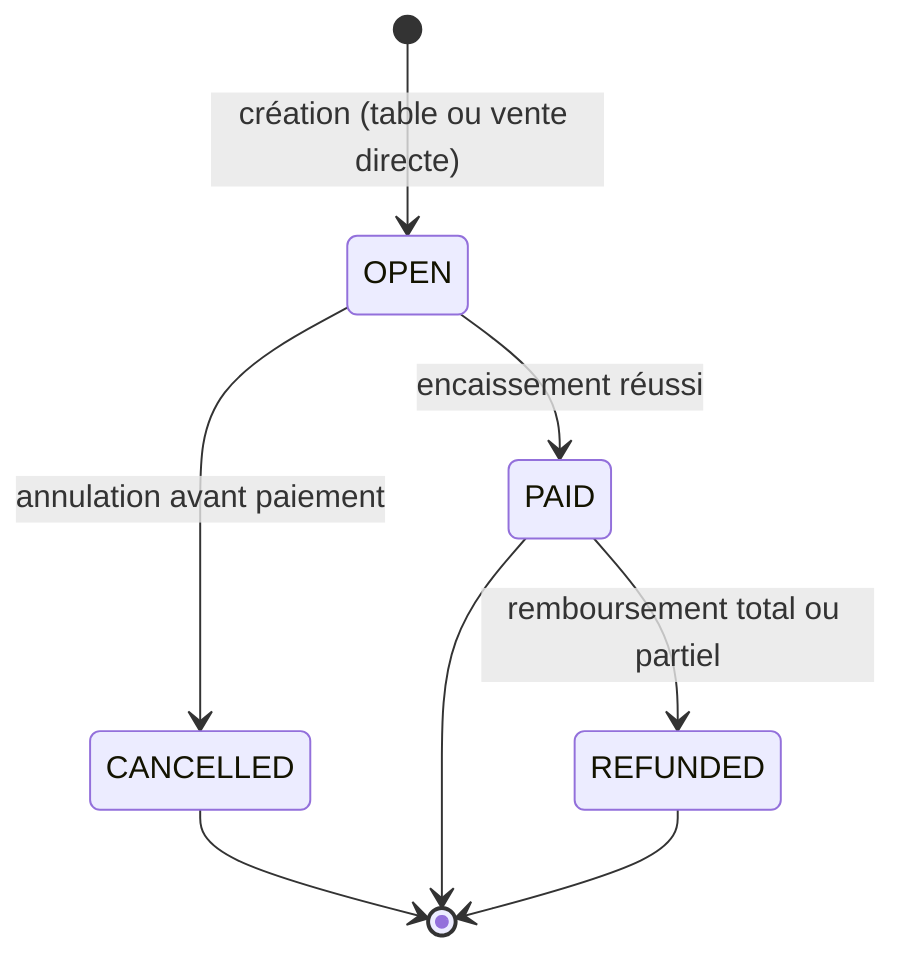

# `DEC-03` — Définir le cycle de vie d'une commande

- Statut : validé.
- Date : 4 août 2026.
- Dépend de : [`DEC-01`](./DEC-01-perimetre-mvp.md).

## Vocabulaire retenu

| Terme | Définition |
| --- | --- |
| **Commande** | L'enregistrement unique en base, de son ouverture à son état final. Terme utilisé dans le code, les API et la documentation technique. |
| **Ticket** | Le même objet que « commande », vu du personnel de salle pendant qu'il est `OPEN`. Terme utilisé dans l'interface orientée salle/caisse (`UX-06`). Il n'existe pas deux concepts différents : un ticket **est** une commande. |
| **Vente** | Une commande qui a atteint l'état `PAID` (et son inverse, `REFUNDED`). Une commande `CANCELLED` n'est jamais une vente. |
| **Vente directe** | Une commande sans table associée (`table_id IS NULL`), utilisée pour un service au comptoir. Un seul parcours existe pour ce cas ; aucune table fictive « Comptoir » n'est créée dans le plan de salle (supprime le doublon relevé par l'audit, section 11). |

## États et transitions canoniques

Règles :

- `OPEN → PAID` : uniquement via le service d'encaissement serveur (`SALE-03`), jamais par
  une mise à jour directe du statut.
- `OPEN → CANCELLED` : nécessite une confirmation explicite et libère immédiatement la
  table associée (`ORD-06`).
- `PAID → REFUNDED` : ne supprime jamais la commande ni ses lignes ; crée un enregistrement
  de remboursement et une ligne de paiement `REFUND` liée (`ORD-10`). Un remboursement
  partiel laisse la commande `PAID` avec un montant net inférieur au total d'origine (le
  statut ne passe à `REFUNDED` que si le remboursement couvre l'intégralité du montant
  encaissé) — cette nuance est tranchée précisément lors de l'implémentation `ORD-01`.
- Aucune transition inverse n'existe (`PAID → OPEN`, `CANCELLED → OPEN`, etc.).

Ce modèle remplace définitivement l'ancien couple `PENDING/COMPLETED` et l'endpoint de
finalisation `orders/:id/complete` qui n'était atteignable par aucun endpoint de création
(anomalie `P0-04`/`P0-09` de l'audit). Le remplacement effectif du schéma et du code est
réalisé en phase 3 (`ORD-01`) ; cette décision fixe la cible dès la phase 0 pour que les
migrations de `FND-05` créent directement le bon modèle.

## Acceptation

- [x] États et transitions `OPEN → PAID`, `OPEN → CANCELLED`, `PAID → REFUNDED` définis.
- [x] « commande », « ticket » et « vente » ont chacun une définition explicite.
- [x] Une seule notion de vente directe est retenue (commande sans table, pas de table
      fictive).
