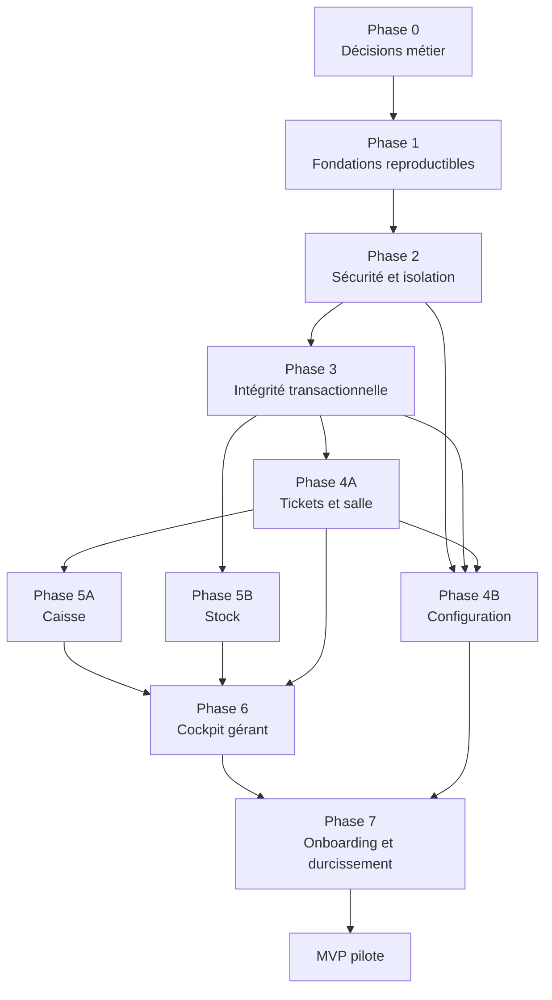
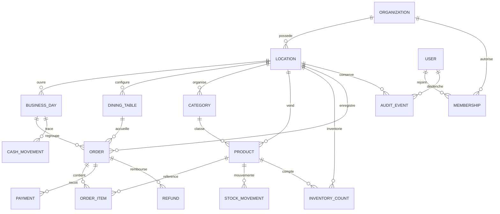

# Kalloud — plan d’exécution du MVP

> Backlog ordonné issu de [`VISION_PRODUIT_ET_AUDIT.md`](./VISION_PRODUIT_ET_AUDIT.md).
>
> Objectif : atteindre un MVP pilotable avec de l’argent réel, des données fiables et une isolation SaaS minimale.
>
> Date de création : 4 août 2026.

## Autorité de ce backlog

Les identifiants de tâches de ce fichier sont désormais **canoniques**. Les identifiants du backlog initial des sections 13 et 14 de l’audit sont remplacés par ce plan détaillé et ne doivent plus être utilisés pour piloter l’exécution.

Lorsqu’un identifiant comme `FND-01` ou `SALE-02` est cité sans nom de fichier, il désigne toujours la tâche de `tasks.md`.

## 1. Cible MVP

Le MVP est atteint lorsqu’un établissement pilote peut :

- créer son compte et son établissement ;
- inviter des utilisateurs avec les rôles `OWNER`, `MANAGER` et `CASHIER` ;
- configurer ses tables et son catalogue ;
- ouvrir un service ;
- ouvrir, reprendre, modifier et annuler un ticket ;
- encaisser en espèces, carte ou paiement mixte sans incohérence ;
- décrémenter et expliquer le stock par des mouvements traçables ;
- enregistrer les mouvements de caisse ;
- compter, rapprocher et clôturer la caisse ;
- consulter un cockpit fondé uniquement sur des données réelles ;
- utiliser le produit sur mobile, tablette et desktop avec des erreurs explicites ;
- garantir qu’aucun client ne peut lire ou modifier les données d’un autre.

Le MVP cible **un établissement par organisation**, tout en conservant un modèle de données compatible avec plusieurs établissements.

### Hors périmètre MVP

Ces capacités sont conservées dans le backlog post-MVP :

- recettes, ingrédients et rendements ;
- fournisseurs et commandes d’achat ;
- prévision avancée des ruptures ;
- consolidation multi-établissements ;
- mode hors ligne ;
- intégrations comptables ;
- planning du personnel ;
- abonnement et facturation SaaS ;
- benchmark anonymisé ;
- objectifs configurables ;
- analyses de marge, coût matière et valorisation ;
- analyses avancées de rotation des tables au-delà des indicateurs MVP.

## 2. Règles d’exécution

### Priorités

- `P0` : bloque le MVP ou met en danger l’argent, les données, la sécurité ou le démarrage.
- `P1` : nécessaire à un pilote fiable et utilisable.
- `P2` : amélioration post-MVP.

### États

- `[ ]` à faire ;
- `[-]` en cours ;
- `[x]` terminé ;
- `[!]` bloqué, avec la raison ajoutée sous la tâche.

### Règles de dépendance

- Ne pas commencer une tâche tant que toutes ses dépendances ne sont pas terminées.
- Les tâches d’une même phase sans dépendance mutuelle peuvent être réalisées en parallèle.
- Une décision `DEC-*` doit produire une courte note de décision dans ce fichier ou dans `docs/decisions/`.
- Toute modification du modèle de données doit passer par une migration testée.
- Chaque tâche doit respecter la définition de terminé située à la fin de ce document.

## 3. Chemin de dépendances

Les branches Caisse et Stock de la phase 5 peuvent avancer en parallèle une fois l’encaissement fiable.

## 4. Modèle de données MVP visé

## 5. Phase 0 — Décisions métier bloquantes

Toutes les tâches de cette phase sont `P0`. Traiter `DEC-01` en premier, puis paralléliser les autres selon leurs dépendances.

- [x] **`DEC-01` — Figer le périmètre du MVP**
  - Priorité : `P0`
  - Dépend de : aucune
  - Livrable : une liste « inclus / exclu » validant un établissement par organisation, les trois rôles, le positionnement lounge/café/petite restauration et les parcours obligatoires.
  - Acceptation : chaque fonction du présent fichier est marquée MVP ou post-MVP ; cible commerciale et critères de succès du pilote sont explicites.
  - Décision : [`docs/decisions/DEC-01-perimetre-mvp.md`](./docs/decisions/DEC-01-perimetre-mvp.md).

- [x] **`DEC-02` — Choisir l’architecture d’exécution**
  - Priorité : `P0`
  - Dépend de : `DEC-01`
  - Livrable : décision entre Route Handlers Next.js et API Express autonome.
  - Recommandation : intégrer l’API à Next.js pour le MVP afin d’obtenir des appels same-origin et un seul déploiement.
  - Acceptation : cible locale, CI et production documentées ; stratégie d’URL, secrets et migrations définie.
  - Décision : [`docs/decisions/DEC-02-architecture-execution.md`](./docs/decisions/DEC-02-architecture-execution.md) — Next.js Route Handlers retenu.

- [x] **`DEC-03` — Définir le cycle de vie d’une commande**
  - Priorité : `P0`
  - Dépend de : `DEC-01`
  - Livrable : états et transitions `OPEN → PAID`, `OPEN → CANCELLED`, `PAID → REFUNDED`.
  - Acceptation : « commande », « ticket » et « vente » ont chacun une définition ; une seule notion de vente directe est retenue.
  - Décision : [`docs/decisions/DEC-03-cycle-vie-commande.md`](./docs/decisions/DEC-03-cycle-vie-commande.md).

- [x] **`DEC-04` — Définir la journée de caisse**
  - Priorité : `P0`
  - Dépend de : `DEC-01`
  - Livrable : règle précisant s’il s’agit d’un service ou d’un jour calendaire, avec fuseau horaire, passage de minuit et comptage aveugle ou non.
  - Acceptation : ouverture, ordre d’affichage compté/attendu, clôture, réouverture éventuelle et traitement des tickets ouverts sont définis.
  - Décision : [`docs/decisions/DEC-04-journee-caisse.md`](./docs/decisions/DEC-04-journee-caisse.md) — session de caisse non aveugle, sans réouverture.

- [x] **`DEC-05` — Définir les règles monétaires**
  - Priorité : `P0`
  - Dépend de : `DEC-01`
  - Livrable : devise, TVA, TTC/HT, arrondis, paiements autorisés, inclusion du paiement mixte au MVP, remise et remboursement.
  - Acceptation : taux par classe fiscale et règle de repli sont définis ; formules et cas limites sont illustrés ; `somme des paiements = total` est obligatoire.
  - Décision : [`docs/decisions/DEC-05-regles-monetaires.md`](./docs/decisions/DEC-05-regles-monetaires.md).

- [x] **`DEC-06` — Définir le stock du MVP**
  - Priorité : `P0`
  - Dépend de : `DEC-01`
  - Livrable : décision produit fini versus ingrédients/recettes.
  - Recommandation : produits finis pour le MVP ; recettes et ingrédients après validation du pilote.
  - Acceptation : unités, types de mouvements, règles de stock négatif, méthode d’inventaire et choix solde dérivé versus solde matérialisé sont définis.
  - Décision : [`docs/decisions/DEC-06-stock-mvp.md`](./docs/decisions/DEC-06-stock-mvp.md) — produits finis, solde matérialisé + ledger.

- [x] **`DEC-07` — Définir les rôles et permissions**
  - Priorité : `P0`
  - Dépend de : `DEC-01`, `DEC-05`
  - Livrable : matrice `OWNER`, `MANAGER`, `CASHIER`.
  - Acceptation : chaque rôle précise ses droits sur prix, stock, caisse, remboursement, clôture, utilisateurs et pilotage.
  - Décision : [`docs/decisions/DEC-07-roles-permissions.md`](./docs/decisions/DEC-07-roles-permissions.md).

- [x] **`DEC-08` — Décider le niveau de fonctionnement hors ligne et multi-appareil**
  - Priorité : `P0`
  - Dépend de : `DEC-01`
  - Livrable : décision explicite sur les coupures réseau et le nombre d’appareils simultanés.
  - Recommandation : pas d’encaissement hors ligne pour le MVP ; erreurs explicites et reprise sûre.
  - Acceptation : comportement attendu lors d’une perte réseau avant, pendant et après un encaissement.
  - Décision : [`docs/decisions/DEC-08-offline-multi-appareil.md`](./docs/decisions/DEC-08-offline-multi-appareil.md).

- [x] **`DEC-09` — Définir les KPI et exports du MVP**
  - Priorité : `P0`
  - Dépend de : `DEC-04`, `DEC-05`, `DEC-06`
  - Livrable : dictionnaire des KPI, sources, formules, périodes, comparaisons et fuseau horaire.
  - Acceptation : CA net, commandes, panier moyen, espèces attendues, écart de caisse et alertes de stock sont définis ; format CSV validé.
  - Décision : [`docs/decisions/DEC-09-kpi-exports.md`](./docs/decisions/DEC-09-kpi-exports.md).

- [x] **`DEC-10` — Définir conservation, sauvegarde et suppression**
  - Priorité : `P0`
  - Dépend de : `DEC-01`
  - Livrable : durées de conservation, politique de sauvegarde, restauration, suppression de compte, RPO et RTO cibles.
  - Acceptation : exigences minimales de confidentialité et responsabilités opérationnelles écrites.
  - Décision : [`docs/decisions/DEC-10-conservation-sauvegarde.md`](./docs/decisions/DEC-10-conservation-sauvegarde.md).

### `GATE-0` — Décisions

- [x] Toutes les décisions `DEC-*` sont validées.
- [x] Le périmètre MVP ne contient aucun élément post-MVP.
- [x] Les termes métier utilisés par le code et l’interface sont fixés.

## 6. Phase 1 — Fondations reproductibles

- [x] **`FND-01` — Nettoyer le suivi Git**
  - Priorité : `P0`
  - Dépend de : aucune
  - Livrable : `.gitignore` complet ; retrait de `.next`, caches, fichiers de build et `.env` du suivi.
  - Acceptation : seul `.env.example` est suivi ; aucun secret réel dans l’historique courant ; `git status` reste propre après build.

- [x] **`FND-02` — Mettre à niveau les dépendances critiques**
  - Priorité : `P0`
  - Dépend de : aucune
  - Livrable : version maintenue de Next.js et dépendances compatibles.
  - Acceptation : version cible et support documentés ; build et typecheck réussis ; aucun avis critique ou élevé non documenté ; gabarit `allowBuilds` de `pnpm-workspace.yaml` résolu.
  - Réalisé : Next.js 16.3.0, React 19.2.8, TypeScript 5.9.3 ; `pnpm audit` : 0 avis.

- [x] **`FND-03` — Configurer lint et formatage non interactifs**
  - Priorité : `P0`
  - Dépend de : `FND-02`
  - Livrable : ESLint, formatage et scripts `lint`, `format:check`.
  - Acceptation : commandes sans question interactive et exécutables en CI.

- [x] **`FND-04` — Installer l’infrastructure de tests**
  - Priorité : `P0`
  - Dépend de : `FND-02`
  - Livrable : tests unitaires, intégration PostgreSQL et parcours navigateur.
  - Acceptation : un test exemple de chaque niveau s’exécute localement et en CI ; les tests peuvent réinitialiser leur base.

- [x] **`FND-05` — Installer un système de migrations canonique**
  - Priorité : `P0`
  - Dépend de : `DEC-02`, `FND-02`
  - Livrable : migrations ordonnées remplaçant la séparation fragile entre `schema.sql`, `002-business-days.sql` et les chemins d’initialisation concurrents.
  - Acceptation : une base vide et une base existante convergent vers le même schéma ; les migrations sont idempotentes au niveau attendu.
  - Réalisé : `migrations/000{1..4}_*.sql` + `scripts/migrate.mjs` (`up`/`status`) ; inclut le schéma `SEC-01`, `SEC-02` et `CFG-00`.

- [x] **`FND-06` — Créer un bootstrap de base cohérent**
  - Priorité : `P0`
  - Dépend de : `FND-05`, `DEC-03`, `DEC-04`, `DEC-06`
  - Livrable : seed minimal, journée initiale ou parcours d’ouverture, tables et catalogue de développement.
  - Acceptation : une installation fraîche peut encaisser sans exécuter manuellement un fichier SQL.
  - Réalisé : `scripts/seed.mjs` (idempotent) — organisation/établissement, réglages, classes fiscales, catalogue, 7 tables (sans « Comptoir » fictif, conforme à `DEC-03`), journée déjà ouverte, 3 comptes de développement `OWNER`/`MANAGER`/`CASHIER`. `pnpm run predev` valide le parcours complet depuis zéro.

- [x] **`FND-07` — Consolider l’API et la couche métier**
  - Priorité : `P0`
  - Dépend de : `DEC-02`, `FND-04`, `FND-05`
  - Livrable : architecture retenue, services métier testables et accès base centralisé.
  - Acceptation : aucune règle métier importante dans un composant React ; les endpoints délèguent à des services.
  - Réalisé : 21 Route Handlers sous `app/api/**`, chacun un contrôleur mince délégant à `lib/repositories/*` et `lib/services/*` ; contrôle statique dans `tests/unit/architecture.test.ts`.

- [x] **`FND-08` — Supprimer les URL `localhost` du client**
  - Priorité : `P0`
  - Dépend de : `FND-07`
  - Livrable : appels same-origin ou configuration d’environnement validée.
  - Acceptation : aucun `http://localhost:3001` dans le code client ; fonctionnement HTTPS et depuis un second appareil vérifié.
  - Réalisé : `lib/client/api.ts` (fetch same-origin unique) ; toutes les pages/composants migrés.

- [x] **`FND-09` — Ajouter contrat d’erreur et healthchecks**
  - Priorité : `P0`
  - Dépend de : `FND-07`
  - Livrable : wrapper async, middleware d’erreur, erreurs JSON stables, `/health/live` et `/health/ready`.
  - Acceptation : une base indisponible produit `503` sans arrêter le processus ; aucune erreur SQL sensible n’est renvoyée.
  - Réalisé : `lib/http.ts` (`apiRoute`, enveloppe `{error:{code,message,requestId}}`), `app/api/health/live`, `app/api/health/ready`.

- [x] **`FND-10` — Fournir une commande de démarrage unique**
  - Priorité : `P0`
  - Dépend de : `FND-06`, `FND-07`, `FND-08`, `FND-09`
  - Livrable : scripts base + migrations + application.
  - Acceptation : un nouveau développeur démarre le projet avec les commandes du README uniquement.
  - Réalisé : `pnpm install && pnpm dev` (hook `predev` : `ensure-db` + `migrate` + `seed`) documenté dans `README.md`.

- [x] **`FND-11` — Créer la CI de qualité**
  - Priorité : `P0`
  - Dépend de : `FND-03`, `FND-04`, `FND-05`
  - Livrable : pipeline install, migrations de test, lint, format, typecheck, tests, build et audit.
  - Acceptation : une étape en échec bloque la fusion ; rapports de tests et de sécurité conservés.
  - Réalisé : `.github/workflows/ci.yml`, vérifié en conditions réelles (run GitHub Actions vert, ~1m54s, 7/7 E2E).

- [x] **`FND-12` — Écrire le README d’exploitation**
  - Priorité : `P1`
  - Dépend de : `FND-10`, `FND-11`
  - Livrable : prérequis, installation, variables, migrations, scripts, tests et dépannage.
  - Acceptation : procédure testée depuis une copie neuve.

- [x] **`FND-13` — Reformater le code condensé**
  - Priorité : `P1`
  - Dépend de : `FND-03`
  - Livrable : pages et composants lisibles, types extraits lorsque réutilisés, imports inutiles retirés.
  - Acceptation : aucune modification fonctionnelle ; lint et tests inchangés au vert.

- [x] **`FND-14` — Séparer strictement données de démo et production**
  - Priorité : `P0`
  - Dépend de : `FND-06`, `FND-07`
  - Livrable : déplacement de `database/demo-reset.sql` vers des fixtures protégées, environnement dédié et badge permanent.
  - Acceptation : aucun fallback local plausible lorsque l’API échoue ; aucune donnée démo chargée en production ; un reset destructif refuse de s’exécuter hors environnement démo/test.
  - Réalisé : `database/demo-reset.sql` supprimé (remplacé par `scripts/seed.mjs`, idempotent, dev/test uniquement) ; `scripts/reset-db.mjs` refuse de s’exécuter hors hôte local sauf `ALLOW_DESTRUCTIVE_DB_RESET=true` explicite ; `lib/client/api.ts` ne comporte aucun repli local sur panne API (redirection `/login` sur 401, état d’erreur explicite sinon).

### `GATE-1` — Projet reproductible

- [x] Base neuve, migrations et application démarrent sans action manuelle cachée.
- [x] Build, typecheck, lint, tests et audit passent en CI.
- [x] Une panne de base n’arrête pas le serveur.
- [x] Aucun artefact ou secret local n’est suivi par Git.

## 7. Phase 2 — Sécurité, isolation et fondations UX

Le modèle d’isolation est construit avant les nouveaux flux métier afin d’éviter de réécrire toutes les requêtes après le MVP.

### Sécurité et multi-tenant

- [x] **`SEC-01` — Ajouter organisations, établissements, utilisateurs et memberships**
  - Priorité : `P0`
  - Dépend de : `FND-05`, `DEC-07`
  - Livrable : tables et contraintes d’identité/périmètre.
  - Acceptation : un utilisateur peut appartenir à une organisation avec un rôle et un établissement actif.
  - Réalisé : `migrations/0001_identity_and_tenancy.sql` (`organizations`, `locations`, `users`, `memberships` + tables de session/auth pour `SEC-03`).

- [x] **`SEC-02` — Ajouter `location_id` aux données métier**
  - Priorité : `P0`
  - Dépend de : `SEC-01`, `FND-06`
  - Livrable : migration de catégories, produits, tables, journées, commandes et mouvements.
  - Acceptation : aucune ligne métier sans établissement ; index et contraintes adaptés.
  - Réalisé : `migrations/0003_business_core.sql` — `location_id NOT NULL` + FK composites vers `locations` sur `categories`, `products`, `dining_tables`, `business_days`, `orders`, `cash_movements`. Le cycle de vie canonique des commandes et le ledger de paiements/stock restent `ORD-01`/`SALE-02`/`STK-01` (phase 3), volontairement non anticipés ici.

- [x] **`CFG-00` — Stocker les paramètres métier de l’établissement**
  - Priorité : `P0`
  - Dépend de : `SEC-01`, `SEC-02`, `DEC-04`, `DEC-05`
  - Livrable : schéma pour fuseau horaire, devise, classes fiscales assignables aux catégories/produits, règle de repli et seuil d’écart de caisse.
  - Acceptation : valeurs obligatoires, validées et disponibles dans le contexte serveur avant tout calcul financier.
  - Réalisé : `migrations/0002_location_settings.sql` (`location_settings`, `tax_classes`) ; exposition dans le contexte serveur via `lib/context` (voir `SEC-04`).

- [x] **`SEC-03` — Ajouter l’authentification**
  - Priorité : `P0`
  - Dépend de : `SEC-01`, `FND-07`
  - Livrable : choix d’auth documenté, connexion, déconnexion, réinitialisation, stockage de mot de passe sûr si applicable, session sécurisée, expiration et révocation.
  - Acceptation : toute page et tout endpoint métier exige une session valide ; rotation/révocation testée ; protection contre la force brute définie.
  - Réalisé : `lib/auth/*` (sessions en base, bcrypt, jetons à hash unique, réinitialisation par jeton, révocation totale sur reset), pages `login`/`forgot-password`/`reset-password`. Testé dans `tests/integration/auth.test.ts` (11 cas) et `tests/e2e/auth.spec.ts`.

- [x] **`SEC-04` — Construire le contexte de requête**
  - Priorité : `P0`
  - Dépend de : `SEC-02`, `SEC-03`
  - Livrable : résolution serveur de l’utilisateur, organisation, établissement et rôle.
  - Acceptation : le client ne peut pas imposer librement un `location_id`.
  - Réalisé : `lib/context.ts` (`getRequestContext`/`requireRequestContext`), exclusivement dérivé du cookie de session validé.

- [x] **`SEC-05` — Appliquer les autorisations par rôle**
  - Priorité : `P0`
  - Dépend de : `SEC-04`, `DEC-07`
  - Livrable : guards réutilisables et matrice codée.
  - Acceptation : chaque mutation sensible vérifie le rôle côté serveur ; les refus renvoient `403`.
  - Réalisé : `lib/authz.ts` (`can`/`requirePermission`), matrice testée ligne à ligne dans `tests/unit/authz.test.ts` contre `DEC-07`.

- [x] **`SEC-06` — Scoper toutes les requêtes par établissement**
  - Priorité : `P0`
  - Dépend de : `SEC-04`
  - Livrable : point d’accès base unique exigeant le contexte d’établissement, repositories scopés et contrôle empêchant les requêtes métier directes.
  - Acceptation : aucune lecture, agrégation ou mutation globale non justifiée ; tests ou contrôle statique détectent un accès non scopé.
  - Réalisé : `lib/repositories/*` (chaque fonction exige `locationId`), contrôle statique dans `tests/unit/architecture.test.ts` (aucun `.query()` direct sous `app/api/**`) ; garantie prouvée à l’exécution par `SEC-08`.

- [x] **`SEC-07` — Durcir l’exposition HTTP**
  - Priorité : `P0`
  - Dépend de : `SEC-03`, `FND-08`
  - Livrable : CORS same-origin ou allowlist, en-têtes de sécurité, limites de corps, cookies sécurisés, protection CSRF et limitation de débit sur authentification/mutations sensibles.
  - Acceptation : aucune origine arbitraire ne peut appeler une mutation authentifiée ; tentatives répétées limitées et journalisées.
  - Réalisé : `proxy.ts` (CSP/HSTS/X-Frame-Options, vérification d’origine, limite de débit, limite de taille de corps) + `lib/auth/rate-limit.ts` (verrou par e-mail/IP journalisé en base).

- [x] **`SEC-08` — Tester l’isolation des tenants**
  - Priorité : `P0`
  - Dépend de : `SEC-05`, `SEC-06`, `FND-04`
  - Livrable : tests positifs et négatifs entre deux organisations.
  - Acceptation : toutes les tentatives de lecture ou modification croisée échouent.
  - Réalisé : `tests/integration/tenant-isolation.test.ts` (14 cas, couche repository/service) + `tests/e2e/tenant-isolation.spec.ts` (couche HTTP complète).

- [x] **`SEC-09` — Créer le journal d’audit métier**
  - Priorité : `P0`
  - Dépend de : `SEC-04`, `SEC-05`, `FND-05`
  - Livrable : `audit_events` avec auteur, établissement, action, cible, avant/après et date.
  - Acceptation : service réutilisable et non modifiable par les rôles opérationnels.
  - Réalisé : `lib/audit.ts` (`recordAuditEvent`/`listAuditEvents`, aucune fonction de mise à jour/suppression exposée) ; appelé depuis l’encaissement, la clôture et les mouvements de caisse.

- [x] **`OPS-01` — Ajouter logs structurés et corrélation**
  - Priorité : `P0`
  - Dépend de : `FND-09`, `SEC-04`
  - Livrable : identifiant de requête, utilisateur, établissement, route, durée et résultat.
  - Acceptation : une erreur d’encaissement peut être suivie du navigateur jusqu’à la base sans exposer de secret.
  - Réalisé : `lib/logger.ts` (JSON structuré via `AsyncLocalStorage`, champs sensibles redacted), `x-request-id` propagé dans les réponses.

### Fondations UX et accessibilité

- [x] **`UX-01` — Standardiser les états asynchrones**
  - Priorité : `P0`
  - Dépend de : `FND-09`, `FND-14`, `DEC-08`
  - Livrable : composants/patterns chargement, vide, erreur, retry, succès et hors-ligne.
  - Acceptation : aucun `catch(() => {})` silencieux ; aucune valeur démo présentée après une panne.
  - Réalisé : `lib/client/api.ts`, `lib/client/use-async-data.ts`, `components/ui/async-section.tsx` ; appliqué à `caisse`, `stock`, `bilan`. Le mode hors-ligne complet (`DEC-08`) reste hors MVP ; les échecs réseau produisent un état d’erreur explicite avec nouvelle tentative.

- [x] **`UX-02` — Créer un composant de dialogue accessible**
  - Priorité : `P0`
  - Dépend de : `FND-03`
  - Livrable : `dialog`, titre associé, `aria-modal`, focus initial, piège de focus, Échap et restauration du focus.
  - Acceptation : les trois tiroirs actuels utilisent ce composant et restent utilisables au clavier.
  - Réalisé : `components/ui/dialog.tsx` (natif `<dialog>` + `showModal()`) ; adopté par `order-drawer`, `close-day-modal`, `cash-movement-modal`.

- [x] **`UX-03` — Corriger noms, états et annonces accessibles**
  - Priorité : `P0`
  - Dépend de : `FND-03`
  - Livrable : labels, `aria-current`, `aria-pressed`/radios, noms des boutons icône et régions live.
  - Acceptation : tous les contrôles ont un nom ; erreurs et confirmations dynamiques sont annoncées.
  - Réalisé : `aria-current="page"` sur la nav active, `role="radiogroup"`/`aria-checked` sur catégories/paiement/mouvement, noms accessibles sur tous les boutons icône, régions `role="status"`/`role="alert"`, lien d’évitement (`skip-link`).

- [x] **`UX-04` — Corriger contraste et responsive**
  - Priorité : `P1`
  - Dépend de : `FND-03`
  - Livrable : couleurs WCAG AA, breakpoint tablette revu, navigation avec safe areas.
  - Acceptation : aucun chevauchement à 320, 375, 700, 768 et 1024 px ; texte normal au moins `4,5:1`, composants graphiques/contrôles au moins `3:1`, notamment les valeurs initiales auditées à `4,15:1`, `3,09:1`, `2,69:1` et `1,20:1`.
  - Réalisé : `--muted` `#718078→#526058` (6,62:1), `--line-strong` `#7f8c83` pour les bordures de champ (3,51:1), palier 700/900px au lieu d’un seul breakpoint à 700px, `safe-area-inset-bottom` sur la navigation et les feuilles, anneau `:focus-visible` global.

- [x] **`UX-05` — Standardiser les formulaires et erreurs**
  - Priorité : `P0`
  - Dépend de : `UX-01`, `UX-03`
  - Livrable : champs requis, validation inline, `aria-invalid`, erreurs liées et conservation de la saisie.
  - Acceptation : aucune erreur uniquement globale ou uniquement colorée.
  - Réalisé : `components/ui/text-field.tsx` (label réel, `aria-invalid`, `aria-describedby`) utilisé par les formulaires d’authentification et les modales de caisse.

- [x] **`UX-06` — Normaliser le vocabulaire**
  - Priorité : `P0`
  - Dépend de : `DEC-03`, `DEC-04`, `DEC-06`
  - Livrable : libellés cohérents pour ticket, commande, vente, service, clôture, vente directe et catégories.
  - Acceptation : suppression des promesses trompeuses « temps réel » et « ticket en cours » tant qu’elles ne sont pas vraies.
  - Réalisé : « Ticket en cours » → « Nouvelle commande »/« Occupée » (n’implique plus une persistance qui n’existe pas encore) ; « Inventaire en temps réel » retiré ; « Nouvelle journée » → « Clôturer le service » ; rôles affichés via `ROLE_LABELS` (`lib/authz.ts`).

### `GATE-2` — Périmètre sécurisé

- [x] Toutes les routes métier exigent une session.
- [x] Toutes les requêtes sont limitées à l’établissement courant.
- [x] Les rôles sont vérifiés côté serveur.
- [x] Les écrans ne masquent plus les pannes.
- [x] Les primitives d’interface respectent le clavier et les noms accessibles.

## 8. Phase 3 — Intégrité transactionnelle

### Contrats et modèles fondamentaux

- [x] **`API-01` — Créer les schémas de validation partagés**
  - Priorité : `P0`
  - Dépend de : `FND-07`, `SEC-05`, `DEC-05`, `DEC-06`
  - Livrable : validation des identifiants, quantités, montants, périodes, enums et réponses.
  - Acceptation : toute entrée invalide retourne une erreur métier stable avant l’accès base.
  - Mise en œuvre : `lib/validation/` (primitives, schémas par endpoint, parsing) ; toutes les routes métier migrées ; `ValidationError` porte un détail par champ. Le test d’intégration compte les accès base pour prouver le « avant », et un contrôle statique interdit `readJsonBody` sans schéma.

- [x] **`API-02` — Ajouter idempotence et contrôle de concurrence**
  - Priorité : `P0`
  - Dépend de : `API-01`, `OPS-01`
  - Livrable : clé d’idempotence pour les opérations financières, stockage, portée par établissement, unicité, TTL, stratégie de verrouillage et conflits.
  - Acceptation : un double clic ou retry réseau ne crée jamais deux encaissements ; une clé réutilisée avec un autre payload est refusée.
  - Mise en œuvre : `migrations/0005_idempotency_keys.sql`, `lib/idempotency.ts`, en-tête `Idempotency-Key` obligatoire sur `POST /api/checkout` et `POST /api/cash-movements` ; fusion et tri des lignes avant verrouillage dans l’encaissement. Documenté dans [`docs/idempotence-et-concurrence.md`](./docs/idempotence-et-concurrence.md). L’UX « état incertain / récupération » reste à `SALE-08`.

- [x] **`ORD-01` — Migrer vers le cycle de vie canonique des commandes**
  - Priorité : `P0`
  - Dépend de : `FND-05`, `SEC-02`, `DEC-03`
  - Livrable : colonnes et contraintes pour `OPEN`, `PAID`, `CANCELLED`, `REFUNDED`, auteur, notes, timestamps, snapshots fiscaux et numéro de commande unique par établissement.
  - Acceptation : transitions contraintes ; ancien modèle `PENDING/COMPLETED` et endpoint de finalisation inaccessible retirés ou migrés.
  - Mise en œuvre : `migrations/0006_order_lifecycle.sql` — `status` réécrit en `OPEN/PAID/CANCELLED/REFUNDED` (défaut `OPEN`), `closed_at` renommé `paid_at`, ajout de `cancelled_at`/`refunded_at`/`created_by`/`notes`/`subtotal_amount`/`tax_amount` (les deux derniers nullable : `checkout.ts` ne calcule pas encore la taxe, un chiffre inventé serait une fausse donnée fiscale, `FND-14` ; `SALE-03` les remplira réellement) et `order_number` (`UNIQUE (location_id, order_number)`), plus la table `order_number_counters` qui le distribue de façon atomique par établissement (`lib/repositories/orders.ts::nextOrderNumber`, `UPDATE ... RETURNING`, sans verrou explicite ni trigger). `lib/services/checkout.ts` insère désormais `PAID` avec un vrai `order_number`/`created_by` ; `lib/repositories/business-days.ts` et `cash-movements.ts` (CA et solde de caisse) mis à jour pour lire `PAID`/`paid_at` — sans ce changement le CA et le solde retombaient silencieusement à zéro. `orders` était vide dans tous les environnements existants : migration purement additive, aucun backfill de données réelles nécessaire. L'ordre des transitions (`OPEN → PAID → REFUNDED`, `OPEN → CANCELLED`, jamais l'inverse) n'est **pas** appliqué par un trigger (aucun dans ce dépôt à ce jour) : le `CHECK` ne fixe que les 4 valeurs possibles au repos, la garantie de séquence viendra des fonctions de transition dédiées qu'`ORD-02`/`ORD-06`/`ORD-10` exposeront (jamais de `UPDATE orders SET status = ...` générique). L'encaissement continue de créer directement `PAID` sans étape `OPEN` persistée (déjà vrai avant `ORD-01` — pas de régression ; `ORD-02` est ce qui donnera un vrai état `OPEN`). Testé par `tests/integration/orders.test.ts` (numérotation, contraintes `CHECK`/`UNIQUE` au niveau base, non-collision entre établissements, concurrence réelle sur deux produits distincts, non-régression du CA/solde de caisse après le renommage). Effet de bord corrigé au passage : `tests/e2e/idempotency.spec.ts` comparait des compteurs de commandes avant/après sur le tenant seedé partagé sans isolation entre tests parallèles (`fullyParallel`), ce qui produisait un échec nondéterministe (le test en échec changeait d'une exécution à l'autre) sans rapport avec `ORD-01` ; passé en `test.describe.serial()`.

- [x] **`CASH-01` — Fiabiliser le modèle de journée de caisse**
  - Priorité : `P0`
  - Dépend de : `FND-05`, `FND-06`, `SEC-02`, `CFG-00`, `DEC-04`
  - Livrable : schéma canonique, première ouverture possible et état réel.
  - Acceptation : au plus une journée ouverte par établissement ; le fuseau métier est appliqué.
  - Mise en œuvre : le schéma `business_days` (`migrations/0003_business_core.sql`) était déjà conforme à `DEC-04` — aucune migration nécessaire. Deux bugs réels corrigés : (1) **« première ouverture impossible »** — le seul point d'entrée était `closeAndReopenBusinessDay`, qui exige une journée déjà active pour la clôturer d'abord ; un établissement neuf n'avait aucun moyen d'ouvrir sa toute première journée via l'API (`scripts/seed.mjs` contournait ça par un `INSERT` SQL brut). Corrigé par `lib/services/business-day.ts::openNewBusinessDay`, exposé sur `POST /api/business-day` (le fichier n'avait qu'un `GET` jusqu'ici), permission `business_day:open`, schéma `openBusinessDaySchema`. Refuse proprement (`ConflictError`, 409) si une journée est déjà ouverte — y compris en cas de course réelle entre deux requêtes simultanées, où c'est l'index unique partiel `one_open_business_day_per_location` qui tranche : la violation de contrainte (`isUniqueViolation`, jusqu'ici définie mais jamais appelée) est traduite en la même erreur propre plutôt que de remonter en 500 opaque. (2) **« état non réel »** — `GET /api/cash-summary` renvoyait `{ balance: "0.00" }` en `200` qu'une journée soit ouverte à 0 € ou qu'il n'y en ait aucune, deux situations indiscernables pour un client. Ajout additif d'un champ `businessDayOpen` (aucun appelant existant cassé). Le label « Service ouvert » codé en dur dans `app/caisse/page.tsx` reste tel quel (commentaire `TODO(CASH-02/CASH-07)` ajouté) : cohérent avec le précédent d'`ORD-01`, cette tâche est backend, le branchement UI revient à `CASH-02`/`CASH-07`. Le calcul mensuel/annuel du dashboard (`getRevenueBetween`, heure serveur plutôt que `location_settings.timezone`) n'a pas été touché : l'agrégation « journée » (le périmètre réel de `DEC-04`) passe déjà exclusivement par `business_day_id`, jamais par une date calendaire, donc par construction sans dépendance au fuseau — le calcul calendaire mensuel/annuel reste `BI-03` (phase 6), comme déjà documenté dans le code avant cette tâche. Testé par `tests/integration/business-day.test.ts` (première ouverture sur tenant vierge, refus d'une seconde ouverture, non-collision entre établissements, concurrence réelle avec résolution par l'index unique, distinction « aucune journée » vs « journée à 0 € »).

- [x] **`STK-01` — Créer le ledger de mouvements de stock**
  - Priorité : `P0`
  - Dépend de : `FND-05`, `SEC-02`, `DEC-06`
  - Livrable : `stock_movements` avec quantité signée, type, motif, auteur, produit, établissement et référence, plus stratégie de solde dérivé ou matérialisé décidée en `DEC-06`.
  - Acceptation : le solde est reconstructible ; s’il est matérialisé, il est mis à jour dans la même transaction et reste égal au ledger.
  - Mise en œuvre : `migrations/0007_stock_movements.sql` — table `stock_movements` (quantité signée `CHECK (quantity <> 0)`, `type` restreint aux 6 valeurs de `DEC-06`, plus un `CHECK` nommé `stock_movements_quantity_sign_check` qui verrouille le signe attendu par type au niveau base — `SALE`/`LOSS` négatif, `OPENING_BALANCE`/`RECEIPT`/`RETURN` positif, `CORRECTION` libre y compris négatif pour un rattrapage documenté). `product_id` référencé via FK composite `(product_id, location_id)` vers `products (id, location_id)`, plus strict que le FK simple existant sur `order_items.product_id` (incohérence pré-existante, hors périmètre). `products.stock_quantity` reste le solde matérialisé (`DEC-06`), aucune colonne modifiée. `lib/repositories/stock-movements.ts::recordStockMovement` est le seul point d'écriture prévu désormais : insère le mouvement et met à jour `products.stock_quantity` en un aller-retour, sans validation de stock négatif (explicitement le rôle de `STK-03`, pas de celui-ci — une `CORRECTION` doit pouvoir amener un solde sous zéro). `getStockBalanceFromLedger` prouve la reconstructibilité exigée par l'acceptation. `DEC-06` assigne lui-même le déclencheur du mouvement `SALE` à `SALE-03`, pas à `STK-01`/`STK-03` : `checkout.ts` n'est donc pas touché ici et continue d'appeler `decrementProductStock` (désormais annoté `TODO(SALE-03)`, symétrique au `TODO(SALE-03)` déjà présent dans `checkout.ts` pour `P0-02`) — l'invariant `stock_quantity == SUM(stock_movements)` reste donc temporairement faux pour tout produit vendu entre cette tâche et `SALE-03`, un écart assumé et tracé, pas silencieux. `overwriteProductStockQuantity` (déjà `TODO(STK-04)` avant cette tâche) n'est pas non plus touché. Testé par `tests/integration/stock-movements.test.ts` (solde tenu à jour dans la même transaction, reconstruction depuis le ledger après plusieurs mouvements de types différents, `CORRECTION` négative acceptée, rejet DB d'un type hors énumération/d'une quantité nulle/d'un signe incohérent avec le type pour les 5 types stricts, isolation inter-établissement via le FK composite).

- [x] **`STK-02` — Migrer les stocks initiaux**
  - Priorité : `P0`
  - Dépend de : `STK-01`, `FND-06`
  - Livrable : mouvements `OPENING_BALANCE` pour les quantités existantes.
  - Acceptation : solde avant/après migration identique et vérifié par test.
  - Mise en œuvre : `migrations/0008_backfill_opening_stock.sql` — un `INSERT ... SELECT` pur, qui n'écrit que dans `stock_movements` et ne touche jamais `products.stock_quantity` (déjà correct) : c'est ce qui rend « solde avant/après identique » vrai par construction, pas par un test qui l'espère. Testé sur la base de dev réelle avant application (9 produits, 9 mouvements `OPENING_BALANCE`, somme 126 = somme des stocks existants) via une transaction annulée avant l'application réelle. `created_by` de `stock_movements` (posé `NOT NULL` par `STK-01`) est assoupli en nullable **uniquement pour `OPENING_BALANCE`** (nouveau `CHECK stock_movements_author_required_check`, `0007` non modifiée) : `DEC-06` décrit lui-même ce type comme déclenché par « migration ou création », donc sans auteur humain réel pour un backfill rétroactif — inventer un auteur aurait été une fausse attribution (`FND-14`). Précédent repris directement du dépôt : `audit_events.actor_user_id` est déjà nullable pour ce même genre d'événement système. Point signalé et validé avec l'utilisateur, hors du périmètre littéral « migrer les stocks existants » mais nécessaire pour ne pas rouvrir immédiatement le même trou : `lib/services/products.ts::createProductWithInitialStock` (nouveau, appelé par `POST /api/products` à la place de `createProduct` direct) crée désormais le produit à `stock_quantity = 0` puis applique le stock de départ demandé via `recordStockMovement` (`STK-01`) dans la même transaction — avec cette fois un auteur réel (`context.userId`), pas `NULL`. `scripts/seed.mjs` n'est pas concerné : il reste un `INSERT` SQL direct pour des données de démo, jamais exécuté en production (`FND-14`), donc hors périmètre d'une migration de données réelles. Testé par `tests/integration/stock-opening-balance.test.ts`, qui rejoue le texte SQL réel du backfill (lu depuis le fichier de migration, pas retranscrit) contre un produit simulant un stock antérieur au ledger — les migrations s'appliquant automatiquement avant toute fixture de test, ce test est la seule façon de prouver la logique du backfill sur un scénario non vide plutôt que de façon vide contre une table `products` fraîchement créée.

- [x] **`STK-03` — Créer le service transactionnel de stock**
  - Priorité : `P0`
  - Dépend de : `STK-01`, `STK-02`, `API-01`
  - Livrable : réservation/décrément atomique et refus du stock négatif.
  - Acceptation : doublons d’un même produit agrégés ; concurrence testée.
  - Mise en œuvre : `lib/services/stock.ts::decrementStockAtomically` (nouveau) — agrège les doublons par `product_id` (logique propre, pas de réutilisation de `mergeItemsByProduct` de `checkout.ts` : deux domaines différents, pas de concept de notes de ligne ici), verrouille dans l'ordre croissant des `product_id` (anti-deadlock, même rationale que `checkout.ts`), refuse (`ValidationError`) produit introuvable/inactif ou stock insuffisant **avant** tout décrément, sinon applique via `recordStockMovement` (`STK-01`) avec le `type`/`motif`/auteur/référence fournis par l'appelant — pas de type figé en dur, ce service n'est pas propre à une vente. Nouvelle fonction de verrouillage `lib/repositories/products.ts::lockActiveProductForStockOperation`, distincte de `lockActiveProductForCheckout` (qui reste propre au flux prototype de `checkout.ts`, `TODO(SALE-03)`) pour ne pas laisser croire à un couplage qui n'existe pas. Comme pour `STK-01`/`STK-02`, `checkout.ts` n'est pas touché : `DEC-06` assigne le déclencheur `SALE` à `SALE-03`, qui appellera ce service dans sa propre transaction (commande + paiements + stock, atomique ensemble). Testé par `tests/integration/stock-decrement.test.ts` : agrégation prouvée par un mouvement unique (pas deux) pour deux lignes du même produit, refus total sans décrément partiel si la demande agrégée dépasse le stock, refus sur produit inactif, mouvement enregistré avec le contexte fourni et solde égal au ledger, et **concurrence réelle** — stock à 5, deux décréments simultanés de 3 chacun via `Promise.allSettled` : exactement un réussit, l'autre échoue proprement, le solde final est `2` (jamais négatif, jamais `-1` par une double application), preuve directe du verrouillage `FOR UPDATE`.

- [x] **`SALE-01` — Exposer un catalogue réel et scopé**
  - Priorité : `P0`
  - Dépend de : `API-01`, `SEC-06`, `CFG-00`
  - Livrable : API des produits actifs avec ID, catégorie, prix, règle fiscale, unité, stock et disponibilité.
  - Acceptation : source unique pour caisse et stock ; pagination/recherche si nécessaire.
  - Mise en œuvre : `lib/repositories/products.ts::listProducts` enrichi (aucune migration, `products.tax_class_id`/`categories.tax_class_id`/`location_settings.default_tax_rate` existaient déjà) — résout la règle fiscale effective par le repli exact de `DEC-05` (taxe du produit → de sa catégorie → défaut de l'établissement) via `COALESCE` sur trois jointures ; `unit` est une constante `'piece'` (pas de colonne : `DEC-06` fixe une seule unité possible au MVP, en ajouter une aurait modélisé un degré de liberté qui n'existe pas encore) ; `is_available = is_active AND stock_quantity > 0`, volontairement distinct d'`is_active` — c'est ce que `SALE-07` (plus tard) utilisera pour griser sans masquer. **Aucun filtre `is_active`** sur la liste : le texte du livrable (« produits actifs ») semblait au premier abord exiger un filtre strict, mais ça aurait rendu impossible le critère de `SALE-07` (« produits indisponibles visibles mais non ajoutables ») sans retoucher cet endpoint plus tard — retenu et validé avec l'utilisateur, cohérent avec le comportement déjà en place (non filtré). Pagination/recherche non implémentées : catalogue de démo à 9 produits, aucune tâche du backlog n'en fait un besoin explicite aujourd'hui (« si nécessaire » de l'acceptation, jugé non nécessaire, validé avec l'utilisateur). `components/order-drawer.tsx` (catalogue codé en dur) et son propre `TODO(SALE-01, SALE-04)` ne sont pas touchés — `SALE-04` charge le vrai catalogue dans le ticket, pas cette tâche. Une jointure sur `tax_class_id` scopée explicitement par `location_id` a été ajoutée par précaution avant de découvrir, en écrivant le test correspondant, qu'une contrainte `FOREIGN KEY (tax_class_id, location_id)` composite existait déjà (`migrations/0003_business_core.sql`) — la jointure reste (documentation redondante mais inoffensive de l'invariant), le commentaire initial affirmant à tort un trou d'isolation a été corrigé. Testé par `tests/integration/catalog.test.ts` : les trois niveaux de repli fiscal, refus DB d'assigner à un produit la classe fiscale d'un autre établissement (`products_tax_class_id_location_id_fkey`), disponibilité selon les trois combinaisons actif/stock, produit désactivé toujours listé (pas masqué), et unité constante.

- [x] **`SALE-02` — Créer le modèle de paiements**
  - Priorité : `P0`
  - Dépend de : `FND-05`, `SEC-02`, `DEC-05`
  - Livrable : lignes `payments` séparées avec type `CHARGE/REFUND`, méthode, montant et lien de remboursement.
  - Acceptation : contraintes monétaires ; charges nettes vérifiables ; migration des données de démo.
  - Mise en œuvre : `migrations/0009_payments.sql` — table `payments` : `type CHECK IN ('CHARGE', 'REFUND')`, `method CHECK IN ('CASH', 'CARD')` (**pas** `MIXED` : c'est une propriété de la commande — deux lignes — jamais d'une ligne individuelle), `amount DECIMAL(10,2) CHECK (amount > 0)` (toujours positif, le `type` porte le sens, pas de solde matérialisé à tenir cohérent avec un signe comme pour `stock_movements`), `refunded_payment_id` avec `CHECK` (obligatoire si `REFUND`, interdit si `CHARGE`) et FK composite auto-référencée `(refunded_payment_id, location_id) → payments (id, location_id)`. `orders.cash_amount`/`card_amount`/`payment_method` ne sont ni supprimées ni modifiées. `lib/repositories/payments.ts::recordCharge`/`recordRefund`/`getNetPaymentsForOrder` (ce dernier rend « charges nettes vérifiables » démontrable : `SUM(CHARGE) - SUM(REFUND)` par méthode, réutilisable tel quel par `CASH-04`). Backfill des commandes existantes (`cash_amount`/`card_amount` → lignes `CHARGE`, scopé `status IN ('PAID', 'REFUNDED')`) : contrairement à `STK-02`, la base de dev avait réellement 3 commandes payées au moment d'écrire cette migration (issues des runs e2e précédents) — vérifié en transaction annulée avant application réelle, résultat exact (3 lignes `CHARGE`/`CARD`/19,00 €). `created_by` reste `NOT NULL` sans assouplissement (contrairement à `stock_movements.created_by` pour `OPENING_BALANCE`) : chaque commande a déjà un auteur réel (`orders.created_by`, `ORD-01`), pas de cas système sans acteur ici. `checkout.ts` non touché : `DEC-05` assigne explicitement le paiement mixte réel à `SALE-03`. Testé par `tests/integration/payments.test.ts` : rejet DB de chaque contrainte (lien de remboursement sur une `CHARGE`, absence de lien sur une `REFUND`, montant nul/négatif, `MIXED` comme méthode de ligne, lien de remboursement vers un paiement d'un autre établissement), calcul net correct (charge seule, charge partiellement remboursée sans jamais toucher la ligne d'origine, deux méthodes indépendantes sur une vente mixte), et backfill (commande `CARD` simple, commande mixte → deux lignes, colonnes `orders` inchangées, commande `CANCELLED` ignorée).

- [x] **`SALE-03` — Réécrire l’encaissement canonique**
  - Priorité : `P0`
  - Dépend de : `ORD-01`, `CASH-01`, `STK-03`, `SALE-01`, `SALE-02`, `CFG-00`, `API-01`, `API-02`
  - Livrable : service serveur calculant sous-total, taxe, total TTC, paiements, commande et mouvements de stock dans une transaction.
  - Acceptation : `cash + card = total TTC`, snapshots fiscaux persistés, `stock >= 0`, calcul uniquement côté serveur et rollback complet.
  - Mise en œuvre : `lib/services/checkout.ts` réécrit — aucune migration nécessaire, tout le schéma nécessaire existait déjà (`ORD-01`, `SALE-02`). `checkoutBodySchema` (`API-01`) n'a pas eu besoin de changer : son propre commentaire anticipait déjà exactement cette règle (« cash + card = total TTC ... lands with the canonical checkout (SALE-03) »). Corrige `P0-02` pour de vrai : `resolvePaymentSplit` n'a aucune branche de repli — `CASH`/`CARD` dérivent entièrement du total calculé serveur (le montant envoyé par le client pour ces deux méthodes est désormais ignoré), `MIXED` vérifie la somme du client contre le vrai total plutôt que de la faire confiance. Nouvelle fonction `lib/repositories/products.ts::lockProductsForSale` (`FOR UPDATE OF p`, résout prix + taux fiscal effectif en une requête) — réutilise la **même** jointure que `listProducts` (`SALE-01`), extraite en constante partagée (`TAX_RESOLUTION_JOIN`) pour qu'une seule implémentation de la règle de repli `DEC-05` existe. `STK-03::decrementStockAtomically` reverrouille ensuite les mêmes lignes pour le décrément — redondant (deux allers-retours) mais volontaire : garder la fiscalité hors du service de stock plutôt que de le faire porter une connaissance qui n'est pas la sienne. Calcul par ligne en centimes entiers (`lib/money.ts::extractTaxCents`, déjà existant, arrondi *half-up* déjà correct) puis somme des lignes déjà arrondies (jamais un recalcul global, conforme au cas limite `DEC-05` : 3 × 3,33 € = 9,99 €). `orders.subtotal_amount`/`tax_amount` (colonnes `ORD-01`, `NULL` jusqu'ici) enfin remplies — **au niveau commande seulement**, pas par ligne (`order_items` n'a pas ces colonnes, `ORD-01` ne les a pas prévues). `orders.cash_amount`/`card_amount` restent écrites (pas abandonnées au profit de `payments` seul) : `CASH-01` en dépend déjà, leur migration vers `payments` est `CASH-04`, pas cette tâche — corriger enfin leur valeur (au lieu du repli buggé) est précisément ce qui règle `P0-02`. Lignes `payments` (`SALE-02::recordCharge`) créées pour chaque montant non nul. Deux fonctions devenues mortes supprimées (`lockActiveProductForCheckout`, `decrementProductStock` — plus aucun appelant après la réécriture) ; leurs `TODO(SALE-03)` respectifs sont donc résolus. Testé par `tests/integration/checkout-tax.test.ts` : taux par défaut de l'établissement, cas limite d'arrondi, deux taux différents sur une même commande, non-régression `P0-02` pour `CASH`/`CARD`/`MIXED` (y compris un montant client ignoré pour `CASH`/`CARD`, et un rejet propre si la somme `MIXED` ne correspond pas au vrai total), mouvement de stock `SALE` réel référençant la commande (ferme enfin l'écart `stock_quantity == SUM(stock_movements)` que `STK-01` avait laissé ouvert), et rollback complet (aucune commande/paiement/mouvement si le stock est insuffisant, y compris quand une première ligne valide précède une ligne en rupture). Un test préexistant d'`ORD-01` (`tests/integration/orders.test.ts`) qui affirmait `subtotal_amount`/`tax_amount` toujours `NULL` a été mis à jour pour refléter le calcul désormais réel.

### Interface d’encaissement

- [x] **`SALE-04` — Charger le catalogue réel dans le ticket**
  - Priorité : `P0`
  - Dépend de : `SALE-01`, `UX-01`
  - Livrable : suppression des constantes produits et des IDs locaux.
  - Acceptation : produit affiché, prix utilisé et produit déstocké sont identiques.
  - Mise en œuvre : `components/order-drawer.tsx` — le catalogue codé en dur (7 produits, IDs sans rapport garanti avec le seed réel, `P0-03`) et sa liste de catégories séparée sont supprimés, remplacés par `useAsyncData(() => apiFetch<CatalogProduct[]>("/api/products"))` + `AsyncSection` (même pattern déjà établi par `UX-01` dans `app/stock/page.tsx`/`app/caisse/page.tsx`, pas une nouvelle façon de faire). Les catégories sont désormais dérivées des valeurs réelles du catalogue (plus de liste séparée qui pourrait diverger silencieusement). Aucun filtre sur `is_active`/`is_available` : tout le catalogue reste affichable et ajoutable — `SALE-07` (plus tard, dépend explicitement de `SALE-04`) est la tâche qui rendra un produit indisponible visible mais non ajoutable ; filtrer dès maintenant aurait obligé `SALE-07` à défaire une décision prise ici. `checkout.ts` (`SALE-03`) refuse déjà proprement un produit inactif ou en rupture au moment de l'encaissement. Testé par `tests/e2e/sale-catalog.spec.ts` (nouveau) : ouvre une table, clique un produit du **vrai** catalogue (créé par le test lui-même via l'API pour rester isolé des autres specs e2e qui vendent dans le catalogue seedé partagé — la même classe de course que celle déjà rencontrée et corrigée dans `idempotency.spec.ts`, ici entre fichiers plutôt qu'au sein d'un seul), vérifie que le nom et le prix affichés dans le ticket correspondent à cette ligne précise, encaisse, et confirme que c'est le stock de **ce même** produit qui a été décrémenté d'exactement une unité — preuve directe de l'acceptation, pas seulement du fait que l'appel HTTP réussit.

- [x] **`SALE-05` — Implémenter espèces, carte et mixte**
  - Priorité : `P0`
  - Dépend de : `SALE-03`, `DEC-05`, `UX-02`, `UX-03`, `UX-05`
  - Livrable : saisie du split mixte et validation des montants.
  - Acceptation : les trois moyens de paiement produisent la ventilation attendue.
  - Mise en œuvre : `components/order-drawer.tsx` — option « Mixte » ajoutée au `radiogroup` de paiement (`UX-03`), deux `TextField` (`UX-05`, réutilise le composant existant, pas un nouveau champ ad hoc) pour les montants espèces/carte quand elle est sélectionnée. Validation locale avant tout appel réseau (`cash + card === total`, comparé en centimes entiers pour éviter les faux négatifs de virgule flottante) : erreur affichée dans le même `.form-error role="alert"` déjà en place, saisie jamais effacée (`UX-05`). Reste une vérification de confort — `SALE-03` reste l'autorité finale, déjà testée. Pour `CASH`/`CARD`, `cashAmount`/`cardAmount` ne sont plus envoyés du tout (`SALE-03` les ignore de toute façon désormais). `onComplete(total)` continue d'utiliser le total calculé côté client — volontairement laissé ainsi avec un `TODO(SALE-06)` explicite plutôt que d'anticiper cette tâche séparée dans ce commit. Testé par `tests/e2e/sale-payment-split.spec.ts` (nouveau) : les trois moyens de paiement, chacun sur un produit isolé créé par le test (même précaution anti-course inter-fichiers que `SALE-04`), assertions faites directement sur la réponse HTTP du clic « Encaisser » (`page.waitForResponse`) plutôt que sur une liste partagée — plus robuste que d'inférer « la dernière commande » sous exécution parallèle. Un split incohérent (17 € pour un total de 20 €) est prouvé refusé **avant** tout appel réseau (`page.on("request")` n'observe aucune requête).

- [x] **`SALE-06` — Utiliser la réponse serveur comme vérité**
  - Priorité : `P0`
  - Dépend de : `SALE-03`, `SALE-04`
  - Livrable : affichage du total serveur et revalidation CA, caisse, table et stock.
  - Acceptation : aucune incrémentation financière calculée uniquement côté client ; une vente espèces rafraîchit le solde espèces.
  - Mise en œuvre : `components/order-drawer.tsx::checkout()` capture désormais la réponse de `POST /api/checkout` et transmet `order.total_amount` (serveur) à `onComplete`, plus le `TODO(SALE-06)` laissé explicitement par `SALE-05`. La revalidation CA/caisse/table (`app/caisse/page.tsx::done()`) existait déjà avant cette tâche (`tablesQuery`/`revenueQuery`/`cashQuery.refetch()`) — vérifiée, pas réécrite ; « stock » n'a pas de widget dédié sur cette page, chaque page qui en affiche (le tiroir lui-même, `/stock`) refait sa propre requête à chaque montage, donc rien à ajouter. Effet de bord découvert et corrigé en marge, nécessaire pour un e2e vert (`Définition de terminé`) : la suite e2e grandissante (`SALE-04/05/06`) dépasse désormais la limite anti-abus de `proxy.ts` (`SEC-07`, `30 requêtes /api/auth/* par minute et par IP`) — `useCurrentUser()` appelant `/api/auth/session` à chaque montage de page multiplie les requêtes avec le nombre de tests, pas avec une intention d'attaque. `AUTH_RATE_LIMIT_MAX` (variable d'environnement, défaut `30` inchangé) fixée à `1000` uniquement dans `playwright.config.ts::webServer.env` — la posture de sécurité réelle (dev, prod, tout client hors de ce process e2e dédié) reste à `30`. Nouveau test unitaire `tests/unit/rate-limit.test.ts` pour le mécanisme sous-jacent (`isRateLimited`), qui n'avait aucune couverture. Deux tests d'`idempotency.spec.ts` (`API-02`) durcis : ils comparaient la longueur de la liste partagée `/api/orders` avant/après, vulnérable à la création de commandes par les nouveaux fichiers e2e `SALE-04/05/06` tournant en parallèle (même classe de course déjà rencontrée et corrigée une fois pour ce fichier via `test.describe.serial()`, cette fois entre fichiers plutôt qu'au sein d'un seul) — remplacé par un produit dédié créé par le test et une vérification ciblée de son propre stock. Testé par `tests/e2e/sale-server-truth.spec.ts` (nouveau) : le message de confirmation reprend exactement `order.total_amount` de la réponse serveur, et une vente espèces rafraîchit le solde affiché sans rechargement de page (comparaison texte capturé avant vs. après, jamais un nombre reconstruit, robuste à l'exécution parallèle).

- [x] **`SALE-07` — Gérer ruptures et indisponibilités**
  - Priorité : `P1`
  - Dépend de : `SALE-01`, `SALE-03`, `SALE-04`
  - Livrable : produits indisponibles visibles mais non ajoutables, message si le stock change avant paiement.
  - Acceptation : aucun échec de stock tardif sans explication et possibilité de corriger le ticket.
  - Mise en œuvre : `components/order-drawer.tsx` consomme le `is_available` déjà calculé par `SALE-01` (`lib/repositories/products.ts::listProducts`, prévu explicitement pour cette tâche à l'époque) — jusqu'ici ignoré par le tiroir. Le bouton produit devient `disabled`/`aria-disabled`, prend une classe `unavailable` (grisée, `app/globals.css`) et affiche un badge « Rupture » **sans disparaître de la grille** : le livrable dit « visibles mais non ajoutables », pas masqués — un produit filtré aurait empêché de comprendre pourquoi il manque. `add()` refuse aussi côté logique (`if (!product.is_available) return;`) en plus du `disabled` natif du bouton, pour rester correct même si un futur appelant contournait le bouton. Le second volet — « message si le stock change avant paiement » — n'ajoute aucune nouvelle validation serveur : `checkout.ts` (`SALE-03`) refusait déjà, dans sa transaction verrouillée, un produit devenu insuffisant entre l'ouverture du ticket et l'encaissement, avec un message nommé (`Stock insuffisant pour "${product.name}".`) ; ce qui manquait était que ce message, déjà propagé jusqu'à `error` par `ApiError`, ne rendait rien *visible* dans la grille au-dessus — la ligne restait affichée comme disponible. `checkout()` appelle donc désormais `productsQuery.refetch()` dans son bloc `catch`, après avoir posé l'erreur : le prochain rendu du catalogue reflète l'état serveur réel, grise l'article et affiche son badge, sans que rien d'autre n'ait besoin de changer. Le ticket n'est jamais vidé par cet échec — la ligne et son contrôle de retrait (`Retirer un <nom>`) restent utilisables, ce qui *est* la « possibilité de corriger le ticket » de l'acceptation, pas une fonctionnalité séparée à construire. Testé par `tests/e2e/sale-unavailable.spec.ts` (nouveau, deux scénarios, chacun sur un produit dédié créé par le test via l'API — même raison anti-course que `sale-catalog.spec.ts`/`sale-server-truth.spec.ts` : la suite tourne `fullyParallel` sur un tenant seedé partagé) : (1) un produit créé à stock `0` est visible, grisé, badgé « Rupture », `disabled`, et un clic forcé dessus n'ajoute rien au ticket — preuve de l'état stable ; (2) un produit ajouté au ticket puis mis à `0` en base *pendant que le ticket est ouvert* (simulant une vente concurrente réelle) produit à l'encaissement une erreur nommant le produit, laisse la ligne et son bouton de retrait en place, regrise l'article dans la grille sans rechargement de page, et se corrige proprement par un retrait qui vide le ticket — preuve de la transition, pas seulement de l'état de repos. Les deux locators de bouton catalogue sont explicitement scopés à `.products` (pas à tout le `dialog`) : une fois l'article sur le ticket, les contrôles de quantité (`Retirer un <nom>`/`Ajouter un <nom>`) contiennent aussi le nom du produit et auraient sinon rendu le sélecteur ambigu — trouvé en faisant échouer le test une première fois plutôt qu'anticipé. Suite complète revérifiée après correction (`lint`/`typecheck`/`format`/222 tests unit+intégration/21 tests e2e sur base fraîche/`build`/`audit --audit-level=high`), toutes vertes.

- [x] **`SALE-08` — Rendre le retry d’encaissement sûr**
  - Priorité : `P0`
  - Dépend de : `SALE-03`, `API-02`, `UX-01`, `DEC-08`
  - Livrable : clé d’idempotence envoyée par le client, état incertain et récupération.
  - Acceptation : retry après timeout sans doublon ; résultat existant récupéré.
  - Mise en œuvre : le mécanisme serveur (`lib/idempotency.ts`, header `Idempotent-Replay`) et l'envoi d'une clé stable par le client (`order-drawer.tsx`, une clé par ticket, jamais renouvelée avant un succès) existaient déjà — construits en phase `ORD-01`/`API-02`, déjà prouvés par `tests/e2e/idempotency.spec.ts` (double-clic, retry séquentiel qui rejoue, clé réutilisée avec un payload différent refusée). Ce qui manquait était strictement le livrable « état incertain et récupération » côté tiroir : `DEC-08` distingue explicitement le cas « pendant l'encaissement (requête envoyée, réponse non reçue) » de tout autre échec — le client ne sait pas si le serveur a traité la demande, et ne doit **jamais** renvoyer une requête différente. Avant cette tâche, `checkout()` traitait un échec réseau exactement comme un rejet serveur définitif (même message générique, même style d'erreur), laissant le caissier deviner si retenter était sûr. Trois changements : (1) `lib/client/api.ts` gagne un callback optionnel `onResponseHeaders` (additif, aucune signature existante changée) pour exposer le header `Idempotent-Replay` sans que chaque appelant d'`apiFetch` doive manipuler une `Response` brute. (2) `order-drawer.tsx` distingue désormais, dans le `catch` de `checkout()`, une `ApiError` de code `NETWORK_ERROR` (fetch lui-même a échoué — exactement le cas « on ne sait pas ») de tout rejet serveur définitif (payload invalide, stock insuffisant) : le premier cas pose un nouvel état `uncertain`, affiche un message nommant explicitement la situation et l'action de récupération, et relabellise le bouton principal en « Vérifier le paiement » — la clé d'idempotence, elle, ne bouge pas, donc ce bouton *est* le retry sûr que `DEC-08` demande, pas une fonctionnalité séparée. Un succès dont la réponse porte `Idempotent-Replay: true` déclenche un message de confirmation différent (« Vente déjà enregistrée retrouvée » plutôt que « Vente encaissée », `app/caisse/page.tsx::done()`), pour que la « récupération » soit visible et pas seulement mécaniquement correcte. (3) `app/globals.css::.form-warning` (palette `--orange`, même forme que `.form-error`) rend cet état visuellement distinct d'un rejet à corriger — « vérifiez » n'est pas « corrigez ». Testé par `tests/e2e/sale-retry.spec.ts` (nouveau, produit dédié créé par le test, même raison anti-course que les autres specs `SALE-0x`) : la première requête `POST /api/checkout` est interceptée et avortée (`page.route`, simulant une coupure réseau sans dépendre d'une vraie connexion instable) — le tiroir affiche l'état incertain (texte + bouton relabellisé), le ticket reste intact ; la deuxième tentative (clic sur « Vérifier le paiement ») aboutit, et les deux requêtes interceptées portent le **même** en-tête `Idempotency-Key` ; le stock du produit n'a bougé que d'une seule unité, preuve directe qu'aucun doublon n'a été créé malgré les deux tentatives côté client. Suite complète revérifiée (`lint`/`typecheck`/`format`/222 tests unit+intégration/22 tests e2e sur base fraîche/`build`/`audit --audit-level=high`), toutes vertes.

- [x] **`SALE-09` — Tester tous les invariants de vente**
  - Priorité : `P0`
  - Dépend de : `SALE-03`, `SALE-05`, `SALE-06`, `SALE-08`
  - Livrable : tests cash, carte, mixte, TVA, arrondis, stock insuffisant, doublons, concurrence et idempotence.
  - Acceptation : tests reproduisent les anomalies initiales puis prouvent leur correction.
  - Mise en œuvre : cette tâche est un audit, pas une nouvelle fonctionnalité — chaque tâche `SALE-01` à `SALE-08` a construit ses propres tests de preuve en même temps que son code, si bien que les 9 catégories du livrable avaient déjà, presque toutes, une couverture directe avant même d'ouvrir cette tâche. Vérifié catégorie par catégorie : **cash/carte** — `tests/integration/checkout-tax.test.ts` (« régression `P0-02` » explicite dans son propre en-tête : la ventilation prototype `cardAmount || total` ne peut plus revenir sans faire échouer ces tests) + `tests/e2e/sale-payment-split.spec.ts`. **mixte** — mêmes fichiers : split exact accepté, split incorrect refusé côté serveur (`resolvePaymentSplit`) et côté client avant tout appel réseau. **TVA** — `checkout-tax.test.ts` (repli à 3 niveaux produit→catégorie→établissement, taux mixtes sur une même commande calculés indépendamment puis sommés). **arrondis** — `checkout-tax.test.ts` (cas limite `DEC-05` : 3 × 3,33 € = 9,99 €, jamais 10,00 €) + `tests/unit/money.test.ts` (règle *half-up*, dérive flottante `0,1 + 0,2 ≠ 0,3` neutralisée par l'arithmétique en centimes entiers). **stock insuffisant** — `checkout-tax.test.ts` (rollback complet : aucune commande/paiement/mouvement, y compris quand une ligne valide précède la ligne en rupture) + `tests/e2e/sale-unavailable.spec.ts` (`SALE-07`). **doublons/concurrence/idempotence** — `tests/integration/idempotency.test.ts`, la couverture la plus dense trouvée : double-clic réel (`Promise.allSettled` sur deux appels concurrents avec la même clé), ordre de verrouillage anti-deadlock entre deux ventes touchant les deux mêmes produits en ordre inverse, quantité **fusionnée** vérifiée contre le stock quand un même produit apparaît deux fois dans une commande (le trou exact qu'une vérification ligne par ligne laisserait passer), isolation multi-tenant sur une clé d'idempotence partagée par coïncidence, libération de la clé après un échec métier (retry corrigé possible) — plus `tests/integration/stock-decrement.test.ts` (deux décréments concurrents sur le même produit, un seul gagnant) et `tests/e2e/idempotency.spec.ts`/`sale-retry.spec.ts` (`SALE-08`) côté HTTP/UI. Un vrai trou identifié durant cet audit, comblé ici : aucun test n'exerçait un paiement `Mixte` sur un total à centimes non ronds (`9,99 €`) — tous les tests `Mixte` existants utilisaient des totaux ronds (`20,00 €` scindé en `12,00`/`8,00`), alors que la comparaison serveur (`resolvePaymentSplit`) est une égalité en centimes sans tolérance et que c'est précisément le cas que `DEC-05`/le commentaire de `order-drawer.tsx` citent (dérive flottante `0,1 + 0,2 ≠ 0,3`). Deux tests ajoutés à `checkout-tax.test.ts` (`SALE-09`, produit à 3,33 €, quantité 3 → total 9,99 €) : un split `4,99 €`/`5,00 €` accepté, un split décalé d'un centime (`5,00 €`/`5,00 €` = 10,00 €) refusé. Suite complète revérifiée (`lint`/`typecheck`/`format`/224 tests unit+intégration [222 + 2 nouveaux]/22 tests e2e sur base fraîche/`build`/`audit --audit-level=high`), toutes vertes.

- [x] **`SALE-10` — Tester l’expérience de rupture**
  - Priorité : `P1`
  - Dépend de : `SALE-07`, `SALE-09`
  - Livrable : tests produit indisponible, changement de stock avant paiement et correction du ticket.
  - Acceptation : aucune rupture n’aboutit à un échec tardif incompréhensible.
  - Mise en œuvre : les trois angles littéraux du livrable (« produit indisponible », « changement de stock avant paiement », « correction du ticket ») étaient déjà couverts par les deux tests de `SALE-07` (`tests/e2e/sale-unavailable.spec.ts`) — un produit déjà en rupture au chargement, et un produit qui s'épuise pendant qu'un ticket à une seule ligne reste ouvert. L'audit pour cette tâche a cherché ce qui restait spécifiquement ouvert par rapport à l'acceptation, plus large, de `SALE-10` (« aucune rupture n'aboutit à un échec tardif incompréhensible ») et a trouvé deux angles réels. Premier : le test de `SALE-07` prouve qu'un retrait vide le ticket, mais jamais qu'après correction la vente **aboutit** — « correction du ticket » démontrée seulement à mi-chemin. Second, plus substantiel, découvert en lisant `checkout.ts` : il existe **deux** chemins de rupture distincts, pas un seul — un produit désactivé (`is_active = false`) et un produit épuisé (`stock_quantity = 0`) produisent des erreurs serveur différentes par construction (le propre commentaire de `checkout.ts` : « Not found and inactive are indistinguishable here on purpose » — `lockProductsForSale` filtre sur `is_active`, donc un produit désactivé échoue par `NotFoundError` générique, « Produit introuvable. », sans jamais nommer le produit, contrairement au `Stock insuffisant pour "<nom>"` d'un produit simplement épuisé). Cette différence est un choix de sécurité délibéré et antérieur (ne pas distinguer « inactif » de « appartient à un autre établissement » dans le message), pas un bug — mais elle n'avait jamais été exercée par un test, et son absence de nom dans le message aurait pu, sans preuve, être un vrai cas d'« échec incompréhensible ». Nouveau fichier `tests/e2e/sale-rupture-recovery.spec.ts` (deux tests, produits dédiés créés par le test — même raison anti-course que le reste de la suite `SALE-0x` `fullyParallel`) : (1) un ticket à **deux** lignes où une seule s'épuise — l'erreur nomme la bonne ligne (pas l'autre), les deux lignes survivent à l'échec, puis après retrait de la seule ligne en cause l'encaissement **aboutit** avec ce qui reste, et seul le stock de l'article conservé bouge (celui retiré n'est pas retouché par cette vente) ; (2) un produit désactivé en cours de ticket échoue avec le message générique attendu (`/introuvable/i`), la ligne reste correctable, et surtout le refetch déjà construit par `SALE-07` (`productsQuery.refetch()` dans le `catch` de `checkout()`) referme le trou que le texte seul laisse : la grille au-dessus grise et badge « Rupture » précisément ce produit, rendant visible ce que le message ne nomme pas. Suite complète revérifiée (`lint`/`typecheck`/`format`/224 tests unit+intégration/24 tests e2e sur base fraîche/`build`/`audit --audit-level=high`), toutes vertes.

### `GATE-3` — Encaissement fiable

- [x] Les IDs et prix viennent uniquement du catalogue serveur. (`SALE-01`, `SALE-04`)
- [x] La somme des paiements égale toujours le total serveur. (`SALE-03`, `SALE-09`)
- [x] Aucun stock négatif n’est possible. (`STK-03`, `SALE-03`, `SALE-09`)
- [x] Un retry ne crée pas de vente en double. (`API-02`, `SALE-08`)
- [x] Les indicateurs locaux se resynchronisent après paiement. (`SALE-06`)

## 9. Phase 4A — Tickets persistants et parcours de salle

- [x] **`ORD-02` — Créer les services de ticket ouvert**
  - Priorité : `P0`
  - Dépend de : `ORD-01`, `API-01`, `SEC-05`, `SEC-06`
  - Livrable : créer, lire, modifier et reprendre une commande `OPEN`.
  - Acceptation : une table ne possède au plus qu’un ticket ouvert actif ; aucun ancien endpoint de finalisation concurrent ne reste exposé.
  - Mise en œuvre : `lib/repositories/tickets.ts`, `lib/services/tickets.ts`, routes `POST /api/tickets` et `GET /api/tickets/:id`. L’unicité est un index partiel (`one_open_order_per_table`, migration 0011), donc garantie par la base et non par le service.

- [x] **`ORD-03` — Dériver l’état des tables des tickets**
  - Priorité : `P0`
  - Dépend de : `ORD-02`
  - Livrable : statut libre/occupé cohérent avec la commande ouverte.
  - Acceptation : aucune table occupée sans ticket ; aucun `PATCH` optimiste sans rollback.
  - Mise en œuvre : la colonne `dining_tables.status` est **supprimée** (migration 0011). L’occupation se calcule à la lecture depuis le ticket ouvert, et le `PATCH {status}` optimiste du navigateur n’a plus de remplaçant — encaisser libère la table par le seul fait que la commande n’est plus `OPEN`.

- [x] **`ORD-04` — Ouvrir ou reprendre un ticket depuis la salle**
  - Priorité : `P0`
  - Dépend de : `ORD-02`, `ORD-03`, `SALE-04`, `UX-01`, `UX-02`, `UX-06`
  - Livrable : tiroir alimenté par la commande persistée.
  - Acceptation : fermer, changer de route ou rafraîchir ne perd aucun article.
  - Mise en œuvre : le tiroir s’ouvre *sur* un ticket existant ; l’encaissement nomme la commande (`orderId`) et le serveur facture ses lignes persistées, jamais celles du navigateur. Prouvé par un rechargement complet dans `tests/e2e/ticket-persistence.spec.ts`.

- [x] **`ORD-05` — Sauvegarder les modifications et gérer les conflits**
  - Priorité : `P0`
  - Dépend de : `ORD-04`, `API-02`, `DEC-08`
  - Livrable : ajout/suppression/quantité persistés avec version ou stratégie de conflit.
  - Acceptation : deux appareils ne s’écrasent pas silencieusement ; l’utilisateur peut recharger l’état courant.
  - Mise en œuvre : `PUT /api/tickets/:id/items` avec verrou optimiste (`orders.version`). Une version périmée renvoie 409 et le tiroir propose « Recharger le ticket » au lieu de laisser renvoyer une liste obsolète. Le conflit réel entre deux navigateurs est testé en E2E.

- [x] **`ORD-06` — Annuler un ticket ouvert**
  - Priorité : `P0`
  - Dépend de : `ORD-02`, `ORD-03`, `ORD-04`, `SEC-09`
  - Livrable : confirmation, motif, audit et libération de table.
  - Acceptation : aucune annulation silencieuse ; ticket conservé en historique.
  - Mise en œuvre : `POST /api/tickets/:id/cancel`, permission `orders:cancel_open`. Le motif est exigé à trois niveaux — schéma, contrainte base (migration 0012) et journal d'audit. Rien n'est supprimé : le ticket garde ses lignes et apparaît en historique avec le statut `CANCELLED`. Aucun stock n'est rendu, un ticket ouvert n'en ayant jamais pris.

- [x] **`ORD-07` — Unifier la vente directe**
  - Priorité : `P0`
  - Dépend de : `DEC-03`, `ORD-02`, `ORD-04`
  - Livrable : un seul parcours « Vente directe » ou « Comptoir ».
  - Acceptation : aucun doublon conceptuel et historique clairement identifiable.
  - Mise en œuvre : le corps d'un encaissement ne porte plus que `orderId`. La branche « créer une commande payée directement » est supprimée : c'était le seul moyen qu'une commande atteigne `PAID` sans avoir été `OPEN`. Une vente au comptoir est un ticket sans table, identifiable comme telle en historique, et `GET /api/tickets` la rend joignable — sans quoi elle devenait invisible dès la fermeture du tiroir.

- [x] **`ORD-08` — Ajouter auteur et notes**
  - Priorité : `P1`
  - Dépend de : `ORD-02`, `SEC-04`
  - Livrable : serveur responsable, notes de commande et historique des modifications utiles.
  - Acceptation : le gérant peut identifier l’auteur d’une opération.
  - Mise en œuvre : l'auteur est résolu en **nom** et non en identifiant, et figure sur le justificatif. La note de commande se sauvegarde avec les lignes et contre la même version (`null` efface, absent laisse tel quel). L'audit porte déjà l'acteur sur l'ouverture, l'annulation, l'encaissement et le remboursement.

- [x] **`ORD-09` — Générer numéro de commande et justificatif**
  - Priorité : `P0`
  - Dépend de : `ORD-01`, `SALE-03`, `DEC-05`
  - Livrable : numéro unique, détail articles, paiements, taxes et date.
  - Acceptation : justificatif cohérent avec les montants persistés.
  - Mise en œuvre : `GET /api/orders/:id/receipt`, ouvert depuis l'historique du Bilan. Le taux de TVA est figé **par ligne** à l'encaissement (migration 0013), sans quoi la ventilation par taux exigée par `DEC-05` se recalculerait au taux du jour pour une vente ancienne. Rien n'est recalculé depuis le catalogue : un test change le prix du produit après la vente et vérifie que le justificatif ne bouge pas.

- [x] **`ORD-10` — Implémenter annulation financière et remboursement**
  - Priorité : `P0`
  - Dépend de : `ORD-09`, `SALE-03`, `SEC-05`, `SEC-09`
  - Livrable : enregistrement `refund`, ligne de paiement `REFUND`, remboursement total/partiel selon décision, motif et permission manager.
  - Acceptation : aucune suppression de vente ; effets sur paiement net, espèces, taxes et stock explicitement compensés.
  - Mise en œuvre : `POST /api/orders/:id/refund`, permission `orders:refund`, clé d'idempotence obligatoire — un remboursement déplace de l'argent. Chaque ligne `REFUND` est rattachée au `CHARGE` qu'elle inverse ; les charges d'origine ne sont jamais modifiées. Total ou partiel selon `DEC-03` : seul un remboursement couvrant tout le solde fait passer la commande en `REFUNDED`. Le CA net et les espèces attendues sont recalculés depuis le **registre des paiements** et non depuis `orders.total_amount`, qui conserve le montant d'origine par construction.
  - Limite assumée : le stock n'est rendu que sur un remboursement **total**. Un remboursement partiel est un montant, pas une liste d'articles — rien ne dit quels produits sont revenus, et inscrire une supposition au ledger corromprait le seul chiffre que l'écran de stock existe pour énoncer.

- [x] **`ORD-11` — Implémenter les remises encadrées**
  - Priorité : `P1`
  - Dépend de : `DEC-05`, `SALE-03`, `SEC-05`, `SEC-09`
  - Livrable : règles de remise, motif et autorisation.
  - Acceptation : remise incluse dans total, taxes, reçu et audit.
  - Mise en œuvre : `PUT /api/tickets/:id/discount`, permission `orders:discount`, montant fixe ou pourcentage, motif obligatoire (migration 0014 refuse toute combinaison partielle). Le montant est **figé** à l'application — un pourcentage recalculé plus tard donnerait un autre chiffre sur un justificatif déjà émis — et **re-résolu** si les lignes changent. `DEC-05` appliquant la remise avant la taxe, elle est répartie sur les lignes au prorata (méthode du plus fort reste, `lib/money-allocation.ts`) pour que la ventilation par taux du justificatif décrive des montants réellement facturés.

- [x] **`ORD-12` — Construire l’historique réel des commandes**
  - Priorité : `P0`
  - Dépend de : `ORD-02`, `ORD-09`, `ORD-10`
  - Livrable : endpoint filtrable et paginé avec détail.
  - Acceptation : remplace toutes les commandes codées en dur.
  - Mise en œuvre : `GET /api/orders` filtrable par statut et par période, paginé, et renvoyant le total — un paginateur incapable de dire combien de lignes existent ne peut proposer que « suivant ». Le tri et le filtre portent sur le moment où la commande a atteint son état final, pas sur son ouverture : un ticket ouvert avant minuit et payé après appartient au jour où il a été payé. Remplace le « 100 dernières, on en affiche 8 » qui était le dernier endroit codé en dur de l'historique.

- [x] **`ORD-13` — Tester le cycle complet d’un ticket**
  - Priorité : `P0`
  - Dépend de : `ORD-05`, `ORD-06`, `ORD-07`, `ORD-09`, `ORD-10`, `ORD-12`
  - Livrable : tests création, reprise, multi-appareil, annulation, paiement, remboursement et rechargement.
  - Acceptation : aucun ticket perdu et aucune table bloquée.
  - Mise en œuvre : `tests/e2e/ticket-lifecycle.spec.ts` parcourt ouverture → remplissage → remise → **rechargement complet** → paiement → remboursement dans un vrai navigateur, et `tests/integration/discounts-history.test.ts` la même trajectoire au niveau service, plus les transitions que `DEC-03` interdit. Vérifié à chaque étape : aucun ticket perdu, aucune table bloquée, une trace d'audit par opération.

- [x] **`ORD-14` — Tester notes, remises, taxes et audit**
  - Priorité : `P1`
  - Dépend de : `ORD-08`, `ORD-09`, `ORD-11`, `ORD-13`
  - Livrable : tests des informations complémentaires qui modifient le total ou le justificatif.
  - Acceptation : remise, TVA, notes, reçu et événements d’audit se réconcilient avec la commande.
  - Mise en œuvre : la réconciliation est testée explicitement — les bandes de TVA du justificatif somment exactement la taxe persistée sur la commande, chaque bande vérifie HT + TVA = TTC, et le total remisé se retrouve à l'identique dans le CA de la journée, sur le justificatif et dans le journal d'audit.

### `GATE-4A` — Salle exploitable

- [x] Toute table occupée possède un ticket ouvert. (`ORD-03` — dérivé, la colonne de statut est supprimée)
- [x] Tout ticket ouvert est reprenable après rafraîchissement. (`ORD-04`, prouvé par un rechargement navigateur)
- [x] Annulation, paiement et remboursement laissent une trace. (`ORD-06`, `ORD-10`, journal d'audit avec acteur et motif)
- [x] La vente directe n’existe qu’une seule fois. (`ORD-07` — un ticket sans table, plus aucun chemin parallèle vers `PAID`)

## 10. Phase 4B — Configuration de l’établissement

- [x] **`CFG-01` — Gérer les paramètres de l’établissement**
  - Priorité : `P0`
  - Dépend de : `CFG-00`, `SEC-04`, `SEC-05`, `UX-05`, `UX-06`
  - Livrable : écran pour nom, fuseau horaire, devise, règles fiscales retenues et seuil d’écart de caisse.
  - Acceptation : paramètres validés côté serveur, réservés au rôle autorisé et utilisés par caisse/dashboard.
  - Mise en œuvre : `GET/PUT /api/settings` et l'écran `/configuration`, permission `settings:manage` (propriétaire seul, `DEC-07`). Nom et réglages vivent dans deux tables, donc l'écriture est une seule transaction. L'existence du fuseau est vérifiée contre les données du runtime plutôt que contre une liste codée en dur, qui deviendrait obsolète. Le fuseau est **réellement appliqué** : les bornes de période du tableau de bord se calculent désormais dans le fuseau de l'établissement (`lib/time.ts`) et non en heure serveur — sur un hôte UTC servant un établissement parisien, chaque mois commençait deux heures trop tard et déplaçait silencieusement une vente de fin de soirée dans le mois suivant.

- [x] **`CFG-02` — Gérer catégories et produits**
  - Priorité : `P0`
  - Dépend de : `SALE-01`, `SEC-05`, `SEC-06`, `SEC-09`, `UX-05`
  - Livrable : créer, modifier, activer/désactiver un produit, son prix, sa catégorie, sa classe fiscale, son unité et son seuil.
  - Acceptation : changements audités ; produit désactivé absent de la caisse mais conservé dans l’historique.
  - Mise en œuvre : catégories créables et renommables avec leur classe fiscale, produits enrichis d'une classe fiscale, d'une unité et d'une catégorie modifiable. Toutes les mutations passent par `lib/services/configuration.ts` et sont auditées. La désactivation remplace la suppression : les lignes de commande passées pointent toujours sur la ligne produit, donc un justificatif imprimé un an plus tard nomme encore ce qui a été vendu.

- [x] **`CFG-03` — Gérer le plan de salle**
  - Priorité : `P0`
  - Dépend de : `ORD-03`, `SEC-05`, `SEC-06`, `SEC-09`, `UX-05`
  - Livrable : créer, renommer, ordonner et désactiver une table.
  - Acceptation : impossibilité de désactiver silencieusement une table avec ticket ouvert ; changements audités.
  - Mise en œuvre : création, renommage, ordre d'affichage et désactivation. Le refus de désactiver une table portant un ticket ouvert est dans la clause `WHERE` de l'`UPDATE`, pas dans une lecture préalable : un ticket ouvert entre-temps par un autre appareil ne peut pas se glisser dans l'intervalle. Le plan de salle ne liste que les tables actives ; l'écran de configuration les voit toutes, pour pouvoir en réactiver une.

- [x] **`CFG-04` — Tester la configuration**
  - Priorité : `P0`
  - Dépend de : `CFG-01`, `CFG-02`, `CFG-03`
  - Livrable : tests permissions, validation, historique et répercussion sur la caisse.
  - Acceptation : un manager non autorisé ne modifie pas les réglages réservés au propriétaire.
  - Mise en œuvre : `tests/integration/configuration.test.ts` (22 cas) et `tests/e2e/configuration.spec.ts` (5 cas). La barrière de permission est vérifiée des deux côtés : l'écran rend le formulaire inerte pour un responsable **et** dit pourquoi, et le serveur renvoie 403 sur la même requête envoyée directement.

### `GATE-4B` — Établissement configurable

- [x] Le propriétaire configure son établissement sans SQL. (`CFG-01` — écran `/configuration`)
- [x] Catalogue, catégories et tables sont administrables. (`CFG-02`, `CFG-03`, chaque mutation auditée)
- [x] Prix et désactivations conservent l’historique des ventes. (`CFG-02` — désactivation et non suppression ; le prix de vente est figé sur la ligne)
- [x] Fuseau, devise et règles fiscales sont réellement appliqués. (`CFG-01` — bornes de période dans le fuseau de l’établissement, devise lue par l’interface, taux par défaut utilisé par l’encaissement)

## 11. Phase 5A — Caisse réconciliable

- [x] **`CASH-02` — Séparer ouverture et clôture**
  - Priorité : `P0`
  - Dépend de : `CASH-01`, `DEC-04`, `UX-02`, `UX-06`, `API-01`
  - Livrable : actions et endpoints distincts, termes « Ouvrir le service » et « Compter et clôturer ».
  - Acceptation : aucune nouvelle journée ouverte implicitement sans choix.
  - Mise en œuvre : `lib/services/business-day.ts::closeAndReopenBusinessDay` remplacé par `closeCurrentBusinessDay`, qui clôture et s'arrête là — l'ouverture passe exclusivement par `openNewBusinessDay` (`CASH-01`), de sorte que toute journée du système remonte à un appel délibéré. `POST /api/business-day/close` ne lit plus de corps de requête (`nextOpeningCash` n'existait que pour alimenter la réouverture) et n'exige plus la permission `business_day:open` en plus de `business_day:close` : ce second droit n'était requis que parce que clôturer ouvrait aussi, si bien qu'un profil autorisé à clôturer mais pas à ouvrir ne pouvait pas clôturer du tout. Un client obsolète qui poste encore `{nextOpeningCash}` voit son corps ignoré et obtient exactement une clôture — le mode de défaillance d'un appelant périmé est « aucun service ouvert », jamais « un service ouvert sans que personne l'ait décidé ». `closeBusinessDaySchema` supprimé (devenu mort), l'événement d'audit `business_day.close_and_reopen` devient `business_day.close` : une seule trace parce qu'un seul acte. Côté écran, `components/close-day-modal.tsx` perd son champ « fond du nouveau service » et prend le libellé imposé par la tâche, `components/open-day-modal.tsx` (nouveau) porte « Ouvrir le service » et la saisie du fond initial (0 € accepté — une caisse peut démarrer vide), et `app/caisse/page.tsx` n'affiche qu'une action à la fois, choisie d'après le `businessDayOpen` exposé par `GET /api/cash-summary` — le champ que `CASH-01` avait ajouté précisément pour ça. Le libellé « Service ouvert » codé en dur (et son `TODO(CASH-02/CASH-07)`) disparaît : il s'affichait même pour un établissement n'ayant jamais ouvert de journée. Tant que l'état n'est pas connu, aucune des deux actions n'est proposée plutôt que d'en deviner une. Hors périmètre, volontairement et conformément au découpage : le montant compté et l'écart sont `CASH-05`, la formule canonique des espèces attendues est `CASH-04` (la clôture conserve ici l'arithmétique existante `fond + ventes espèces`), le blocage sur tickets ouverts et la protection contre deux clôtures concurrentes sont `CASH-06`. Testé par `tests/integration/business-day.test.ts` (6 cas ajoutés : plus aucune journée ouverte après clôture, aucun mouvement `OPENING` fantôme, montant de clôture et action d'audit, refus de clôturer sans journée ouverte, réouverture possible comme appel distinct, seconde clôture refusée) et `tests/e2e/business-day-open-close.spec.ts` (nouveau). Ce dernier travaille sur un tenant jetable créé en base plutôt que sur le tenant seedé (même précédent que `tests/e2e/tenant-isolation.spec.ts`) : clôturer une journée est une mutation à l'échelle de l'établissement, et sous `fullyParallel` les specs de vente encaissent au même moment sur la journée du tenant seedé — la clôturer en cours de route les casserait toutes, exactement la classe de course déjà rencontrée deux fois ici.

- [x] **`CASH-03` — Fiabiliser les mouvements de caisse**
  - Priorité : `P0`
  - Dépend de : `CASH-01`, `API-01`, `SEC-05`, `SEC-09`
  - Livrable : entrée/sortie avec montant positif, catégorie, motif, auteur et établissement ; un retrait de fin de service est une catégorie de sortie.
  - Acceptation : erreurs serveur affichées ; mouvement immuable et auditable ; aucun retrait compté deux fois.
  - Mise en œuvre : l'audit de l'existant a montré que la majorité du livrable tenait déjà — montant strictement positif (`createCashMovementSchema` + `CHECK amount >= 0`), motif obligatoire, auteur (`created_by`), établissement (`location_id`), audit (`cash_movement.create`), et « aucun retrait compté deux fois » assuré par l'idempotence (`API-02`, `withIdempotency`) déjà en place sur la route. Ce qui manquait, et qui est le cœur de la tâche, c'est la **catégorie**. Décision documentée en [`DEC-11`](./docs/decisions/DEC-11-categories-mouvements-caisse.md) plutôt que laissée implicite dans le code, parce que deux tâches en dépendent : `CASH-04` doit isoler le retrait de fin de service pour ne pas le compter deux fois, et `CASH-07` filtrera le journal dessus — ni l'un ni l'autre ne peut s'appuyer sur le motif en texte libre. Le `type` porte le **sens** (et donc le signe), la nouvelle colonne `category` porte la **nature** ; les deux sont appariés par un `CHECK` en base (`migrations/0016`) autant que par zod, parce que l'application n'est pas le seul écrivain de cette table — `scripts/seed.mjs` y insère en SQL brut et a dû être corrigé ici même (il aurait cassé sur le `NOT NULL`). `OPENING_FLOAT` est volontairement hors de l'énumération client : `CASH_MOVEMENT_TYPES` excluait déjà `OPENING` des types acceptés en entrée, donc un appelant ne peut pas fabriquer un fond de caisse, et seul `openNewBusinessDay` (`CASH-02`) écrit cette ligne. La migration est additive puis rétro-remplie avant de passer `NOT NULL` — `OPENING` devient `OPENING_FLOAT` (sens unique et non ambigu), `IN`/`OUT` deviennent `OTHER` plutôt qu'une catégorie inventée pour des lignes dont l'intention n'est pas récupérable : c'est exactement le piège où `0006` était tombé (`ORD-01`), et le cas est couvert dans `tests/integration/migrations-legacy-data.test.ts`. La catégorie est ajoutée à la charge utile d'audit : sans elle la trace disait que 200 € étaient sortis, pas s'il s'agissait d'un achat ou du retrait du tiroir. Côté écran, `components/cash-movement-modal.tsx` gagne un sélecteur dont les options dépendent du sens sélectionné (l'option « Retrait de fin de service » n'existe pas tant que le mouvement est une entrée) et se rabat sur `OTHER` si un changement de sens invalide le choix ; le défaut est `OTHER` et non le premier de la liste, pour ne pas classer silencieusement des mouvements en « retrait de fin de service ». Corrigé au passage dans le même composant : le bouton affichait « Valider l'sortie » (élision valable seulement pour « entrée »). Hors périmètre : la formule des espèces attendues reste `CASH-04` (le `TODO` correspondant dans `getCashBalance` est inchangé), le journal filtré reste `CASH-07`. Testé par `tests/unit/validation.test.ts` (appariement catégorie/sens dans les deux sens, `OPENING` refusé, catégorie obligatoire sans repli silencieux), `tests/integration/cash-movements.test.ts` (nouveau — catégorie sur tout le chemin d'écriture, deux sorties de 200 € rendues distinguables, refus au niveau base même en contournant zod, et absence de tout `UPDATE`/`DELETE` sur la table pour l'« immuabilité »), `tests/integration/migrations-legacy-data.test.ts` (rétro-remplissage et `CHECK`) et `tests/e2e/cash-movement-category.spec.ts` (nouveau — retrait enregistré et audité avec sa catégorie, et refus serveur affiché dans la modale sans effacer la saisie, `UX-05`). Ce dernier travaille sur un tenant jetable, même raison que `CASH-02`.

- [x] **`CASH-04` — Calculer les espèces attendues**
  - Priorité : `P0`
  - Dépend de : `CASH-03`, `SALE-03`
  - Livrable : `fond initial + paiements espèces nets + entrées - sorties`, les paiements nets intégrant les remboursements espèces.
  - Acceptation : formule partagée par API, clôture et dashboard ; aucun double comptage des retraits ; tests chiffrés avec remboursement.
  - Mise en œuvre : `lib/repositories/cash-movements.ts::getExpectedCash` remplace `getCashBalance` et devient la définition unique. La divergence corrigée était réelle et chiffrable : `/api/cash-summary` sommait le journal des mouvements, tandis que la clôture calculait `opening_cash + cash_revenue` et **ignorait entièrement les mouvements de caisse** — une journée ouverte à 150 €, vendant 100 € en espèces, avec un retrait de fin de service de 200 €, se clôturait à 250 € face à un tiroir en contenant 50, et le caissier se voyait demander de justifier un écart de 200 € qui était son propre retrait enregistré. Les trois consommateurs partagent désormais la fonction : la route, `closeCurrentBusinessDay`, et le tableau de bord (`lib/services/dashboard.ts`, nouveau champ `expected_cash` rendu par un KPI « Espèces attendues » sur `/bilan`). Ce champ vaut `null` hors de `period=day`, et c'est la réponse honnête plutôt qu'un champ absent : les espèces attendues sont une propriété d'une session de caisse (`DEC-04`), pas d'un mois calendaire — additionner des tiroirs sur un mois produirait un nombre qui se réconcilie contre rien. Deux pièges de double comptage sont fermés par construction plutôt que par convention. (1) Le fond initial existe deux fois dans le schéma — `business_days.opening_cash` et le mouvement `OPENING` écrit à côté (`CASH-01`) : il est lu une seule fois, depuis la journée, et `OPENING` est exclu des sommes de mouvements, ce qui reste correct pour une journée héritée dont le fond précède le journal. (2) Un retrait est une seule ligne `OUT`, soustraite une fois ; le retrait de fin de service n'est délibérément **pas** traité à part dans l'arithmétique — il quitte le tiroir comme n'importe quelle sortie, et le mettre à part est précisément ce qui créerait le double comptage interdit. Sa catégorie (`DEC-11`) existe pour que l'écran de clôture puisse le *montrer* (`CASH-05`), pas pour que le calcul se plie autour. La fonction renvoie le détail des quatre termes et pas seulement le total, parce que `DEC-04` impose d'afficher le détail du calcul au-dessus du montant compté, et qu'un total seul ne s'explique pas à un caissier qui le conteste. Le calcul est fait en SQL sur des `DECIMAL(10,2)`, jamais en additionnant ces valeurs comme flottants JS : un centime d'écart ici est un centime à justifier (`DEC-05`). Hors périmètre : la saisie du comptage et l'écart restent `CASH-05`, le journal filtré reste `CASH-07`. Testé par `tests/integration/cash-movements.test.ts` (5 cas chiffrés : les quatre termes additionnés et rapportés individuellement ; un remboursement espèces qui ressort du tiroir alors qu'un remboursement carte n'y touche pas ; un retrait de fin de service soustrait exactement une fois, avec exclusion nommée des deux modes de défaillance `250.00` et `-50.00` ; le fond compté une seule fois bien que le schéma le porte deux fois ; et la clôture qui écrit très exactement le chiffre que l'écran affichait, garde-fou de la régression ci-dessus).

- [x] **`CASH-05` — Saisir les espèces comptées et l’écart**
  - Priorité : `P0`
  - Dépend de : `CASH-02`, `CASH-04`, `CFG-00`, `DEC-04`, `UX-05`
  - Livrable : comptage, prochain fond, écart et justification au-delà d’un seuil.
  - Acceptation : montant vide ou invalide refusé ; ordre d’affichage compté/attendu conforme à `DEC-04` ; auteur et horodatage conservés.
  - Mise en œuvre : `migrations/0017` renomme `closing_cash` en `expected_cash` — depuis `CASH-04` la colonne contient le montant *attendu*, et un nom « closing cash » posé à côté d'un nouveau « counted cash » se lirait comme l'autre chiffre — puis ajoute `counted_cash`, `cash_variance`, `variance_reason`, `next_opening_cash` et `closed_by`. `cash_variance` est une colonne **générée** (`counted_cash - expected_cash`) : l'écart est une définition, pas une décision, et une colonne maintenue à la main finit par contredire ses propres entrées. Les journées clôturées avant cette tâche gardent `counted_cash` et `closed_by` à `NULL` — ces clôtures n'ont jamais demandé de comptage, et en inventer un fabriquerait une réconciliation qui n'a pas eu lieu ; même principe que `0006` pour l'auteur des commandes pré-`ORD-01`. La règle du seuil est appliquée à l'écriture (`closeCurrentBusinessDay`) et non par un `CHECK` : le seuil est un réglage (`CFG-00`) et une contrainte en base invaliderait rétroactivement l'historique le jour où quelqu'un l'abaisse. L'écart est comparé en centimes entiers et **en valeur absolue** — une caisse excédentaire de 20 € est une anomalie autant qu'une caisse courte de 20 €, et seule la seconde est un réflexe de suspicion. Le « prochain fond » est **enregistré seulement** : il pré-remplit la prochaine « Ouvrir le service » (`GET /api/cash-summary` expose `suggestedOpeningCash` quand aucune journée n'est ouverte) et n'ouvre rien, conformément à `DEC-04`/`CASH-02` ; il ne génère pas non plus de mouvement de retrait, ce qui recréerait exactement le double comptage que `CASH-04` vient de fermer si le caissier a déjà enregistré son retrait à la main. `GET /api/business-day/summary` rend désormais le détail des quatre termes et le seuil, pour que l'écran n'ait pas à les deviner. La modale suit l'ordre littéral de `DEC-04` : fond, détail du calcul, attendu, **puis** compté, puis écart — comptage non aveugle assumé par la décision, l'objectif étant de détecter une erreur immédiatement, pas d'auditer le caissier. Le champ motif porte `aria-required` et non `required` : la validation native aurait bloqué l'envoi avant que le serveur puisse répondre, laissant une infobulle de navigateur à la place de la phrase nommant le seuil et l'écart réels — le serveur reste l'autorité, l'écran se contente de prévenir avant le clic. Hors périmètre : le blocage sur tickets ouverts et la double clôture concurrente restent `CASH-06`. Testé par `tests/unit/validation.test.ts` (comptage obligatoire, zéro accepté, vide/négatif/trois décimales refusés), `tests/integration/business-day.test.ts` (6 cas : persistance du comptage, de l'écart généré, du motif, du prochain fond, de l'auteur et de l'horodatage ; refus au-delà du seuil sans motif, avec la journée laissée ouverte ; symétrie excédent/manque ; silence sous le seuil ; prochain fond proposé à l'ouverture suivante ; et rien proposé quand la clôture n'en a nommé aucun) et `tests/e2e/cash-count-variance.spec.ts` (nouveau — ordre d'affichage `DEC-04`, écart affiché dès la saisie, refus serveur visible sans effacer le montant tapé, puis clôture acceptée avec motif et pré-remplissage du fond suivant). Les deux specs e2e de `CASH-02`/`CASH-03` sont passées en `test.describe.serial` : elles partagent un établissement jetable dont elles mutent l'état, et `fullyParallel` parallélise aussi *au sein* d'un fichier — leur ordre était correct par chance, il est maintenant déclaré.

- [x] **`CASH-06` — Sécuriser la clôture**
  - Priorité : `P0`
  - Dépend de : `CASH-05`, `ORD-02`, `API-02`
  - Livrable : blocage ou traitement explicite des tickets ouverts et protection contre double clôture.
  - Acceptation : deux requêtes concurrentes ne ferment pas deux fois ; liste des tickets bloquants affichée.
  - Mise en œuvre : trois protections, à trois niveaux différents, parce que « double clôture » recouvre trois scénarios distincts. (1) **Concurrence** : `lockActiveBusinessDay` (`SELECT … FOR UPDATE`) remplace la simple lecture au début de la transaction de clôture. Deux requêtes simultanées lisaient la même journée `OPEN` et poursuivaient toutes les deux — la seconde écrasait le comptage, l'écart et l'auteur de la première, et écrivait un second événement d'audit pour un service clôturé une fois. Avec le verrou, la seconde attend le commit de la première puis, sous `READ COMMITTED`, Postgres réévalue `status = 'OPEN'` contre la ligne committée, ne trouve rien, et l'appelant reçoit « Aucune journée ouverte » — ce qui est la vérité au moment où il pose la question. L'`UPDATE` de `closeBusinessDay` porte en plus un filtre `status = 'OPEN'` : sans lui, il réécrirait joyeusement le comptage et l'auteur d'une journée déjà clôturée, ce qui est exactement à quoi ressemblait une double clôture côté base. (2) **Rejeu séquentiel** (`API-02`) : la clôture prend désormais une clé d'idempotence, comme tout autre écrit financier. Sans elle, un caissier qui réessaie après un timeout reçoit « Aucune journée ouverte » — indiscernable d'une clôture qui n'a jamais eu lieu, pour un acte irréversible (`DEC-04`) ; avec elle, le rejeu renvoie la clôture d'origine, comptage et écart compris. Les clés protègent le rejeu séquentiel, le verrou protège la concurrence, et la tâche a besoin des deux. (3) **Tickets ouverts** : `listOpenTickets` (nouveau — `listOpenCounterTickets` répond à une autre question et exclut délibérément les tickets de table, ce qui en ferait une mauvaise base pour « peut-on clôturer ? ») ; le service **refuse** en nommant les tickets, sans jamais en encaisser ni en annuler un à la place de l'utilisateur, comme `DEC-04` l'exige. `GET /api/business-day/summary` rend la liste pour que l'écran les nomme avant même que l'utilisateur tente quoi que ce soit ; le contrôle côté service reste nécessaire pour le cas où un ticket est ouvert après le chargement de l'écran. La modale retire alors **tout le formulaire** de réconciliation plutôt que de l'afficher désactivé : rien n'y est actionnable, et un montant compté saisi contre un total qui bouge encore serait jeté. Hors périmètre : le journal filtré reste `CASH-07`. Testé par `tests/integration/business-day.test.ts` (3 cas ajoutés : refus nommant le ticket bloquant avec la journée laissée ouverte et le ticket intact ; clôture possible une fois le ticket annulé ; et la course réelle — `Promise.allSettled` sur deux clôtures simultanées, exactement une aboutie, une seule ligne `CLOSED` portant le comptage du gagnant et non celui du perdant, un seul événement d'audit) et `tests/e2e/close-blocking-tickets.spec.ts` (nouveau — le ticket est nommé à l'écran, le formulaire est absent, puis la clôture aboutit une fois le ticket annulé). Le test de course a été vérifié en retirant temporairement les deux garde-fous : il échoue alors avec deux clôtures abouties, ce qui confirme qu'il teste bien quelque chose.

- [x] **`CASH-07` — Brancher le journal réel et rafraîchir la caisse**
  - Priorité : `P1`
  - Dépend de : `CASH-03`, `SALE-06`, `UX-01`
  - Livrable : journal filtré de la journée et solde rafraîchi après vente/mouvement.
  - Acceptation : suppression des lignes +150/−20 codées en dur.
  - Mise en œuvre : l'audit de l'existant a montré que **l'acceptation était déjà satisfaite** — les lignes `+150,00 €` / `−20,00 €` codées en dur ont été retirées par `e06a77a` (`UX-01..UX-06`), qui a branché le journal sur `/api/cash-movements`. C'est noté ici plutôt que réécrit : cocher une case déjà cochée par quelqu'un d'autre serait s'attribuer son travail. Ce qui restait réellement ouvert, c'est l'autre moitié du livrable, « journal **filtré de la journée** » : `listCashMovements` lisait les 100 derniers mouvements de l'établissement quel que soit le service auquel ils appartenaient, si bien que le lendemain d'une clôture le journal affichait encore le fond et les retraits de la veille **sous** le solde du jour — deux nombres décrivant des périodes différentes, empilés comme s'ils s'expliquaient l'un l'autre. `DEC-04` est explicite (« agrégation journée : toujours par `business_day_id`, jamais par date calendaire ») et c'était la dernière lecture qui l'ignorait. Le paramètre est optionnel côté dépôt — les tests assertent légitimement sur tout l'historique d'un établissement — mais la route, seul appelant qui alimente un écran, le passe toujours ; sans journée ouverte elle renvoie une liste vide plutôt que le dernier service clôturé, un journal sous un solde à 0,00 € invitant à lire ces lignes comme celles du jour. Le journal affiche désormais la **catégorie** (`DEC-11`) au lieu du seul sens : c'est la différence entre un log et un registre, et c'est ici que la catégorie posée en `CASH-03` devient visible. Le second volet, « solde rafraîchi après vente/mouvement », était déjà en place côté vente (`SALE-06`) et côté mouvement (`CASH-03`) ; il n'est pas réimplémenté mais désormais **prouvé** des deux côtés. Testé par `tests/integration/cash-movements.test.ts` (2 cas : le journal d'un second service ne contient plus le fond ni l'achat du premier, alors que la lecture non filtrée renvoie bien les quatre lignes ; et la catégorie portée par la ligne) et `tests/e2e/cash-journal-refresh.spec.ts` (nouveau — le solde affiché suit un mouvement sans rechargement de page, et le journal d'un nouveau service ne contient plus l'achat du précédent). Au passage, `tests/e2e/helpers/tenant.ts` (nouveau) extrait la création d'un établissement jetable, copiée à l'identique dans les quatre specs de la phase 5A ; les quatre sont migrées dessus — laisser un helper à côté de quatre copies aurait été le pire des deux mondes.

- [x] **`CASH-08` — Tester ouverture, mouvements et clôture**
  - Priorité : `P0`
  - Dépend de : `CASH-04`, `CASH-05`, `CASH-06`
  - Livrable : tests formules, remboursement espèces, fuseau, passage de minuit, écarts, tickets ouverts et concurrence.
  - Acceptation : caisse attendue entièrement reconstructible pour chaque scénario.
  - Mise en œuvre : audit des sept angles du livrable avant d'écrire quoi que ce soit. **Cinq étaient déjà prouvés** par les tests livrés avec leur propre tâche, et ne sont pas dupliqués : formules et remboursement espèces (`CASH-04`, `tests/integration/cash-movements.test.ts`), écarts — seuil, symétrie excédent/manque, silence sous le seuil — ainsi que tickets ouverts et concurrence (`CASH-05`/`CASH-06`, `tests/integration/business-day.test.ts`). Réécrire ces cas aurait gonflé la suite sans rien garder de plus. Restaient les deux que le livrable nomme et qu'aucun test ne touchait, **fuseau** et **passage de minuit**, plus le critère d'acceptation lui-même, qui est une affirmation sur le registre entier et non sur une formule. `tests/integration/cash-reconciliation.test.ts` (nouveau) : deux cas de minuit — des mouvements de part et d'autre de minuit restent dans le même tiroir, et la clôture porte sur la session complète et non sur un jour calendaire (`DEC-04` : « une session peut dépasser minuit sans se clôturer automatiquement ») ; un cas de fuseau — deux établissements, l'un à `Europe/Paris`, l'autre à `Pacific/Auckland` qui est sur la date calendaire *suivante* aux instants testés, produisent le même montant attendu, parce que la formule ne demande jamais quel jour on est : elle filtre sur `business_day_id` seul, le fuseau ne gouvernant que les périodes de reporting (`BI-03`) ; et un cas de reconstructibilité — un service complet (fond, vente espèces, vente carte, remboursement espèces, appoint, achat, retrait de fin de service, mouvements à cheval sur minuit) dont le montant attendu est **reconstruit depuis les tables brutes**, comme le ferait un comptable depuis le journal, puis confronté au calcul en direct et au montant figé à la clôture — les trois doivent coïncider, et chaque terme est vérifié individuellement pour qu'un désaccord soit localisable et pas seulement constatable. Les tests de minuit ont été validés par mutation : en datant temporairement la formule sur un jour calendaire, trois des quatre cas tombent. Le cas de fuseau, lui, reste vert sous cette mutation — les deux établissements reçoivent la même mauvaise réponse — ce qui est noté ici parce que c'est exactement ce qu'il garde : la non-divergence entre établissements, pas le datage lui-même, dont les cas de minuit se chargent.

- [x] **`CASH-09` — Tester journal et rafraîchissement de l’interface**
  - Priorité : `P1`
  - Dépend de : `CASH-07`, `CASH-08`
  - Livrable : tests des données réelles, états réseau et mise à jour après vente/mouvement.
  - Acceptation : aucune ligne fictive et aucun solde obsolète après une opération réussie.
  - Mise en œuvre : même audit préalable que `CASH-08`. La mise à jour après vente était prouvée par `SALE-06` et celle après mouvement par `CASH-07` ; elles ne sont pas redites. Le volet jamais couvert est celui des **états réseau** — un écran qui continue silencieusement d'afficher le dernier chiffre qu'il a réussi à récupérer est, pour qui le lit, indiscernable d'un écran à jour ; pour une caisse, c'est la différence entre un solde et une supposition. `tests/e2e/cash-journal-states.spec.ts` (nouveau, 4 cas) : (1) le journal affiche **exactement** les lignes enregistrées — l'assertion porte sur leur *nombre*, ce qui est ce qui attrape une ligne fictive, les `+150/−20` codés en dur d'autrefois en auraient fait quatre au lieu de deux ; (2) sans service ouvert, l'écran dit « Aucun mouvement de caisse enregistré » au lieu de laisser les lignes du service précédent sous un solde à 0,00 € — la forme la plus tranchée de « aucune ligne fictive » ; (3) une récupération du journal qui échoue affiche une alerte avec un bouton de réessai, et **pas** une liste vide (« rien à montrer » et « je n'ai pas pu demander » sont deux faits différents, un seul appartient à l'établissement), puis le réessai ramène les vraies données ; (4) quand `/api/cash-summary` échoue, la carte affiche `—` et jamais le dernier montant connu. Les pannes sont simulées en interrompant la requête (`route.abort`), même précédent que la spec de `SALE-08`. Un détail trouvé en écrivant le cas (3) : la page émet la requête **deux fois** sous la double invocation des effets React en développement, si bien qu'un échec à un coup était réparé par la seconde requête avant que l'assertion ne s'exécute ; la panne est donc maintenue depuis le test et levée explicitement avant le réessai, plutôt que désarmée après le premier appel.

## 12. Phase 5B — Stock traçable

- [x] **`STK-04` — Créer l’ajustement atomique de stock**
  - Priorité : `P0`
  - Dépend de : `STK-03`, `API-01`, `SEC-05`, `SEC-09`
  - Livrable : mutation en delta avec type, quantité et motif.
  - Acceptation : aucune mise à jour absolue depuis un état client périmé ; anciens endpoints d’écriture absolue retirés.
  - Mise en œuvre : le bug que l'acceptation décrit était visible à `app/stock/page.tsx`, qui envoyait `product.stock_quantity + amount` — un **total absolu calculé depuis sa propre copie**, éventuellement périmée. Une vente encaissée entre le rendu de l'écran et le clic était donc écrasée : la colonne repartait à ce que le client croyait, et le registre (qui gardait sa ligne `SALE`) restait durablement en désaccord avec elle, sans trace du pourquoi. Un delta ne peut pas faire ça — il dit de combien bouger, jamais quelle doit être la réponse — donc une vente concurrente s'y compose au lieu de disparaître. `lib/services/stock.ts::adjustProductStock` est le nouveau et unique chemin manuel : il verrouille la ligne produit (le mouvement et le solde matérialisé doivent bouger ensemble, `DEC-06`), refuse un solde négatif **sauf** pour une `CORRECTION` — `DEC-06` autorise le rattrapage documenté à passer sous zéro, et le motif obligatoire est précisément ce qui le documente — puis écrit la ligne de registre et l'événement d'audit dans la même transaction. L'ancien `PATCH /api/products/[id]/stock` devient `POST` (chaque ajustement est une nouvelle entrée du registre, pas une édition du produit : deux réceptions identiques de 6 unités sont deux événements réels), et `overwriteProductStockQuantity` comme `updateStockSchema` sont **supprimés** plutôt que dépréciés — laisser une écriture absolue joignable, c'est laisser la course joignable. Le schéma apparie le signe au type, en miroir du `CHECK` de `migrations/0007` : un `RECEIPT` qui retire des unités n'est pas une réception. La duplication est assumée — la base reste l'autorité, zod est la moitié que l'utilisateur peut lire (`API-01`), sinon la violation de contrainte remonterait en 500 opaque. `SALE` et `OPENING_BALANCE` sont hors de l'énumération saisissable : un client qui pourrait en poster une forgerait l'effet stock d'une vente sans vente, même discipline que `OPENING` pour la caisse. L'écran garde son `prompt()` — c'est `STK-05` qui le remplace — mais poste désormais un delta. Testé par `tests/integration/stock-adjustment.test.ts` (nouveau, 7 cas dont celui qui porte l'acceptation : une vente survenue depuis le chargement de l'écran **se compose** avec l'ajustement au lieu d'être effacée, avec exclusion nommée du total absolu qu'aurait produit l'ancien appel) et `tests/unit/validation.test.ts` (appariement signe/type dans les deux sens, delta nul et non entier refusés, types système refusés). Trois tests existants migrés : l'isolation inter-établissement en intégration et en e2e, et les deux specs de rupture (`SALE-07`/`SALE-10`) qui forçaient un produit à zéro par écriture absolue — elles le font désormais par une `CORRECTION` motivée, ce qui est exactement ce que ce type de mouvement existe pour exprimer.

- [x] **`STK-05` — Remplacer `prompt()` par un formulaire**
  - Priorité : `P1`
  - Dépend de : `STK-04`, `UX-02`, `UX-05`
  - Livrable : dialogue contextualisé avec quantité, type, motif, chargement et résultat.
  - Acceptation : bouton global « Recharger » mène à un vrai parcours.
  - Mise en œuvre : `components/stock-adjust-modal.tsx` (nouveau) remplace `window.prompt()`. Le prompt posait **une** question — « combien ? » — et répondait aux deux autres à la place de l'utilisateur : tout ajustement était classé `RECEIPT` avec le motif figé « Réception de marchandise », si bien qu'une casse et une livraison étaient indiscernables dans un registre que `DEC-06` a précisément conçu pour les distinguer. Il avait aussi un mode de panne silencieux, rencontré en vrai pendant la recette de `STK-04` : une fois qu'un navigateur a été prié d'arrêter de créer des boîtes de dialogue (case de Chrome, cochée par mégarde après quelques appels d'affilée), tous les appels suivants retournent `null` sans rien afficher — le clic ne faisait plus rien du tout, sans erreur à lire. Le dialogue porte le produit et son solde de départ, le **type** de mouvement, la quantité, le motif obligatoire, l'état de chargement et le résultat. La quantité se saisit en nombre **positif** et le sens vient du type (`DEC-06` / `migrations/0007`) : demander à quelqu'un de taper « -3 » serait lui demander d'encoder une règle que le type énonce déjà. `CORRECTION` est la seule exception — le seul type libre d'aller dans les deux sens — donc lui seul demande la direction, avec deux libellés qui disent le constat métier (« le stock réel est supérieur / inférieur ») plutôt que le signe. Le nouveau solde est affiché **avant** validation, ce que le prompt ne pouvait pas faire. Sur refus serveur, la saisie est conservée (`UX-05`) : le serveur refuse peut-être exactement ce montant, et retaper n'est pas le correctif. Le **bouton global « Recharger » est rétabli** et c'est le cœur de l'acceptation : le prototype le câblait sur `alert("Sélectionnez un produit pour le recharger.")` — une action dont tout le comportement était de dire d'aller en faire une autre — et `UX-01` l'avait supprimé plutôt que rendu réel ; il ouvre désormais le même dialogue, avec un sélecteur de produit. Testé par `tests/e2e/stock-adjustment.spec.ts` (nouveau, 4 cas : perte depuis la ligne produit avec type et motif, parcours complet depuis le bouton global, choix du sens propre à la correction, et refus serveur affiché sans perdre la saisie). Chaque cas vérifie en outre que `window.prompt` **n'a pas été appelé** — l'acceptation dans sa forme la plus littérale, et un garde-fou qui vaut la peine : le prompt natif est exactement le genre de chose qui revient un jour dans l'urgence.

- [x] **`STK-06` — Ajouter les opérations de stock MVP**
  - Priorité : `P1`
  - Dépend de : `STK-04`, `DEC-06`
  - Livrable : réception, correction, casse/perte et retour.
  - Acceptation : chaque opération produit un mouvement signé, motivé et attribué.
  - Mise en œuvre : audit préalable, comme pour `CASH-08`. **Les quatre opérations étaient déjà livrées** : `DEC-06` assigne leur déclencheur à cette tâche, mais un service qui prend un type (`STK-04`) et un dialogue qui propose la liste (`STK-05`) les ont apportées en avance. Les droits étaient déjà bons aussi — `DEC-07` donne le même droit aux quatre opérations (`OWNER`/`MANAGER`, jamais `CASHIER`), ce que `stock:adjust` fait exactement ; il n'y avait donc pas de modèle de permission plus fin à écrire. Ce qui manquait est la **preuve** : l'acceptation dit *chaque* opération, et `RETURN` n'avait aucune couverture à l'exécution — `tests/unit/validation.test.ts` exerçait le schéma, rien n'exerçait l'écriture. Ajouté dans `tests/integration/stock-adjustment.test.ts` un cas piloté par table sur les quatre types, vérifiant pour chacun le signe (celui que `migrations/0007` épingle au type, donc une réception ne peut qu'ajouter et une perte que retirer), le motif dans les mots de l'opérateur, l'auteur, et la cohérence du solde avec le registre reconstruit. La table est volontairement pilotée par `MANUAL_STOCK_MOVEMENT_TYPES` avec une assertion de complétude : une cinquième opération ajoutée à l'énumération sans ligne correspondante devient une omission **visible**, là où quatre tests écrits à la main resteraient silencieux. Côté écran, `tests/e2e/stock-adjustment.spec.ts` gagne le retour client — le seul type que le dialogue n'avait jamais été piloté pour produire, et celui dont le sens est le moins évident d'après son nom, d'où l'assertion sur le solde qui rend « correctement signé » visible — et une vérification que le sélecteur propose **exactement** les quatre opérations, sans `SALE` ni `OPENING_BALANCE` : les offrir laisserait forger l'effet stock d'une vente sans vente. Corrigé au passage un locator ambigu introduit en `STK-05` : `getByRole("status")` désignait à la fois le message de la page et l'état « Chargement… » d'`AsyncSection`, et ne passait que tant que la liste n'était pas en train de se rafraîchir.

- [ ] **`STK-07` — Ajouter l’inventaire physique**
  - Priorité : `P1`
  - Dépend de : `STK-04`
  - Livrable : saisie du comptage, écart et mouvements de correction.
  - Acceptation : stock avant, compté, différence, auteur et date consultables.

- [ ] **`STK-08` — Fiabiliser la liste et les alertes**
  - Priorité : `P1`
  - Dépend de : `STK-05`, `STK-06`, `STK-07`, `UX-01`
  - Livrable : données réelles, état vide, recherche sans résultat, seuils et resynchronisation multi-appareil.
  - Acceptation : « temps réel » utilisé uniquement si garanti ; alertes fondées sur le solde serveur.

- [ ] **`STK-09` — Tester le ledger de stock**
  - Priorité : `P0`
  - Dépend de : `STK-03`, `STK-04`
  - Livrable : tests vente, ajustement, concurrence et invariant du solde.
  - Acceptation : le solde courant égale toujours la somme des mouvements.

- [ ] **`STK-10` — Tester les opérations et l’interface de stock**
  - Priorité : `P1`
  - Dépend de : `STK-06`, `STK-07`, `STK-08`, `STK-09`
  - Livrable : tests réception, perte, correction, inventaire, alertes, état vide et resynchronisation.
  - Acceptation : chaque opération visible correspond à un mouvement auditable.

### `GATE-5` — Exploitation réconciliable

- [x] Une journée de caisse peut être ouverte, comptée et clôturée. (`CASH-02` — deux actions distinctes ; `CASH-05` — comptage et clôture définitive)
- [x] Tout écart de caisse est visible et justifiable. (`CASH-05` — écart affiché dès la saisie, motif obligatoire au-delà du seuil `CFG-00`, `cash_variance` généré en base)
- [x] Tout mouvement de caisse possède un auteur et un motif. (`CASH-03` — `created_by` `NOT NULL` et motif obligatoire dans le schéma, plus une catégorie contrainte par `DEC-11`)
- [ ] Tout stock courant est reconstructible depuis son ledger.
- [ ] Caisse et Stock peuvent être utilisés sans `prompt()`, `alert()` ou données fictives.
      *(Volet caisse fait — `CASH-07`/`CASH-09` : journal réel borné au service, aucune ligne fictive. Le volet stock reste ouvert : `STK-05` doit encore remplacer `prompt()`.)*

## 13. Phase 6 — Cockpit gérant

- [ ] **`BI-01` — Implémenter le contrat des métriques**
  - Priorité : `P0`
  - Dépend de : `DEC-09`, `ORD-12`, `CASH-04`, `STK-09`
  - Livrable : service de métriques avec formules versionnées et tests.
  - Acceptation : chaque KPI expose source, période, fuseau et fraîcheur.

- [ ] **`BI-02` — Créer les requêtes d’historique filtrées**
  - Priorité : `P0`
  - Dépend de : `BI-01`, `SEC-06`
  - Livrable : ventes, paiements, commandes, caisse et stock paginés et filtrables.
  - Acceptation : aucune agrégation entre établissements ; performances mesurées.

- [ ] **`BI-03` — Clarifier service et périodes calendaires**
  - Priorité : `P0`
  - Dépend de : `BI-02`, `CASH-01`, `CFG-00`, `DEC-04`
  - Livrable : filtres « Service en cours », jour, mois, année et plage.
  - Acceptation : mois/années dynamiques ; aucun filtre visible s’il est ignoré.

- [ ] **`BI-04` — Supprimer tous les historiques fictifs**
  - Priorité : `P0`
  - Dépend de : `BI-02`, `UX-01`
  - Livrable : vraies commandes et vrais mouvements de caisse.
  - Acceptation : aucune constante métier dans `app/bilan`.

- [ ] **`BI-05` — Construire le bandeau de contexte**
  - Priorité : `P1`
  - Dépend de : `BI-03`, `UX-01`
  - Livrable : établissement, période, état du service et dernière synchronisation.
  - Acceptation : le gérant connaît toujours le périmètre des chiffres.

- [ ] **`BI-06` — Ajouter les alertes actionnables**
  - Priorité : `P1`
  - Dépend de : `ORD-12`, `CASH-05`, `STK-08`, `BI-02`, `CFG-00`
  - Livrable : écart de caisse, rupture, ticket ancien, anomalie et clôture en retard.
  - Acceptation : maximum cinq alertes prioritaires ; chacune ouvre l’action correspondante.

- [ ] **`BI-07` — Ajouter performance et comparaison**
  - Priorité : `P1`
  - Dépend de : `BI-01`, `BI-03`
  - Livrable : CA net, commandes, panier moyen et comparaison pertinente.
  - Acceptation : comparaison avec période précédente comparable et calcul testé.

- [ ] **`BI-08` — Ajouter tendances et ventilation des ventes**
  - Priorité : `P1`
  - Dépend de : `BI-02`, `ORD-12`
  - Livrable : évolution heure/jour, ventes par catégorie/produit, rotation des tables et durée moyenne de service.
  - Acceptation : chaque valeur mène aux commandes sources ; calcul de rotation limité aux tickets avec table.

- [ ] **`BI-09` — Ajouter le bloc de rapprochement de caisse**
  - Priorité : `P1`
  - Dépend de : `CASH-05`, `CASH-07`, `BI-01`
  - Livrable : fond, ventes espèces, entrées, sorties, attendu, compté et écart.
  - Acceptation : valeurs identiques au détail de clôture, y compris après remboursement espèces.

- [ ] **`BI-10` — Ajouter le bloc stock à risque**
  - Priorité : `P1`
  - Dépend de : `STK-08`, `BI-01`
  - Livrable : ruptures, sous-seuils et actions de réapprovisionnement.
  - Acceptation : alerte ouvre le produit et son formulaire de mouvement.

- [ ] **`BI-11` — Implémenter le drill-down et “Voir tout”**
  - Priorité : `P1`
  - Dépend de : `BI-04`, `BI-07`, `BI-08`, `BI-09`, `BI-10`
  - Livrable : pages/drawers de détail, pagination et filtres conservés.
  - Acceptation : aucun bouton sans action ; retour au dashboard sans perdre le contexte.

- [ ] **`BI-12` — Ajouter l’export CSV**
  - Priorité : `P1`
  - Dépend de : `BI-02`, `DEC-09`
  - Livrable : exports ventes, paiements, caisse et stock selon périmètre validé.
  - Acceptation : colonnes, encodage, dates, montants et autorisations testés.

- [ ] **`BI-13` — Tester toutes les métriques**
  - Priorité : `P0`
  - Dépend de : `BI-01`, `BI-02`, `BI-03`, `BI-04`
  - Livrable : fixtures contrôlées et tests des formules fondamentales, périodes, fuseaux, remboursements et isolation.
  - Acceptation : les totaux fondamentaux se réconcilient avec commandes, paiements, caisse et stock.

- [ ] **`BI-14` — Tester le cockpit complet**
  - Priorité : `P1`
  - Dépend de : `BI-05`, `BI-06`, `BI-07`, `BI-08`, `BI-09`, `BI-10`, `BI-11`, `BI-12`, `BI-13`
  - Livrable : tests des widgets, alertes, drill-down, fraîcheur et exports.
  - Acceptation : les interactions du cockpit expliquent les totaux et respectent filtres/permissions.

### `GATE-6` — Pilotage fiable

- [ ] Aucun contenu du cockpit n’est mocké.
- [ ] Chaque KPI possède une définition et un test.
- [ ] Les détails expliquent chaque total.
- [ ] Les alertes conduisent à une action.
- [ ] L’export respecte exactement les filtres et autorisations.

## 14. Phase 7 — Onboarding, exploitation et sortie MVP

- [ ] **`SAAS-01` — Créer l’onboarding initial**
  - Priorité : `P0`
  - Dépend de : `SEC-03`, `SEC-04`, `CFG-04`, `CASH-02`
  - Livrable : création organisation/établissement, profil propriétaire, tables, catalogue et ouverture du premier service.
  - Acceptation : aucun SQL ou seed manuel pour un nouveau client.

- [ ] **`SAAS-02` — Gérer l’équipe et les rôles**
  - Priorité : `P1`
  - Dépend de : `SEC-05`, `DEC-07`
  - Livrable : inviter, changer de rôle et désactiver un utilisateur.
  - Acceptation : seuls les rôles autorisés administrent l’équipe ; actions auditées.

- [ ] **`OPS-02` — Ajouter métriques et alertes d’exploitation**
  - Priorité : `P1`
  - Dépend de : `OPS-01`, `SALE-09`, `CASH-08`
  - Livrable : disponibilité, latence, erreurs, encaissements échoués, clôtures et écarts.
  - Acceptation : seuils et destinataires définis ; aucun bruit excessif.

- [ ] **`OPS-03` — Mettre en place sauvegarde et restauration**
  - Priorité : `P0`
  - Dépend de : `FND-05`, `DEC-10`
  - Livrable : sauvegardes automatiques et procédure de restauration répondant aux RPO/RTO de `DEC-10`.
  - Acceptation : restauration testée sur un environnement isolé dans les cibles convenues.

- [ ] **`OPS-04` — Implémenter rétention et suppression**
  - Priorité : `P1`
  - Dépend de : `DEC-10`, `SEC-01`, `SEC-09`
  - Livrable : politiques de rétention, export et suppression/anonymisation.
  - Acceptation : comportement documenté et testé sans casser les obligations comptables retenues.

- [ ] **`OPS-05` — Préparer le déploiement de production**
  - Priorité : `P0`
  - Dépend de : `FND-10`, `FND-11`, `SEC-07`, `OPS-03`
  - Livrable : environnement, secrets, HTTPS, migrations, rollback et healthchecks.
  - Acceptation : déploiement reproductible ; rollback testé ; aucune variable de développement.

- [ ] **`OPS-06` — Vérifier les parcours complets**
  - Priorité : `P0`
  - Dépend de : `ORD-13`, `CASH-08`, `STK-09`, `BI-13`, `CFG-04`, `SAAS-01`
  - Livrable : tests navigateur → API → base → réponse sur les invariants critiques.
  - Acceptation : onboarding, ticket, vente, stock, clôture et métriques fondamentales passent sur une base neuve.

- [ ] **`OPS-06B` — Vérifier tous les parcours P1 du MVP**
  - Priorité : `P1`
  - Dépend de : `OPS-06`, `SALE-10`, `ORD-14`, `CASH-09`, `STK-10`, `BI-14`
  - Livrable : tests complets des opérations, interfaces, drill-down et exports.
  - Acceptation : tous les parcours P1 inclus au MVP passent sur les trois rôles.

- [ ] **`OPS-07` — Faire la recette accessibilité et responsive**
  - Priorité : `P1`
  - Dépend de : `UX-02`, `UX-03`, `UX-04`, `UX-05`, `OPS-06B`
  - Livrable : audit clavier, lecteur d’écran, contrastes et viewports réels.
  - Acceptation : aucun blocage WCAG A/AA connu sur les parcours MVP.

- [ ] **`OPS-08` — Faire la revue de sécurité finale**
  - Priorité : `P0`
  - Dépend de : `SEC-08`, `OPS-05`, `OPS-06`
  - Livrable : revue du socle critique auth, autorisations, isolation, injection, exposition des erreurs et dépendances.
  - Acceptation : aucun finding critique/élevé sur les parcours P0.

- [ ] **`OPS-08B` — Revoir la sécurité des parcours P1**
  - Priorité : `P1`
  - Dépend de : `OPS-06B`, `OPS-08`
  - Livrable : revue différentielle des interfaces et endpoints P1 ajoutés après le socle critique.
  - Acceptation : aucun finding critique/élevé ouvert avant pilote.

- [ ] **`OPS-09` — Préparer les données et la procédure de pilote**
  - Priorité : `P1`
  - Dépend de : `SAAS-01`, `OPS-05`, `FND-12`
  - Livrable : import catalogue/tables, formation, support, retour arrière et collecte de feedback.
  - Acceptation : données de démo séparées des données pilote ; responsable et canal d’incident identifiés.

- [ ] **`CLEAN-01` — Supprimer les chemins morts et doublonnés**
  - Priorité : `P1`
  - Dépend de : `ORD-13`, `STK-09`, `BI-04`, `FND-13`, `FND-14`
  - Livrable : vérification finale du retrait des fallbacks, concepts remplacés, anciens scripts destructifs et endpoints déjà supprimés dans `ORD-01/02` et `STK-04`.
  - Acceptation : un seul cycle de commande, une seule mutation de stock et une seule vente directe ; aucun bouton sans effet ; `database/demo-reset.sql` absent des chemins de production.

- [ ] **`REL-01` — Exécuter la gate de sortie MVP**
  - Priorité : `P0`
  - Dépend de : `SAAS-02`, `OPS-02`, `OPS-03`, `OPS-04`, `OPS-06B`, `OPS-07`, `OPS-08B`, `OPS-09`, `CLEAN-01`
  - Livrable : rapport de release et décision Go/No-Go.
  - Acceptation : `GATE-0`, `GATE-1`, `GATE-2`, `GATE-3`, `GATE-4A`, `GATE-4B`, `GATE-5` et `GATE-6` validées ; critères de `GATE-7` vérifiés ; aucun `P0` ni `P1` du MVP ouvert ; rollback disponible.

### `GATE-7` — MVP pilote

- [ ] Un client peut être onboardé sans intervention en base.
- [ ] Les trois rôles disposent uniquement de leurs permissions.
- [ ] Sauvegarde, restauration, logs, alertes et rollback sont opérationnels.
- [ ] Les parcours complets passent sur mobile, tablette et desktop.
- [ ] Aucun `P0`, aucune vulnérabilité critique/élevée et aucun mock silencieux ne restent ouverts.
- [ ] Le gérant pilote une journée complète et explique ventes, caisse et stock.

---

# Ligne de sortie MVP

Tout ce qui suit est `P2` et ne doit pas retarder le pilote, sauf nouvelle décision métier explicite.

## 15. Backlog post-MVP

- [ ] **`P2-STK-01` — Ajouter ingrédients, recettes, unités et rendements**
  - Dépend de : `STK-09`, validation métier du modèle d’ingrédients.
  - Résultat : consommation automatique des composants lors d’une vente.
  - Acceptation : consommation et arrondis d’unités testés ; historique explicable.

- [ ] **`P2-STK-02` — Ajouter fournisseurs, commandes d’achat et réceptions**
  - Dépend de : `P2-STK-01` ou modèle produit fini confirmé.
  - Résultat : cycle achat → réception → stock.
  - Acceptation : une réception rapproche commande, quantité reçue, coût et mouvement de stock.

- [ ] **`P2-STK-03` — Ajouter coûts, valorisation, marge et pertes**
  - Dépend de : `P2-STK-01`, `P2-STK-02`.
  - Résultat : marge brute et valeur de stock fiables.
  - Acceptation : méthode de coût documentée et chiffres réconciliables avec les mouvements.

- [ ] **`P2-STK-04` — Ajouter jours de couverture et prévision de rupture**
  - Dépend de : `P2-STK-03`, historique de consommation suffisant.
  - Résultat : recommandations de réapprovisionnement.
  - Acceptation : horizon, historique utilisé et niveau de confiance visibles.

- [ ] **`P2-BI-01` — Ajouter objectifs configurables**
  - Dépend de : `BI-14`.
  - Résultat : comparaison réel versus objectif par période.
  - Acceptation : objectifs versionnés, autorisés et comparés sur la même période.

- [ ] **`P2-BI-02` — Ajouter marge et coût matière au cockpit**
  - Dépend de : `P2-STK-03`.
  - Résultat : pilotage rentabilité produit/catégorie.
  - Acceptation : drill-down jusqu’aux coûts et ventes sources.

- [ ] **`P2-SAAS-01` — Ajouter plusieurs établissements et consolidation**
  - Dépend de : pilote validé, `SEC-08`, `BI-14`.
  - Résultat : vue consolidée et permissions multi-sites.
  - Acceptation : agrégations sans fuite inter-organisation et fuseaux explicitement gérés.

- [ ] **`P2-SAAS-02` — Ajouter abonnement, essai et facturation**
  - Dépend de : proposition de valeur et tarification validées.
  - Résultat : cycle de vie commercial SaaS.
  - Acceptation : états d’abonnement, webhooks, relances et droits d’accès testés.

- [ ] **`P2-OFF-01` — Ajouter un mode hors ligne**
  - Dépend de : besoin pilote confirmé et stratégie de résolution de conflits.
  - Résultat : opérations autorisées hors connexion avec synchronisation sûre.
  - Acceptation : conflits, doublons et état incertain d’un paiement couverts par des tests.

- [ ] **`P2-INT-01` — Ajouter exports comptables et intégrations**
  - Dépend de : `BI-12`, besoins comptables validés.
  - Résultat : intégration avec les outils retenus.
  - Acceptation : contrats, reprise sur erreur, sécurité et rapprochement documentés.

- [ ] **`P2-OPS-01` — Ajouter planning ou suivi du personnel**
  - Dépend de : besoin métier confirmé.
  - Résultat : pilotage des équipes sans transformer Kalloud en ERP généraliste.
  - Acceptation : besoin et indicateurs d’usage validés par le pilote avant développement.

- [ ] **`P2-DATA-01` — Ajouter benchmark anonymisé**
  - Dépend de : consentement explicite, gouvernance, anonymisation vérifiée et volume suffisant.
  - Résultat : comparaison agrégée sans exposition d’un client.
  - Acceptation : seuil d’anonymat, consentement révocable et revue de confidentialité validés.

## 16. Définition de prêt

Une tâche peut commencer si :

- ses dépendances sont terminées ;
- la règle métier concernée est décidée ;
- les critères d’acceptation sont compris ;
- les données et migrations nécessaires sont identifiées ;
- les risques de sécurité et d’isolation sont connus ;
- le test qui prouvera la correction est défini.

## 17. Définition de terminé

Une tâche est terminée si :

- la règle métier est codée côté serveur ;
- les entrées et autorisations sont validées ;
- l’opération respecte les invariants transactionnels ;
- les données sont réelles et correctement scopées ;
- chargement, vide, erreur, retry et succès sont traités ;
- le clavier, les noms accessibles et les contrastes sont vérifiés ;
- les montants, dates et fuseaux suivent les décisions ;
- les tests unitaires/intégration/E2E pertinents passent ;
- les logs permettent de diagnostiquer l’échec ;
- migrations et documentation sont à jour ;
- build, typecheck, lint, audit et CI sont verts ;
- aucun fallback ou contenu de démonstration n’est présenté comme réel.

## 18. Ordre de démarrage immédiat

Commencer uniquement par cette séquence :

1. lancer `FND-01`, `FND-02` et `DEC-01` immédiatement en parallèle ;
2. terminer `DEC-02` à `DEC-10` ;
3. terminer `FND-03` à `FND-06` ;
4. terminer `FND-07` à `FND-14` ;
5. terminer `SEC-01`, `SEC-02`, `CFG-00`, `SEC-03` à `SEC-09` et `OPS-01` ;
6. terminer `UX-01` à `UX-06` ;
7. terminer `API-01`, `API-02`, `ORD-01`, `CASH-01`, `STK-01` à `STK-03` ;
8. terminer `SALE-01` à `SALE-10` ;
9. terminer `ORD-02` à `ORD-14`, puis `CFG-01` à `CFG-04` ;
10. poursuivre ensuite les phases et gates dans l’ordre du document.

La première ligne de code métier ne doit pas être une nouvelle carte de dashboard : elle doit sécuriser la base, les paiements et la persistance des tickets.
