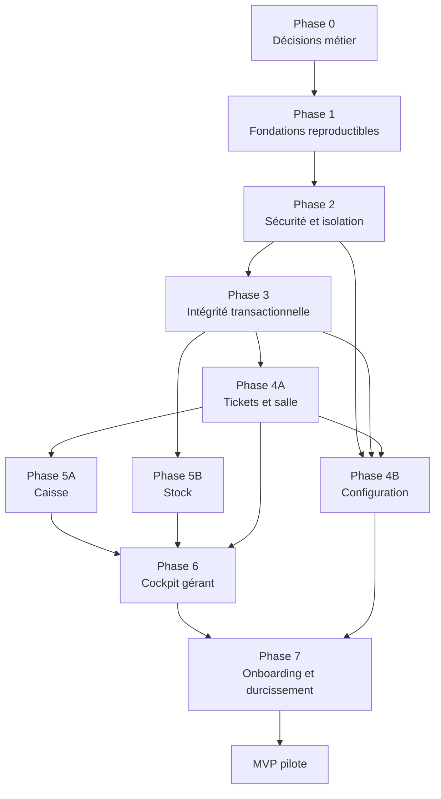
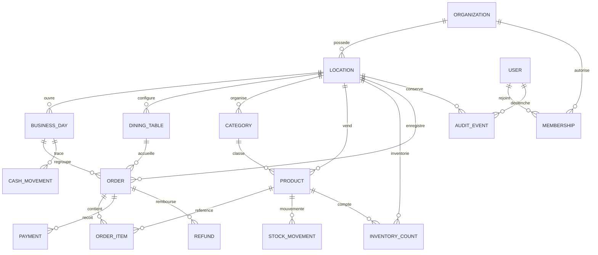

# Kalloud — plan d’exécution du MVP

> Backlog ordonné issu de [`VISION_PRODUIT_ET_AUDIT.md`](./VISION_PRODUIT_ET_AUDIT.md).
>
> Objectif : atteindre un MVP pilotable avec de l’argent réel, des données fiables et une isolation SaaS minimale.
>
> Date de création : 4 août 2026.

## Autorité de ce backlog

Les identifiants de tâches de ce fichier sont désormais **canoniques**. Les identifiants du backlog initial des sections 13 et 14 de l’audit sont remplacés par ce plan détaillé et ne doivent plus être utilisés pour piloter l’exécution.

Lorsqu’un identifiant comme `FND-01` ou `SALE-02` est cité sans nom de fichier, il désigne toujours la tâche de `tasks.md`.

## 1. Cible MVP

Le MVP est atteint lorsqu’un établissement pilote peut :

- créer son compte et son établissement ;
- inviter des utilisateurs avec les rôles `OWNER`, `MANAGER` et `CASHIER` ;
- configurer ses tables et son catalogue ;
- ouvrir un service ;
- ouvrir, reprendre, modifier et annuler un ticket ;
- encaisser en espèces, carte ou paiement mixte sans incohérence ;
- décrémenter et expliquer le stock par des mouvements traçables ;
- enregistrer les mouvements de caisse ;
- compter, rapprocher et clôturer la caisse ;
- consulter un cockpit fondé uniquement sur des données réelles ;
- utiliser le produit sur mobile, tablette et desktop avec des erreurs explicites ;
- garantir qu’aucun client ne peut lire ou modifier les données d’un autre.

Le MVP cible **un établissement par organisation**, tout en conservant un modèle de données compatible avec plusieurs établissements.

### Hors périmètre MVP

Ces capacités sont conservées dans le backlog post-MVP :

- recettes, ingrédients et rendements ;
- fournisseurs et commandes d’achat ;
- prévision avancée des ruptures ;
- consolidation multi-établissements ;
- mode hors ligne ;
- intégrations comptables ;
- planning du personnel ;
- abonnement et facturation SaaS ;
- benchmark anonymisé ;
- objectifs configurables ;
- analyses de marge, coût matière et valorisation ;
- analyses avancées de rotation des tables au-delà des indicateurs MVP.

## 2. Règles d’exécution

### Priorités

- `P0` : bloque le MVP ou met en danger l’argent, les données, la sécurité ou le démarrage.
- `P1` : nécessaire à un pilote fiable et utilisable.
- `P2` : amélioration post-MVP.

### États

- `[ ]` à faire ;
- `[-]` en cours ;
- `[x]` terminé ;
- `[!]` bloqué, avec la raison ajoutée sous la tâche.

### Règles de dépendance

- Ne pas commencer une tâche tant que toutes ses dépendances ne sont pas terminées.
- Les tâches d’une même phase sans dépendance mutuelle peuvent être réalisées en parallèle.
- Une décision `DEC-*` doit produire une courte note de décision dans ce fichier ou dans `docs/decisions/`.
- Toute modification du modèle de données doit passer par une migration testée.
- Chaque tâche doit respecter la définition de terminé située à la fin de ce document.

## 3. Chemin de dépendances

Les branches Caisse et Stock de la phase 5 peuvent avancer en parallèle une fois l’encaissement fiable.

## 4. Modèle de données MVP visé

## 5. Phase 0 — Décisions métier bloquantes

Toutes les tâches de cette phase sont `P0`. Traiter `DEC-01` en premier, puis paralléliser les autres selon leurs dépendances.

- [x] **`DEC-01` — Figer le périmètre du MVP**
  - Priorité : `P0`
  - Dépend de : aucune
  - Livrable : une liste « inclus / exclu » validant un établissement par organisation, les trois rôles, le positionnement lounge/café/petite restauration et les parcours obligatoires.
  - Acceptation : chaque fonction du présent fichier est marquée MVP ou post-MVP ; cible commerciale et critères de succès du pilote sont explicites.
  - Décision : [`docs/decisions/DEC-01-perimetre-mvp.md`](./docs/decisions/DEC-01-perimetre-mvp.md).

- [x] **`DEC-02` — Choisir l’architecture d’exécution**
  - Priorité : `P0`
  - Dépend de : `DEC-01`
  - Livrable : décision entre Route Handlers Next.js et API Express autonome.
  - Recommandation : intégrer l’API à Next.js pour le MVP afin d’obtenir des appels same-origin et un seul déploiement.
  - Acceptation : cible locale, CI et production documentées ; stratégie d’URL, secrets et migrations définie.
  - Décision : [`docs/decisions/DEC-02-architecture-execution.md`](./docs/decisions/DEC-02-architecture-execution.md) — Next.js Route Handlers retenu.

- [x] **`DEC-03` — Définir le cycle de vie d’une commande**
  - Priorité : `P0`
  - Dépend de : `DEC-01`
  - Livrable : états et transitions `OPEN → PAID`, `OPEN → CANCELLED`, `PAID → REFUNDED`.
  - Acceptation : « commande », « ticket » et « vente » ont chacun une définition ; une seule notion de vente directe est retenue.
  - Décision : [`docs/decisions/DEC-03-cycle-vie-commande.md`](./docs/decisions/DEC-03-cycle-vie-commande.md).

- [x] **`DEC-04` — Définir la journée de caisse**
  - Priorité : `P0`
  - Dépend de : `DEC-01`
  - Livrable : règle précisant s’il s’agit d’un service ou d’un jour calendaire, avec fuseau horaire, passage de minuit et comptage aveugle ou non.
  - Acceptation : ouverture, ordre d’affichage compté/attendu, clôture, réouverture éventuelle et traitement des tickets ouverts sont définis.
  - Décision : [`docs/decisions/DEC-04-journee-caisse.md`](./docs/decisions/DEC-04-journee-caisse.md) — session de caisse non aveugle, sans réouverture.

- [x] **`DEC-05` — Définir les règles monétaires**
  - Priorité : `P0`
  - Dépend de : `DEC-01`
  - Livrable : devise, TVA, TTC/HT, arrondis, paiements autorisés, inclusion du paiement mixte au MVP, remise et remboursement.
  - Acceptation : taux par classe fiscale et règle de repli sont définis ; formules et cas limites sont illustrés ; `somme des paiements = total` est obligatoire.
  - Décision : [`docs/decisions/DEC-05-regles-monetaires.md`](./docs/decisions/DEC-05-regles-monetaires.md).

- [x] **`DEC-06` — Définir le stock du MVP**
  - Priorité : `P0`
  - Dépend de : `DEC-01`
  - Livrable : décision produit fini versus ingrédients/recettes.
  - Recommandation : produits finis pour le MVP ; recettes et ingrédients après validation du pilote.
  - Acceptation : unités, types de mouvements, règles de stock négatif, méthode d’inventaire et choix solde dérivé versus solde matérialisé sont définis.
  - Décision : [`docs/decisions/DEC-06-stock-mvp.md`](./docs/decisions/DEC-06-stock-mvp.md) — produits finis, solde matérialisé + ledger.

- [x] **`DEC-07` — Définir les rôles et permissions**
  - Priorité : `P0`
  - Dépend de : `DEC-01`, `DEC-05`
  - Livrable : matrice `OWNER`, `MANAGER`, `CASHIER`.
  - Acceptation : chaque rôle précise ses droits sur prix, stock, caisse, remboursement, clôture, utilisateurs et pilotage.
  - Décision : [`docs/decisions/DEC-07-roles-permissions.md`](./docs/decisions/DEC-07-roles-permissions.md).

- [x] **`DEC-08` — Décider le niveau de fonctionnement hors ligne et multi-appareil**
  - Priorité : `P0`
  - Dépend de : `DEC-01`
  - Livrable : décision explicite sur les coupures réseau et le nombre d’appareils simultanés.
  - Recommandation : pas d’encaissement hors ligne pour le MVP ; erreurs explicites et reprise sûre.
  - Acceptation : comportement attendu lors d’une perte réseau avant, pendant et après un encaissement.
  - Décision : [`docs/decisions/DEC-08-offline-multi-appareil.md`](./docs/decisions/DEC-08-offline-multi-appareil.md).

- [x] **`DEC-09` — Définir les KPI et exports du MVP**
  - Priorité : `P0`
  - Dépend de : `DEC-04`, `DEC-05`, `DEC-06`
  - Livrable : dictionnaire des KPI, sources, formules, périodes, comparaisons et fuseau horaire.
  - Acceptation : CA net, commandes, panier moyen, espèces attendues, écart de caisse et alertes de stock sont définis ; format CSV validé.
  - Décision : [`docs/decisions/DEC-09-kpi-exports.md`](./docs/decisions/DEC-09-kpi-exports.md).

- [x] **`DEC-10` — Définir conservation, sauvegarde et suppression**
  - Priorité : `P0`
  - Dépend de : `DEC-01`
  - Livrable : durées de conservation, politique de sauvegarde, restauration, suppression de compte, RPO et RTO cibles.
  - Acceptation : exigences minimales de confidentialité et responsabilités opérationnelles écrites.
  - Décision : [`docs/decisions/DEC-10-conservation-sauvegarde.md`](./docs/decisions/DEC-10-conservation-sauvegarde.md).

### `GATE-0` — Décisions

- [x] Toutes les décisions `DEC-*` sont validées.
- [x] Le périmètre MVP ne contient aucun élément post-MVP.
- [x] Les termes métier utilisés par le code et l’interface sont fixés.

## 6. Phase 1 — Fondations reproductibles

- [x] **`FND-01` — Nettoyer le suivi Git**
  - Priorité : `P0`
  - Dépend de : aucune
  - Livrable : `.gitignore` complet ; retrait de `.next`, caches, fichiers de build et `.env` du suivi.
  - Acceptation : seul `.env.example` est suivi ; aucun secret réel dans l’historique courant ; `git status` reste propre après build.

- [x] **`FND-02` — Mettre à niveau les dépendances critiques**
  - Priorité : `P0`
  - Dépend de : aucune
  - Livrable : version maintenue de Next.js et dépendances compatibles.
  - Acceptation : version cible et support documentés ; build et typecheck réussis ; aucun avis critique ou élevé non documenté ; gabarit `allowBuilds` de `pnpm-workspace.yaml` résolu.
  - Réalisé : Next.js 16.3.0, React 19.2.8, TypeScript 5.9.3 ; `pnpm audit` : 0 avis.

- [x] **`FND-03` — Configurer lint et formatage non interactifs**
  - Priorité : `P0`
  - Dépend de : `FND-02`
  - Livrable : ESLint, formatage et scripts `lint`, `format:check`.
  - Acceptation : commandes sans question interactive et exécutables en CI.

- [x] **`FND-04` — Installer l’infrastructure de tests**
  - Priorité : `P0`
  - Dépend de : `FND-02`
  - Livrable : tests unitaires, intégration PostgreSQL et parcours navigateur.
  - Acceptation : un test exemple de chaque niveau s’exécute localement et en CI ; les tests peuvent réinitialiser leur base.

- [x] **`FND-05` — Installer un système de migrations canonique**
  - Priorité : `P0`
  - Dépend de : `DEC-02`, `FND-02`
  - Livrable : migrations ordonnées remplaçant la séparation fragile entre `schema.sql`, `002-business-days.sql` et les chemins d’initialisation concurrents.
  - Acceptation : une base vide et une base existante convergent vers le même schéma ; les migrations sont idempotentes au niveau attendu.
  - Réalisé : `migrations/000{1..4}_*.sql` + `scripts/migrate.mjs` (`up`/`status`) ; inclut le schéma `SEC-01`, `SEC-02` et `CFG-00`.

- [x] **`FND-06` — Créer un bootstrap de base cohérent**
  - Priorité : `P0`
  - Dépend de : `FND-05`, `DEC-03`, `DEC-04`, `DEC-06`
  - Livrable : seed minimal, journée initiale ou parcours d’ouverture, tables et catalogue de développement.
  - Acceptation : une installation fraîche peut encaisser sans exécuter manuellement un fichier SQL.
  - Réalisé : `scripts/seed.mjs` (idempotent) — organisation/établissement, réglages, classes fiscales, catalogue, 7 tables (sans « Comptoir » fictif, conforme à `DEC-03`), journée déjà ouverte, 3 comptes de développement `OWNER`/`MANAGER`/`CASHIER`. `pnpm run predev` valide le parcours complet depuis zéro.

- [x] **`FND-07` — Consolider l’API et la couche métier**
  - Priorité : `P0`
  - Dépend de : `DEC-02`, `FND-04`, `FND-05`
  - Livrable : architecture retenue, services métier testables et accès base centralisé.
  - Acceptation : aucune règle métier importante dans un composant React ; les endpoints délèguent à des services.
  - Réalisé : 21 Route Handlers sous `app/api/**`, chacun un contrôleur mince délégant à `lib/repositories/*` et `lib/services/*` ; contrôle statique dans `tests/unit/architecture.test.ts`.

- [x] **`FND-08` — Supprimer les URL `localhost` du client**
  - Priorité : `P0`
  - Dépend de : `FND-07`
  - Livrable : appels same-origin ou configuration d’environnement validée.
  - Acceptation : aucun `http://localhost:3001` dans le code client ; fonctionnement HTTPS et depuis un second appareil vérifié.
  - Réalisé : `lib/client/api.ts` (fetch same-origin unique) ; toutes les pages/composants migrés.

- [x] **`FND-09` — Ajouter contrat d’erreur et healthchecks**
  - Priorité : `P0`
  - Dépend de : `FND-07`
  - Livrable : wrapper async, middleware d’erreur, erreurs JSON stables, `/health/live` et `/health/ready`.
  - Acceptation : une base indisponible produit `503` sans arrêter le processus ; aucune erreur SQL sensible n’est renvoyée.
  - Réalisé : `lib/http.ts` (`apiRoute`, enveloppe `{error:{code,message,requestId}}`), `app/api/health/live`, `app/api/health/ready`.

- [x] **`FND-10` — Fournir une commande de démarrage unique**
  - Priorité : `P0`
  - Dépend de : `FND-06`, `FND-07`, `FND-08`, `FND-09`
  - Livrable : scripts base + migrations + application.
  - Acceptation : un nouveau développeur démarre le projet avec les commandes du README uniquement.
  - Réalisé : `pnpm install && pnpm dev` (hook `predev` : `ensure-db` + `migrate` + `seed`) documenté dans `README.md`.

- [x] **`FND-11` — Créer la CI de qualité**
  - Priorité : `P0`
  - Dépend de : `FND-03`, `FND-04`, `FND-05`
  - Livrable : pipeline install, migrations de test, lint, format, typecheck, tests, build et audit.
  - Acceptation : une étape en échec bloque la fusion ; rapports de tests et de sécurité conservés.
  - Réalisé : `.github/workflows/ci.yml`, vérifié en conditions réelles (run GitHub Actions vert, ~1m54s, 7/7 E2E).

- [x] **`FND-12` — Écrire le README d’exploitation**
  - Priorité : `P1`
  - Dépend de : `FND-10`, `FND-11`
  - Livrable : prérequis, installation, variables, migrations, scripts, tests et dépannage.
  - Acceptation : procédure testée depuis une copie neuve.

- [x] **`FND-13` — Reformater le code condensé**
  - Priorité : `P1`
  - Dépend de : `FND-03`
  - Livrable : pages et composants lisibles, types extraits lorsque réutilisés, imports inutiles retirés.
  - Acceptation : aucune modification fonctionnelle ; lint et tests inchangés au vert.

- [x] **`FND-14` — Séparer strictement données de démo et production**
  - Priorité : `P0`
  - Dépend de : `FND-06`, `FND-07`
  - Livrable : déplacement de `database/demo-reset.sql` vers des fixtures protégées, environnement dédié et badge permanent.
  - Acceptation : aucun fallback local plausible lorsque l’API échoue ; aucune donnée démo chargée en production ; un reset destructif refuse de s’exécuter hors environnement démo/test.
  - Réalisé : `database/demo-reset.sql` supprimé (remplacé par `scripts/seed.mjs`, idempotent, dev/test uniquement) ; `scripts/reset-db.mjs` refuse de s’exécuter hors hôte local sauf `ALLOW_DESTRUCTIVE_DB_RESET=true` explicite ; `lib/client/api.ts` ne comporte aucun repli local sur panne API (redirection `/login` sur 401, état d’erreur explicite sinon).

### `GATE-1` — Projet reproductible

- [x] Base neuve, migrations et application démarrent sans action manuelle cachée.
- [x] Build, typecheck, lint, tests et audit passent en CI.
- [x] Une panne de base n’arrête pas le serveur.
- [x] Aucun artefact ou secret local n’est suivi par Git.

## 7. Phase 2 — Sécurité, isolation et fondations UX

Le modèle d’isolation est construit avant les nouveaux flux métier afin d’éviter de réécrire toutes les requêtes après le MVP.

### Sécurité et multi-tenant

- [x] **`SEC-01` — Ajouter organisations, établissements, utilisateurs et memberships**
  - Priorité : `P0`
  - Dépend de : `FND-05`, `DEC-07`
  - Livrable : tables et contraintes d’identité/périmètre.
  - Acceptation : un utilisateur peut appartenir à une organisation avec un rôle et un établissement actif.
  - Réalisé : `migrations/0001_identity_and_tenancy.sql` (`organizations`, `locations`, `users`, `memberships` + tables de session/auth pour `SEC-03`).

- [x] **`SEC-02` — Ajouter `location_id` aux données métier**
  - Priorité : `P0`
  - Dépend de : `SEC-01`, `FND-06`
  - Livrable : migration de catégories, produits, tables, journées, commandes et mouvements.
  - Acceptation : aucune ligne métier sans établissement ; index et contraintes adaptés.
  - Réalisé : `migrations/0003_business_core.sql` — `location_id NOT NULL` + FK composites vers `locations` sur `categories`, `products`, `dining_tables`, `business_days`, `orders`, `cash_movements`. Le cycle de vie canonique des commandes et le ledger de paiements/stock restent `ORD-01`/`SALE-02`/`STK-01` (phase 3), volontairement non anticipés ici.

- [x] **`CFG-00` — Stocker les paramètres métier de l’établissement**
  - Priorité : `P0`
  - Dépend de : `SEC-01`, `SEC-02`, `DEC-04`, `DEC-05`
  - Livrable : schéma pour fuseau horaire, devise, classes fiscales assignables aux catégories/produits, règle de repli et seuil d’écart de caisse.
  - Acceptation : valeurs obligatoires, validées et disponibles dans le contexte serveur avant tout calcul financier.
  - Réalisé : `migrations/0002_location_settings.sql` (`location_settings`, `tax_classes`) ; exposition dans le contexte serveur via `lib/context` (voir `SEC-04`).

- [x] **`SEC-03` — Ajouter l’authentification**
  - Priorité : `P0`
  - Dépend de : `SEC-01`, `FND-07`
  - Livrable : choix d’auth documenté, connexion, déconnexion, réinitialisation, stockage de mot de passe sûr si applicable, session sécurisée, expiration et révocation.
  - Acceptation : toute page et tout endpoint métier exige une session valide ; rotation/révocation testée ; protection contre la force brute définie.
  - Réalisé : `lib/auth/*` (sessions en base, bcrypt, jetons à hash unique, réinitialisation par jeton, révocation totale sur reset), pages `login`/`forgot-password`/`reset-password`. Testé dans `tests/integration/auth.test.ts` (11 cas) et `tests/e2e/auth.spec.ts`.

- [x] **`SEC-04` — Construire le contexte de requête**
  - Priorité : `P0`
  - Dépend de : `SEC-02`, `SEC-03`
  - Livrable : résolution serveur de l’utilisateur, organisation, établissement et rôle.
  - Acceptation : le client ne peut pas imposer librement un `location_id`.
  - Réalisé : `lib/context.ts` (`getRequestContext`/`requireRequestContext`), exclusivement dérivé du cookie de session validé.

- [x] **`SEC-05` — Appliquer les autorisations par rôle**
  - Priorité : `P0`
  - Dépend de : `SEC-04`, `DEC-07`
  - Livrable : guards réutilisables et matrice codée.
  - Acceptation : chaque mutation sensible vérifie le rôle côté serveur ; les refus renvoient `403`.
  - Réalisé : `lib/authz.ts` (`can`/`requirePermission`), matrice testée ligne à ligne dans `tests/unit/authz.test.ts` contre `DEC-07`.

- [x] **`SEC-06` — Scoper toutes les requêtes par établissement**
  - Priorité : `P0`
  - Dépend de : `SEC-04`
  - Livrable : point d’accès base unique exigeant le contexte d’établissement, repositories scopés et contrôle empêchant les requêtes métier directes.
  - Acceptation : aucune lecture, agrégation ou mutation globale non justifiée ; tests ou contrôle statique détectent un accès non scopé.
  - Réalisé : `lib/repositories/*` (chaque fonction exige `locationId`), contrôle statique dans `tests/unit/architecture.test.ts` (aucun `.query()` direct sous `app/api/**`) ; garantie prouvée à l’exécution par `SEC-08`.

- [x] **`SEC-07` — Durcir l’exposition HTTP**
  - Priorité : `P0`
  - Dépend de : `SEC-03`, `FND-08`
  - Livrable : CORS same-origin ou allowlist, en-têtes de sécurité, limites de corps, cookies sécurisés, protection CSRF et limitation de débit sur authentification/mutations sensibles.
  - Acceptation : aucune origine arbitraire ne peut appeler une mutation authentifiée ; tentatives répétées limitées et journalisées.
  - Réalisé : `proxy.ts` (CSP/HSTS/X-Frame-Options, vérification d’origine, limite de débit, limite de taille de corps) + `lib/auth/rate-limit.ts` (verrou par e-mail/IP journalisé en base).

- [x] **`SEC-08` — Tester l’isolation des tenants**
  - Priorité : `P0`
  - Dépend de : `SEC-05`, `SEC-06`, `FND-04`
  - Livrable : tests positifs et négatifs entre deux organisations.
  - Acceptation : toutes les tentatives de lecture ou modification croisée échouent.
  - Réalisé : `tests/integration/tenant-isolation.test.ts` (14 cas, couche repository/service) + `tests/e2e/tenant-isolation.spec.ts` (couche HTTP complète).

- [x] **`SEC-09` — Créer le journal d’audit métier**
  - Priorité : `P0`
  - Dépend de : `SEC-04`, `SEC-05`, `FND-05`
  - Livrable : `audit_events` avec auteur, établissement, action, cible, avant/après et date.
  - Acceptation : service réutilisable et non modifiable par les rôles opérationnels.
  - Réalisé : `lib/audit.ts` (`recordAuditEvent`/`listAuditEvents`, aucune fonction de mise à jour/suppression exposée) ; appelé depuis l’encaissement, la clôture et les mouvements de caisse.

- [x] **`OPS-01` — Ajouter logs structurés et corrélation**
  - Priorité : `P0`
  - Dépend de : `FND-09`, `SEC-04`
  - Livrable : identifiant de requête, utilisateur, établissement, route, durée et résultat.
  - Acceptation : une erreur d’encaissement peut être suivie du navigateur jusqu’à la base sans exposer de secret.
  - Réalisé : `lib/logger.ts` (JSON structuré via `AsyncLocalStorage`, champs sensibles redacted), `x-request-id` propagé dans les réponses.

### Fondations UX et accessibilité

- [x] **`UX-01` — Standardiser les états asynchrones**
  - Priorité : `P0`
  - Dépend de : `FND-09`, `FND-14`, `DEC-08`
  - Livrable : composants/patterns chargement, vide, erreur, retry, succès et hors-ligne.
  - Acceptation : aucun `catch(() => {})` silencieux ; aucune valeur démo présentée après une panne.
  - Réalisé : `lib/client/api.ts`, `lib/client/use-async-data.ts`, `components/ui/async-section.tsx` ; appliqué à `caisse`, `stock`, `bilan`. Le mode hors-ligne complet (`DEC-08`) reste hors MVP ; les échecs réseau produisent un état d’erreur explicite avec nouvelle tentative.

- [x] **`UX-02` — Créer un composant de dialogue accessible**
  - Priorité : `P0`
  - Dépend de : `FND-03`
  - Livrable : `dialog`, titre associé, `aria-modal`, focus initial, piège de focus, Échap et restauration du focus.
  - Acceptation : les trois tiroirs actuels utilisent ce composant et restent utilisables au clavier.
  - Réalisé : `components/ui/dialog.tsx` (natif `<dialog>` + `showModal()`) ; adopté par `order-drawer`, `close-day-modal`, `cash-movement-modal`.

- [x] **`UX-03` — Corriger noms, états et annonces accessibles**
  - Priorité : `P0`
  - Dépend de : `FND-03`
  - Livrable : labels, `aria-current`, `aria-pressed`/radios, noms des boutons icône et régions live.
  - Acceptation : tous les contrôles ont un nom ; erreurs et confirmations dynamiques sont annoncées.
  - Réalisé : `aria-current="page"` sur la nav active, `role="radiogroup"`/`aria-checked` sur catégories/paiement/mouvement, noms accessibles sur tous les boutons icône, régions `role="status"`/`role="alert"`, lien d’évitement (`skip-link`).

- [x] **`UX-04` — Corriger contraste et responsive**
  - Priorité : `P1`
  - Dépend de : `FND-03`
  - Livrable : couleurs WCAG AA, breakpoint tablette revu, navigation avec safe areas.
  - Acceptation : aucun chevauchement à 320, 375, 700, 768 et 1024 px ; texte normal au moins `4,5:1`, composants graphiques/contrôles au moins `3:1`, notamment les valeurs initiales auditées à `4,15:1`, `3,09:1`, `2,69:1` et `1,20:1`.
  - Réalisé : `--muted` `#718078→#526058` (6,62:1), `--line-strong` `#7f8c83` pour les bordures de champ (3,51:1), palier 700/900px au lieu d’un seul breakpoint à 700px, `safe-area-inset-bottom` sur la navigation et les feuilles, anneau `:focus-visible` global.

- [x] **`UX-05` — Standardiser les formulaires et erreurs**
  - Priorité : `P0`
  - Dépend de : `UX-01`, `UX-03`
  - Livrable : champs requis, validation inline, `aria-invalid`, erreurs liées et conservation de la saisie.
  - Acceptation : aucune erreur uniquement globale ou uniquement colorée.
  - Réalisé : `components/ui/text-field.tsx` (label réel, `aria-invalid`, `aria-describedby`) utilisé par les formulaires d’authentification et les modales de caisse.

- [x] **`UX-06` — Normaliser le vocabulaire**
  - Priorité : `P0`
  - Dépend de : `DEC-03`, `DEC-04`, `DEC-06`
  - Livrable : libellés cohérents pour ticket, commande, vente, service, clôture, vente directe et catégories.
  - Acceptation : suppression des promesses trompeuses « temps réel » et « ticket en cours » tant qu’elles ne sont pas vraies.
  - Réalisé : « Ticket en cours » → « Nouvelle commande »/« Occupée » (n’implique plus une persistance qui n’existe pas encore) ; « Inventaire en temps réel » retiré ; « Nouvelle journée » → « Clôturer le service » ; rôles affichés via `ROLE_LABELS` (`lib/authz.ts`).

### `GATE-2` — Périmètre sécurisé

- [x] Toutes les routes métier exigent une session.
- [x] Toutes les requêtes sont limitées à l’établissement courant.
- [x] Les rôles sont vérifiés côté serveur.
- [x] Les écrans ne masquent plus les pannes.
- [x] Les primitives d’interface respectent le clavier et les noms accessibles.

## 8. Phase 3 — Intégrité transactionnelle

### Contrats et modèles fondamentaux

- [x] **`API-01` — Créer les schémas de validation partagés**
  - Priorité : `P0`
  - Dépend de : `FND-07`, `SEC-05`, `DEC-05`, `DEC-06`
  - Livrable : validation des identifiants, quantités, montants, périodes, enums et réponses.
  - Acceptation : toute entrée invalide retourne une erreur métier stable avant l’accès base.
  - Mise en œuvre : `lib/validation/` (primitives, schémas par endpoint, parsing) ; toutes les routes métier migrées ; `ValidationError` porte un détail par champ. Le test d’intégration compte les accès base pour prouver le « avant », et un contrôle statique interdit `readJsonBody` sans schéma.

- [x] **`API-02` — Ajouter idempotence et contrôle de concurrence**
  - Priorité : `P0`
  - Dépend de : `API-01`, `OPS-01`
  - Livrable : clé d’idempotence pour les opérations financières, stockage, portée par établissement, unicité, TTL, stratégie de verrouillage et conflits.
  - Acceptation : un double clic ou retry réseau ne crée jamais deux encaissements ; une clé réutilisée avec un autre payload est refusée.
  - Mise en œuvre : `migrations/0005_idempotency_keys.sql`, `lib/idempotency.ts`, en-tête `Idempotency-Key` obligatoire sur `POST /api/checkout` et `POST /api/cash-movements` ; fusion et tri des lignes avant verrouillage dans l’encaissement. Documenté dans [`docs/idempotence-et-concurrence.md`](./docs/idempotence-et-concurrence.md). L’UX « état incertain / récupération » reste à `SALE-08`.

- [ ] **`ORD-01` — Migrer vers le cycle de vie canonique des commandes**
  - Priorité : `P0`
  - Dépend de : `FND-05`, `SEC-02`, `DEC-03`
  - Livrable : colonnes et contraintes pour `OPEN`, `PAID`, `CANCELLED`, `REFUNDED`, auteur, notes, timestamps, snapshots fiscaux et numéro de commande unique par établissement.
  - Acceptation : transitions contraintes ; ancien modèle `PENDING/COMPLETED` et endpoint de finalisation inaccessible retirés ou migrés.

- [ ] **`CASH-01` — Fiabiliser le modèle de journée de caisse**
  - Priorité : `P0`
  - Dépend de : `FND-05`, `FND-06`, `SEC-02`, `CFG-00`, `DEC-04`
  - Livrable : schéma canonique, première ouverture possible et état réel.
  - Acceptation : au plus une journée ouverte par établissement ; le fuseau métier est appliqué.

- [ ] **`STK-01` — Créer le ledger de mouvements de stock**
  - Priorité : `P0`
  - Dépend de : `FND-05`, `SEC-02`, `DEC-06`
  - Livrable : `stock_movements` avec quantité signée, type, motif, auteur, produit, établissement et référence, plus stratégie de solde dérivé ou matérialisé décidée en `DEC-06`.
  - Acceptation : le solde est reconstructible ; s’il est matérialisé, il est mis à jour dans la même transaction et reste égal au ledger.

- [ ] **`STK-02` — Migrer les stocks initiaux**
  - Priorité : `P0`
  - Dépend de : `STK-01`, `FND-06`
  - Livrable : mouvements `OPENING_BALANCE` pour les quantités existantes.
  - Acceptation : solde avant/après migration identique et vérifié par test.

- [ ] **`STK-03` — Créer le service transactionnel de stock**
  - Priorité : `P0`
  - Dépend de : `STK-01`, `STK-02`, `API-01`
  - Livrable : réservation/décrément atomique et refus du stock négatif.
  - Acceptation : doublons d’un même produit agrégés ; concurrence testée.

- [ ] **`SALE-01` — Exposer un catalogue réel et scopé**
  - Priorité : `P0`
  - Dépend de : `API-01`, `SEC-06`, `CFG-00`
  - Livrable : API des produits actifs avec ID, catégorie, prix, règle fiscale, unité, stock et disponibilité.
  - Acceptation : source unique pour caisse et stock ; pagination/recherche si nécessaire.

- [ ] **`SALE-02` — Créer le modèle de paiements**
  - Priorité : `P0`
  - Dépend de : `FND-05`, `SEC-02`, `DEC-05`
  - Livrable : lignes `payments` séparées avec type `CHARGE/REFUND`, méthode, montant et lien de remboursement.
  - Acceptation : contraintes monétaires ; charges nettes vérifiables ; migration des données de démo.

- [ ] **`SALE-03` — Réécrire l’encaissement canonique**
  - Priorité : `P0`
  - Dépend de : `ORD-01`, `CASH-01`, `STK-03`, `SALE-01`, `SALE-02`, `CFG-00`, `API-01`, `API-02`
  - Livrable : service serveur calculant sous-total, taxe, total TTC, paiements, commande et mouvements de stock dans une transaction.
  - Acceptation : `cash + card = total TTC`, snapshots fiscaux persistés, `stock >= 0`, calcul uniquement côté serveur et rollback complet.

### Interface d’encaissement

- [ ] **`SALE-04` — Charger le catalogue réel dans le ticket**
  - Priorité : `P0`
  - Dépend de : `SALE-01`, `UX-01`
  - Livrable : suppression des constantes produits et des IDs locaux.
  - Acceptation : produit affiché, prix utilisé et produit déstocké sont identiques.

- [ ] **`SALE-05` — Implémenter espèces, carte et mixte**
  - Priorité : `P0`
  - Dépend de : `SALE-03`, `DEC-05`, `UX-02`, `UX-03`, `UX-05`
  - Livrable : saisie du split mixte et validation des montants.
  - Acceptation : les trois moyens de paiement produisent la ventilation attendue.

- [ ] **`SALE-06` — Utiliser la réponse serveur comme vérité**
  - Priorité : `P0`
  - Dépend de : `SALE-03`, `SALE-04`
  - Livrable : affichage du total serveur et revalidation CA, caisse, table et stock.
  - Acceptation : aucune incrémentation financière calculée uniquement côté client ; une vente espèces rafraîchit le solde espèces.

- [ ] **`SALE-07` — Gérer ruptures et indisponibilités**
  - Priorité : `P1`
  - Dépend de : `SALE-01`, `SALE-03`, `SALE-04`
  - Livrable : produits indisponibles visibles mais non ajoutables, message si le stock change avant paiement.
  - Acceptation : aucun échec de stock tardif sans explication et possibilité de corriger le ticket.

- [ ] **`SALE-08` — Rendre le retry d’encaissement sûr**
  - Priorité : `P0`
  - Dépend de : `SALE-03`, `API-02`, `UX-01`, `DEC-08`
  - Livrable : clé d’idempotence envoyée par le client, état incertain et récupération.
  - Acceptation : retry après timeout sans doublon ; résultat existant récupéré.

- [ ] **`SALE-09` — Tester tous les invariants de vente**
  - Priorité : `P0`
  - Dépend de : `SALE-03`, `SALE-05`, `SALE-06`, `SALE-08`
  - Livrable : tests cash, carte, mixte, TVA, arrondis, stock insuffisant, doublons, concurrence et idempotence.
  - Acceptation : tests reproduisent les anomalies initiales puis prouvent leur correction.

- [ ] **`SALE-10` — Tester l’expérience de rupture**
  - Priorité : `P1`
  - Dépend de : `SALE-07`, `SALE-09`
  - Livrable : tests produit indisponible, changement de stock avant paiement et correction du ticket.
  - Acceptation : aucune rupture n’aboutit à un échec tardif incompréhensible.

### `GATE-3` — Encaissement fiable

- [ ] Les IDs et prix viennent uniquement du catalogue serveur.
- [ ] La somme des paiements égale toujours le total serveur.
- [ ] Aucun stock négatif n’est possible.
- [ ] Un retry ne crée pas de vente en double.
- [ ] Les indicateurs locaux se resynchronisent après paiement.

## 9. Phase 4A — Tickets persistants et parcours de salle

- [ ] **`ORD-02` — Créer les services de ticket ouvert**
  - Priorité : `P0`
  - Dépend de : `ORD-01`, `API-01`, `SEC-05`, `SEC-06`
  - Livrable : créer, lire, modifier et reprendre une commande `OPEN`.
  - Acceptation : une table ne possède au plus qu’un ticket ouvert actif ; aucun ancien endpoint de finalisation concurrent ne reste exposé.

- [ ] **`ORD-03` — Dériver l’état des tables des tickets**
  - Priorité : `P0`
  - Dépend de : `ORD-02`
  - Livrable : statut libre/occupé cohérent avec la commande ouverte.
  - Acceptation : aucune table occupée sans ticket ; aucun `PATCH` optimiste sans rollback.

- [ ] **`ORD-04` — Ouvrir ou reprendre un ticket depuis la salle**
  - Priorité : `P0`
  - Dépend de : `ORD-02`, `ORD-03`, `SALE-04`, `UX-01`, `UX-02`, `UX-06`
  - Livrable : tiroir alimenté par la commande persistée.
  - Acceptation : fermer, changer de route ou rafraîchir ne perd aucun article.

- [ ] **`ORD-05` — Sauvegarder les modifications et gérer les conflits**
  - Priorité : `P0`
  - Dépend de : `ORD-04`, `API-02`, `DEC-08`
  - Livrable : ajout/suppression/quantité persistés avec version ou stratégie de conflit.
  - Acceptation : deux appareils ne s’écrasent pas silencieusement ; l’utilisateur peut recharger l’état courant.

- [ ] **`ORD-06` — Annuler un ticket ouvert**
  - Priorité : `P0`
  - Dépend de : `ORD-02`, `ORD-03`, `ORD-04`, `SEC-09`
  - Livrable : confirmation, motif, audit et libération de table.
  - Acceptation : aucune annulation silencieuse ; ticket conservé en historique.

- [ ] **`ORD-07` — Unifier la vente directe**
  - Priorité : `P0`
  - Dépend de : `DEC-03`, `ORD-02`, `ORD-04`
  - Livrable : un seul parcours « Vente directe » ou « Comptoir ».
  - Acceptation : aucun doublon conceptuel et historique clairement identifiable.

- [ ] **`ORD-08` — Ajouter auteur et notes**
  - Priorité : `P1`
  - Dépend de : `ORD-02`, `SEC-04`
  - Livrable : serveur responsable, notes de commande et historique des modifications utiles.
  - Acceptation : le gérant peut identifier l’auteur d’une opération.

- [ ] **`ORD-09` — Générer numéro de commande et justificatif**
  - Priorité : `P0`
  - Dépend de : `ORD-01`, `SALE-03`, `DEC-05`
  - Livrable : numéro unique, détail articles, paiements, taxes et date.
  - Acceptation : justificatif cohérent avec les montants persistés.

- [ ] **`ORD-10` — Implémenter annulation financière et remboursement**
  - Priorité : `P0`
  - Dépend de : `ORD-09`, `SALE-03`, `SEC-05`, `SEC-09`
  - Livrable : enregistrement `refund`, ligne de paiement `REFUND`, remboursement total/partiel selon décision, motif et permission manager.
  - Acceptation : aucune suppression de vente ; effets sur paiement net, espèces, taxes et stock explicitement compensés.

- [ ] **`ORD-11` — Implémenter les remises encadrées**
  - Priorité : `P1`
  - Dépend de : `DEC-05`, `SALE-03`, `SEC-05`, `SEC-09`
  - Livrable : règles de remise, motif et autorisation.
  - Acceptation : remise incluse dans total, taxes, reçu et audit.

- [ ] **`ORD-12` — Construire l’historique réel des commandes**
  - Priorité : `P0`
  - Dépend de : `ORD-02`, `ORD-09`, `ORD-10`
  - Livrable : endpoint filtrable et paginé avec détail.
  - Acceptation : remplace toutes les commandes codées en dur.

- [ ] **`ORD-13` — Tester le cycle complet d’un ticket**
  - Priorité : `P0`
  - Dépend de : `ORD-05`, `ORD-06`, `ORD-07`, `ORD-09`, `ORD-10`, `ORD-12`
  - Livrable : tests création, reprise, multi-appareil, annulation, paiement, remboursement et rechargement.
  - Acceptation : aucun ticket perdu et aucune table bloquée.

- [ ] **`ORD-14` — Tester notes, remises, taxes et audit**
  - Priorité : `P1`
  - Dépend de : `ORD-08`, `ORD-09`, `ORD-11`, `ORD-13`
  - Livrable : tests des informations complémentaires qui modifient le total ou le justificatif.
  - Acceptation : remise, TVA, notes, reçu et événements d’audit se réconcilient avec la commande.

### `GATE-4A` — Salle exploitable

- [ ] Toute table occupée possède un ticket ouvert.
- [ ] Tout ticket ouvert est reprenable après rafraîchissement.
- [ ] Annulation, paiement et remboursement laissent une trace.
- [ ] La vente directe n’existe qu’une seule fois.

## 10. Phase 4B — Configuration de l’établissement

- [ ] **`CFG-01` — Gérer les paramètres de l’établissement**
  - Priorité : `P0`
  - Dépend de : `CFG-00`, `SEC-04`, `SEC-05`, `UX-05`, `UX-06`
  - Livrable : écran pour nom, fuseau horaire, devise, règles fiscales retenues et seuil d’écart de caisse.
  - Acceptation : paramètres validés côté serveur, réservés au rôle autorisé et utilisés par caisse/dashboard.

- [ ] **`CFG-02` — Gérer catégories et produits**
  - Priorité : `P0`
  - Dépend de : `SALE-01`, `SEC-05`, `SEC-06`, `SEC-09`, `UX-05`
  - Livrable : créer, modifier, activer/désactiver un produit, son prix, sa catégorie, sa classe fiscale, son unité et son seuil.
  - Acceptation : changements audités ; produit désactivé absent de la caisse mais conservé dans l’historique.

- [ ] **`CFG-03` — Gérer le plan de salle**
  - Priorité : `P0`
  - Dépend de : `ORD-03`, `SEC-05`, `SEC-06`, `SEC-09`, `UX-05`
  - Livrable : créer, renommer, ordonner et désactiver une table.
  - Acceptation : impossibilité de désactiver silencieusement une table avec ticket ouvert ; changements audités.

- [ ] **`CFG-04` — Tester la configuration**
  - Priorité : `P0`
  - Dépend de : `CFG-01`, `CFG-02`, `CFG-03`
  - Livrable : tests permissions, validation, historique et répercussion sur la caisse.
  - Acceptation : un manager non autorisé ne modifie pas les réglages réservés au propriétaire.

### `GATE-4B` — Établissement configurable

- [ ] Le propriétaire configure son établissement sans SQL.
- [ ] Catalogue, catégories et tables sont administrables.
- [ ] Prix et désactivations conservent l’historique des ventes.
- [ ] Fuseau, devise et règles fiscales sont réellement appliqués.

## 11. Phase 5A — Caisse réconciliable

- [ ] **`CASH-02` — Séparer ouverture et clôture**
  - Priorité : `P0`
  - Dépend de : `CASH-01`, `DEC-04`, `UX-02`, `UX-06`, `API-01`
  - Livrable : actions et endpoints distincts, termes « Ouvrir le service » et « Compter et clôturer ».
  - Acceptation : aucune nouvelle journée ouverte implicitement sans choix.

- [ ] **`CASH-03` — Fiabiliser les mouvements de caisse**
  - Priorité : `P0`
  - Dépend de : `CASH-01`, `API-01`, `SEC-05`, `SEC-09`
  - Livrable : entrée/sortie avec montant positif, catégorie, motif, auteur et établissement ; un retrait de fin de service est une catégorie de sortie.
  - Acceptation : erreurs serveur affichées ; mouvement immuable et auditable ; aucun retrait compté deux fois.

- [ ] **`CASH-04` — Calculer les espèces attendues**
  - Priorité : `P0`
  - Dépend de : `CASH-03`, `SALE-03`
  - Livrable : `fond initial + paiements espèces nets + entrées - sorties`, les paiements nets intégrant les remboursements espèces.
  - Acceptation : formule partagée par API, clôture et dashboard ; aucun double comptage des retraits ; tests chiffrés avec remboursement.

- [ ] **`CASH-05` — Saisir les espèces comptées et l’écart**
  - Priorité : `P0`
  - Dépend de : `CASH-02`, `CASH-04`, `CFG-00`, `DEC-04`, `UX-05`
  - Livrable : comptage, prochain fond, écart et justification au-delà d’un seuil.
  - Acceptation : montant vide ou invalide refusé ; ordre d’affichage compté/attendu conforme à `DEC-04` ; auteur et horodatage conservés.

- [ ] **`CASH-06` — Sécuriser la clôture**
  - Priorité : `P0`
  - Dépend de : `CASH-05`, `ORD-02`, `API-02`
  - Livrable : blocage ou traitement explicite des tickets ouverts et protection contre double clôture.
  - Acceptation : deux requêtes concurrentes ne ferment pas deux fois ; liste des tickets bloquants affichée.

- [ ] **`CASH-07` — Brancher le journal réel et rafraîchir la caisse**
  - Priorité : `P1`
  - Dépend de : `CASH-03`, `SALE-06`, `UX-01`
  - Livrable : journal filtré de la journée et solde rafraîchi après vente/mouvement.
  - Acceptation : suppression des lignes +150/−20 codées en dur.

- [ ] **`CASH-08` — Tester ouverture, mouvements et clôture**
  - Priorité : `P0`
  - Dépend de : `CASH-04`, `CASH-05`, `CASH-06`
  - Livrable : tests formules, remboursement espèces, fuseau, passage de minuit, écarts, tickets ouverts et concurrence.
  - Acceptation : caisse attendue entièrement reconstructible pour chaque scénario.

- [ ] **`CASH-09` — Tester journal et rafraîchissement de l’interface**
  - Priorité : `P1`
  - Dépend de : `CASH-07`, `CASH-08`
  - Livrable : tests des données réelles, états réseau et mise à jour après vente/mouvement.
  - Acceptation : aucune ligne fictive et aucun solde obsolète après une opération réussie.

## 12. Phase 5B — Stock traçable

- [ ] **`STK-04` — Créer l’ajustement atomique de stock**
  - Priorité : `P0`
  - Dépend de : `STK-03`, `API-01`, `SEC-05`, `SEC-09`
  - Livrable : mutation en delta avec type, quantité et motif.
  - Acceptation : aucune mise à jour absolue depuis un état client périmé ; anciens endpoints d’écriture absolue retirés.

- [ ] **`STK-05` — Remplacer `prompt()` par un formulaire**
  - Priorité : `P1`
  - Dépend de : `STK-04`, `UX-02`, `UX-05`
  - Livrable : dialogue contextualisé avec quantité, type, motif, chargement et résultat.
  - Acceptation : bouton global « Recharger » mène à un vrai parcours.

- [ ] **`STK-06` — Ajouter les opérations de stock MVP**
  - Priorité : `P1`
  - Dépend de : `STK-04`, `DEC-06`
  - Livrable : réception, correction, casse/perte et retour.
  - Acceptation : chaque opération produit un mouvement signé, motivé et attribué.

- [ ] **`STK-07` — Ajouter l’inventaire physique**
  - Priorité : `P1`
  - Dépend de : `STK-04`
  - Livrable : saisie du comptage, écart et mouvements de correction.
  - Acceptation : stock avant, compté, différence, auteur et date consultables.

- [ ] **`STK-08` — Fiabiliser la liste et les alertes**
  - Priorité : `P1`
  - Dépend de : `STK-05`, `STK-06`, `STK-07`, `UX-01`
  - Livrable : données réelles, état vide, recherche sans résultat, seuils et resynchronisation multi-appareil.
  - Acceptation : « temps réel » utilisé uniquement si garanti ; alertes fondées sur le solde serveur.

- [ ] **`STK-09` — Tester le ledger de stock**
  - Priorité : `P0`
  - Dépend de : `STK-03`, `STK-04`
  - Livrable : tests vente, ajustement, concurrence et invariant du solde.
  - Acceptation : le solde courant égale toujours la somme des mouvements.

- [ ] **`STK-10` — Tester les opérations et l’interface de stock**
  - Priorité : `P1`
  - Dépend de : `STK-06`, `STK-07`, `STK-08`, `STK-09`
  - Livrable : tests réception, perte, correction, inventaire, alertes, état vide et resynchronisation.
  - Acceptation : chaque opération visible correspond à un mouvement auditable.

### `GATE-5` — Exploitation réconciliable

- [ ] Une journée de caisse peut être ouverte, comptée et clôturée.
- [ ] Tout écart de caisse est visible et justifiable.
- [ ] Tout mouvement de caisse possède un auteur et un motif.
- [ ] Tout stock courant est reconstructible depuis son ledger.
- [ ] Caisse et Stock peuvent être utilisés sans `prompt()`, `alert()` ou données fictives.

## 13. Phase 6 — Cockpit gérant

- [ ] **`BI-01` — Implémenter le contrat des métriques**
  - Priorité : `P0`
  - Dépend de : `DEC-09`, `ORD-12`, `CASH-04`, `STK-09`
  - Livrable : service de métriques avec formules versionnées et tests.
  - Acceptation : chaque KPI expose source, période, fuseau et fraîcheur.

- [ ] **`BI-02` — Créer les requêtes d’historique filtrées**
  - Priorité : `P0`
  - Dépend de : `BI-01`, `SEC-06`
  - Livrable : ventes, paiements, commandes, caisse et stock paginés et filtrables.
  - Acceptation : aucune agrégation entre établissements ; performances mesurées.

- [ ] **`BI-03` — Clarifier service et périodes calendaires**
  - Priorité : `P0`
  - Dépend de : `BI-02`, `CASH-01`, `CFG-00`, `DEC-04`
  - Livrable : filtres « Service en cours », jour, mois, année et plage.
  - Acceptation : mois/années dynamiques ; aucun filtre visible s’il est ignoré.

- [ ] **`BI-04` — Supprimer tous les historiques fictifs**
  - Priorité : `P0`
  - Dépend de : `BI-02`, `UX-01`
  - Livrable : vraies commandes et vrais mouvements de caisse.
  - Acceptation : aucune constante métier dans `app/bilan`.

- [ ] **`BI-05` — Construire le bandeau de contexte**
  - Priorité : `P1`
  - Dépend de : `BI-03`, `UX-01`
  - Livrable : établissement, période, état du service et dernière synchronisation.
  - Acceptation : le gérant connaît toujours le périmètre des chiffres.

- [ ] **`BI-06` — Ajouter les alertes actionnables**
  - Priorité : `P1`
  - Dépend de : `ORD-12`, `CASH-05`, `STK-08`, `BI-02`, `CFG-00`
  - Livrable : écart de caisse, rupture, ticket ancien, anomalie et clôture en retard.
  - Acceptation : maximum cinq alertes prioritaires ; chacune ouvre l’action correspondante.

- [ ] **`BI-07` — Ajouter performance et comparaison**
  - Priorité : `P1`
  - Dépend de : `BI-01`, `BI-03`
  - Livrable : CA net, commandes, panier moyen et comparaison pertinente.
  - Acceptation : comparaison avec période précédente comparable et calcul testé.

- [ ] **`BI-08` — Ajouter tendances et ventilation des ventes**
  - Priorité : `P1`
  - Dépend de : `BI-02`, `ORD-12`
  - Livrable : évolution heure/jour, ventes par catégorie/produit, rotation des tables et durée moyenne de service.
  - Acceptation : chaque valeur mène aux commandes sources ; calcul de rotation limité aux tickets avec table.

- [ ] **`BI-09` — Ajouter le bloc de rapprochement de caisse**
  - Priorité : `P1`
  - Dépend de : `CASH-05`, `CASH-07`, `BI-01`
  - Livrable : fond, ventes espèces, entrées, sorties, attendu, compté et écart.
  - Acceptation : valeurs identiques au détail de clôture, y compris après remboursement espèces.

- [ ] **`BI-10` — Ajouter le bloc stock à risque**
  - Priorité : `P1`
  - Dépend de : `STK-08`, `BI-01`
  - Livrable : ruptures, sous-seuils et actions de réapprovisionnement.
  - Acceptation : alerte ouvre le produit et son formulaire de mouvement.

- [ ] **`BI-11` — Implémenter le drill-down et “Voir tout”**
  - Priorité : `P1`
  - Dépend de : `BI-04`, `BI-07`, `BI-08`, `BI-09`, `BI-10`
  - Livrable : pages/drawers de détail, pagination et filtres conservés.
  - Acceptation : aucun bouton sans action ; retour au dashboard sans perdre le contexte.

- [ ] **`BI-12` — Ajouter l’export CSV**
  - Priorité : `P1`
  - Dépend de : `BI-02`, `DEC-09`
  - Livrable : exports ventes, paiements, caisse et stock selon périmètre validé.
  - Acceptation : colonnes, encodage, dates, montants et autorisations testés.

- [ ] **`BI-13` — Tester toutes les métriques**
  - Priorité : `P0`
  - Dépend de : `BI-01`, `BI-02`, `BI-03`, `BI-04`
  - Livrable : fixtures contrôlées et tests des formules fondamentales, périodes, fuseaux, remboursements et isolation.
  - Acceptation : les totaux fondamentaux se réconcilient avec commandes, paiements, caisse et stock.

- [ ] **`BI-14` — Tester le cockpit complet**
  - Priorité : `P1`
  - Dépend de : `BI-05`, `BI-06`, `BI-07`, `BI-08`, `BI-09`, `BI-10`, `BI-11`, `BI-12`, `BI-13`
  - Livrable : tests des widgets, alertes, drill-down, fraîcheur et exports.
  - Acceptation : les interactions du cockpit expliquent les totaux et respectent filtres/permissions.

### `GATE-6` — Pilotage fiable

- [ ] Aucun contenu du cockpit n’est mocké.
- [ ] Chaque KPI possède une définition et un test.
- [ ] Les détails expliquent chaque total.
- [ ] Les alertes conduisent à une action.
- [ ] L’export respecte exactement les filtres et autorisations.

## 14. Phase 7 — Onboarding, exploitation et sortie MVP

- [ ] **`SAAS-01` — Créer l’onboarding initial**
  - Priorité : `P0`
  - Dépend de : `SEC-03`, `SEC-04`, `CFG-04`, `CASH-02`
  - Livrable : création organisation/établissement, profil propriétaire, tables, catalogue et ouverture du premier service.
  - Acceptation : aucun SQL ou seed manuel pour un nouveau client.

- [ ] **`SAAS-02` — Gérer l’équipe et les rôles**
  - Priorité : `P1`
  - Dépend de : `SEC-05`, `DEC-07`
  - Livrable : inviter, changer de rôle et désactiver un utilisateur.
  - Acceptation : seuls les rôles autorisés administrent l’équipe ; actions auditées.

- [ ] **`OPS-02` — Ajouter métriques et alertes d’exploitation**
  - Priorité : `P1`
  - Dépend de : `OPS-01`, `SALE-09`, `CASH-08`
  - Livrable : disponibilité, latence, erreurs, encaissements échoués, clôtures et écarts.
  - Acceptation : seuils et destinataires définis ; aucun bruit excessif.

- [ ] **`OPS-03` — Mettre en place sauvegarde et restauration**
  - Priorité : `P0`
  - Dépend de : `FND-05`, `DEC-10`
  - Livrable : sauvegardes automatiques et procédure de restauration répondant aux RPO/RTO de `DEC-10`.
  - Acceptation : restauration testée sur un environnement isolé dans les cibles convenues.

- [ ] **`OPS-04` — Implémenter rétention et suppression**
  - Priorité : `P1`
  - Dépend de : `DEC-10`, `SEC-01`, `SEC-09`
  - Livrable : politiques de rétention, export et suppression/anonymisation.
  - Acceptation : comportement documenté et testé sans casser les obligations comptables retenues.

- [ ] **`OPS-05` — Préparer le déploiement de production**
  - Priorité : `P0`
  - Dépend de : `FND-10`, `FND-11`, `SEC-07`, `OPS-03`
  - Livrable : environnement, secrets, HTTPS, migrations, rollback et healthchecks.
  - Acceptation : déploiement reproductible ; rollback testé ; aucune variable de développement.

- [ ] **`OPS-06` — Vérifier les parcours complets**
  - Priorité : `P0`
  - Dépend de : `ORD-13`, `CASH-08`, `STK-09`, `BI-13`, `CFG-04`, `SAAS-01`
  - Livrable : tests navigateur → API → base → réponse sur les invariants critiques.
  - Acceptation : onboarding, ticket, vente, stock, clôture et métriques fondamentales passent sur une base neuve.

- [ ] **`OPS-06B` — Vérifier tous les parcours P1 du MVP**
  - Priorité : `P1`
  - Dépend de : `OPS-06`, `SALE-10`, `ORD-14`, `CASH-09`, `STK-10`, `BI-14`
  - Livrable : tests complets des opérations, interfaces, drill-down et exports.
  - Acceptation : tous les parcours P1 inclus au MVP passent sur les trois rôles.

- [ ] **`OPS-07` — Faire la recette accessibilité et responsive**
  - Priorité : `P1`
  - Dépend de : `UX-02`, `UX-03`, `UX-04`, `UX-05`, `OPS-06B`
  - Livrable : audit clavier, lecteur d’écran, contrastes et viewports réels.
  - Acceptation : aucun blocage WCAG A/AA connu sur les parcours MVP.

- [ ] **`OPS-08` — Faire la revue de sécurité finale**
  - Priorité : `P0`
  - Dépend de : `SEC-08`, `OPS-05`, `OPS-06`
  - Livrable : revue du socle critique auth, autorisations, isolation, injection, exposition des erreurs et dépendances.
  - Acceptation : aucun finding critique/élevé sur les parcours P0.

- [ ] **`OPS-08B` — Revoir la sécurité des parcours P1**
  - Priorité : `P1`
  - Dépend de : `OPS-06B`, `OPS-08`
  - Livrable : revue différentielle des interfaces et endpoints P1 ajoutés après le socle critique.
  - Acceptation : aucun finding critique/élevé ouvert avant pilote.

- [ ] **`OPS-09` — Préparer les données et la procédure de pilote**
  - Priorité : `P1`
  - Dépend de : `SAAS-01`, `OPS-05`, `FND-12`
  - Livrable : import catalogue/tables, formation, support, retour arrière et collecte de feedback.
  - Acceptation : données de démo séparées des données pilote ; responsable et canal d’incident identifiés.

- [ ] **`CLEAN-01` — Supprimer les chemins morts et doublonnés**
  - Priorité : `P1`
  - Dépend de : `ORD-13`, `STK-09`, `BI-04`, `FND-13`, `FND-14`
  - Livrable : vérification finale du retrait des fallbacks, concepts remplacés, anciens scripts destructifs et endpoints déjà supprimés dans `ORD-01/02` et `STK-04`.
  - Acceptation : un seul cycle de commande, une seule mutation de stock et une seule vente directe ; aucun bouton sans effet ; `database/demo-reset.sql` absent des chemins de production.

- [ ] **`REL-01` — Exécuter la gate de sortie MVP**
  - Priorité : `P0`
  - Dépend de : `SAAS-02`, `OPS-02`, `OPS-03`, `OPS-04`, `OPS-06B`, `OPS-07`, `OPS-08B`, `OPS-09`, `CLEAN-01`
  - Livrable : rapport de release et décision Go/No-Go.
  - Acceptation : `GATE-0`, `GATE-1`, `GATE-2`, `GATE-3`, `GATE-4A`, `GATE-4B`, `GATE-5` et `GATE-6` validées ; critères de `GATE-7` vérifiés ; aucun `P0` ni `P1` du MVP ouvert ; rollback disponible.

### `GATE-7` — MVP pilote

- [ ] Un client peut être onboardé sans intervention en base.
- [ ] Les trois rôles disposent uniquement de leurs permissions.
- [ ] Sauvegarde, restauration, logs, alertes et rollback sont opérationnels.
- [ ] Les parcours complets passent sur mobile, tablette et desktop.
- [ ] Aucun `P0`, aucune vulnérabilité critique/élevée et aucun mock silencieux ne restent ouverts.
- [ ] Le gérant pilote une journée complète et explique ventes, caisse et stock.

---

# Ligne de sortie MVP

Tout ce qui suit est `P2` et ne doit pas retarder le pilote, sauf nouvelle décision métier explicite.

## 15. Backlog post-MVP

- [ ] **`P2-STK-01` — Ajouter ingrédients, recettes, unités et rendements**
  - Dépend de : `STK-09`, validation métier du modèle d’ingrédients.
  - Résultat : consommation automatique des composants lors d’une vente.
  - Acceptation : consommation et arrondis d’unités testés ; historique explicable.

- [ ] **`P2-STK-02` — Ajouter fournisseurs, commandes d’achat et réceptions**
  - Dépend de : `P2-STK-01` ou modèle produit fini confirmé.
  - Résultat : cycle achat → réception → stock.
  - Acceptation : une réception rapproche commande, quantité reçue, coût et mouvement de stock.

- [ ] **`P2-STK-03` — Ajouter coûts, valorisation, marge et pertes**
  - Dépend de : `P2-STK-01`, `P2-STK-02`.
  - Résultat : marge brute et valeur de stock fiables.
  - Acceptation : méthode de coût documentée et chiffres réconciliables avec les mouvements.

- [ ] **`P2-STK-04` — Ajouter jours de couverture et prévision de rupture**
  - Dépend de : `P2-STK-03`, historique de consommation suffisant.
  - Résultat : recommandations de réapprovisionnement.
  - Acceptation : horizon, historique utilisé et niveau de confiance visibles.

- [ ] **`P2-BI-01` — Ajouter objectifs configurables**
  - Dépend de : `BI-14`.
  - Résultat : comparaison réel versus objectif par période.
  - Acceptation : objectifs versionnés, autorisés et comparés sur la même période.

- [ ] **`P2-BI-02` — Ajouter marge et coût matière au cockpit**
  - Dépend de : `P2-STK-03`.
  - Résultat : pilotage rentabilité produit/catégorie.
  - Acceptation : drill-down jusqu’aux coûts et ventes sources.

- [ ] **`P2-SAAS-01` — Ajouter plusieurs établissements et consolidation**
  - Dépend de : pilote validé, `SEC-08`, `BI-14`.
  - Résultat : vue consolidée et permissions multi-sites.
  - Acceptation : agrégations sans fuite inter-organisation et fuseaux explicitement gérés.

- [ ] **`P2-SAAS-02` — Ajouter abonnement, essai et facturation**
  - Dépend de : proposition de valeur et tarification validées.
  - Résultat : cycle de vie commercial SaaS.
  - Acceptation : états d’abonnement, webhooks, relances et droits d’accès testés.

- [ ] **`P2-OFF-01` — Ajouter un mode hors ligne**
  - Dépend de : besoin pilote confirmé et stratégie de résolution de conflits.
  - Résultat : opérations autorisées hors connexion avec synchronisation sûre.
  - Acceptation : conflits, doublons et état incertain d’un paiement couverts par des tests.

- [ ] **`P2-INT-01` — Ajouter exports comptables et intégrations**
  - Dépend de : `BI-12`, besoins comptables validés.
  - Résultat : intégration avec les outils retenus.
  - Acceptation : contrats, reprise sur erreur, sécurité et rapprochement documentés.

- [ ] **`P2-OPS-01` — Ajouter planning ou suivi du personnel**
  - Dépend de : besoin métier confirmé.
  - Résultat : pilotage des équipes sans transformer Kalloud en ERP généraliste.
  - Acceptation : besoin et indicateurs d’usage validés par le pilote avant développement.

- [ ] **`P2-DATA-01` — Ajouter benchmark anonymisé**
  - Dépend de : consentement explicite, gouvernance, anonymisation vérifiée et volume suffisant.
  - Résultat : comparaison agrégée sans exposition d’un client.
  - Acceptation : seuil d’anonymat, consentement révocable et revue de confidentialité validés.

## 16. Définition de prêt

Une tâche peut commencer si :

- ses dépendances sont terminées ;
- la règle métier concernée est décidée ;
- les critères d’acceptation sont compris ;
- les données et migrations nécessaires sont identifiées ;
- les risques de sécurité et d’isolation sont connus ;
- le test qui prouvera la correction est défini.

## 17. Définition de terminé

Une tâche est terminée si :

- la règle métier est codée côté serveur ;
- les entrées et autorisations sont validées ;
- l’opération respecte les invariants transactionnels ;
- les données sont réelles et correctement scopées ;
- chargement, vide, erreur, retry et succès sont traités ;
- le clavier, les noms accessibles et les contrastes sont vérifiés ;
- les montants, dates et fuseaux suivent les décisions ;
- les tests unitaires/intégration/E2E pertinents passent ;
- les logs permettent de diagnostiquer l’échec ;
- migrations et documentation sont à jour ;
- build, typecheck, lint, audit et CI sont verts ;
- aucun fallback ou contenu de démonstration n’est présenté comme réel.

## 18. Ordre de démarrage immédiat

Commencer uniquement par cette séquence :

1. lancer `FND-01`, `FND-02` et `DEC-01` immédiatement en parallèle ;
2. terminer `DEC-02` à `DEC-10` ;
3. terminer `FND-03` à `FND-06` ;
4. terminer `FND-07` à `FND-14` ;
5. terminer `SEC-01`, `SEC-02`, `CFG-00`, `SEC-03` à `SEC-09` et `OPS-01` ;
6. terminer `UX-01` à `UX-06` ;
7. terminer `API-01`, `API-02`, `ORD-01`, `CASH-01`, `STK-01` à `STK-03` ;
8. terminer `SALE-01` à `SALE-10` ;
9. terminer `ORD-02` à `ORD-14`, puis `CFG-01` à `CFG-04` ;
10. poursuivre ensuite les phases et gates dans l’ordre du document.

La première ligne de code métier ne doit pas être une nouvelle carte de dashboard : elle doit sécuriser la base, les paiements et la persistance des tickets.
